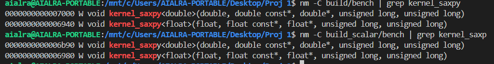
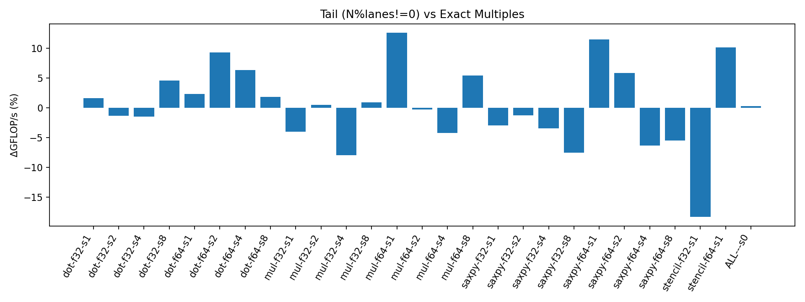
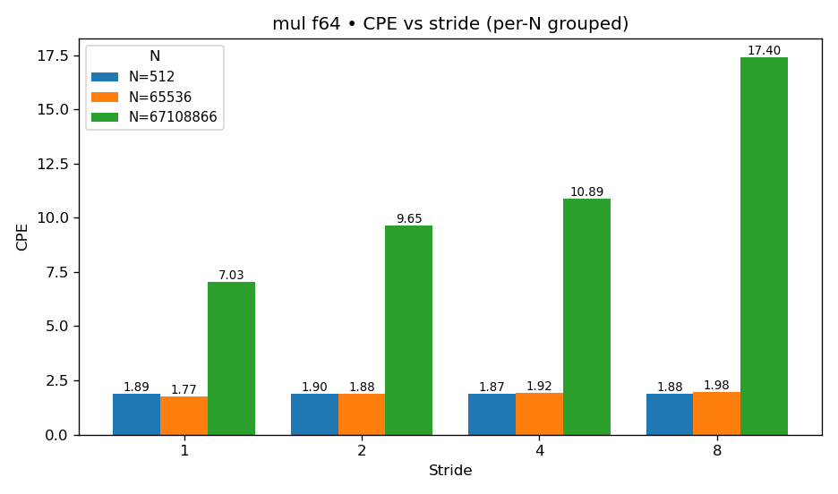
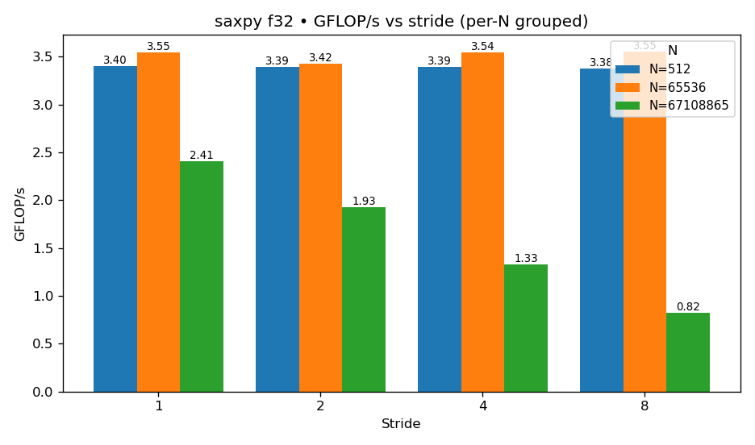
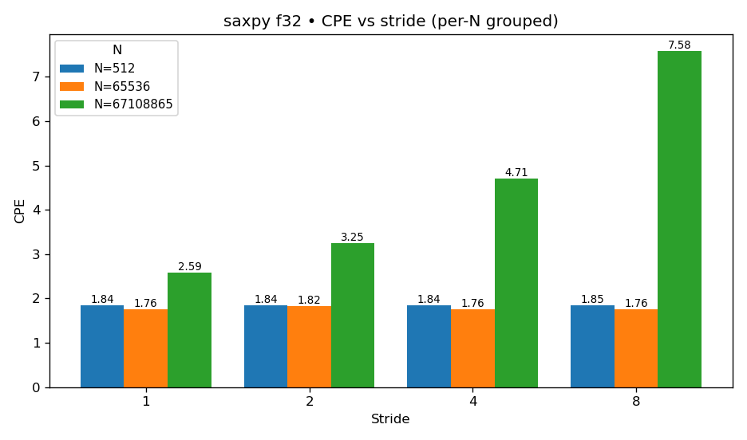
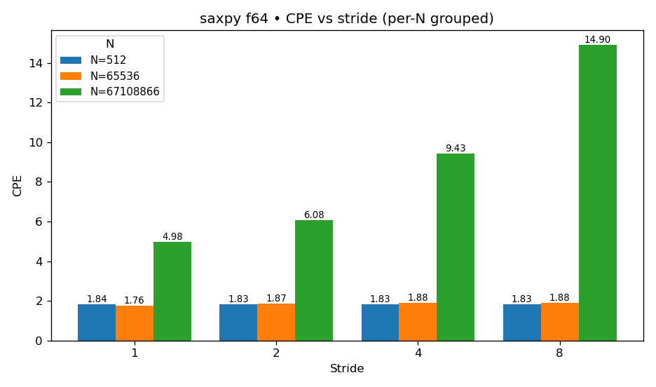
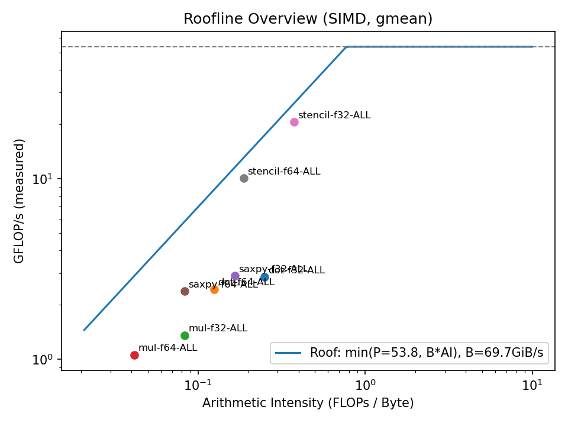

# Project 1 SIMD Advantage Evaluation

**Lucas Ding**

---

## 0. Introduction

### 0.1 Purpose

* This experiment aims to systematically test and compare the scalar and SIMD versions of typical numerical kernels (such as SAXPY, DOT, MUL, STENCIL) under different data sizes, alignments, strides, and data types. By combining compiler reports, disassembly, and performance counters, it reveals the real-world benefits and limitations of vectorization in both compute-bound and memory bandwidth-bound scenarios. Using the Roofline model to locate performance bottlenecks, it comprehensively evaluates the strengths and constraints of SIMD instruction sets in single-thread high-performance computing.

### 0.2 Core Concepts

* **SIMD / Vectorization**: SIMD (Single Instruction, Multiple Data) is a parallel computing technique that allows a single instruction to operate simultaneously on multiple data elements. For example, in the AVX2 instruction set, a 256-bit register can hold 8 single-precision floats (float32) or 4 double-precision floats (float64) at once, enabling multiple arithmetic operations to be completed within one CPU cycle, thus significantly improving throughput. The essence of vectorization is to “pack” element-wise loops into parallel operations, reducing instruction scheduling and loop overhead.

* **FTZ (Flush-to-Zero)**: FTZ is a floating-point processing mode that forces results to zero when operations generate *subnormal (denormal)* numbers (values extremely close to zero but not zero). This avoids the CPU’s slow path when handling subnormal numbers, ensuring stable performance. When FTZ is enabled, all underflow results are flushed to zero instead of being kept as subnormals. It applies to *output results*.

* **DAZ (Denormals-Are-Zero)**: DAZ is an optimization on the *input* side, where subnormal input values are treated as zero to avoid expensive subnormal computations. This prevents performance penalties when inputs fall in the subnormal range. DAZ simplifies extremely small *input values* to 0, while FTZ simplifies *output values* to 0.

* **CPE (Cycles Per Element)**: measures the average number of CPU cycles needed to process one data element. For example, if a loop processes 100 million elements in one second on a 2.5 GHz CPU, you can compute the average cycles per element. Together with GFLOP/s, CPE helps diagnose bottlenecks: lower CPE means higher efficiency; higher GFLOP/s means better hardware utilization.

* **GiB/s (Gibibyte per second)**:is often used to estimate memory bandwidth utilization. It’s computed as “total data moved / execution time”. Comparing this to theoretical bandwidth reveals whether performance is memory-bound. For instance, if a program moves 40 GiB in 1 second, its bandwidth is 40 GiB/s. If this approaches the system’s physical limit, further optimization may require cache or algorithmic restructuring rather than instruction-level tuning.

### 0.3 Tools Used

* **Compilers**: GCC / Clang
* **Disassembly/Reports**: `g++ -fopt-info-vec*`, `clang++ -Rpass=loop-vectorize`, `objdump`, `llvm-objdump`
* **Timing**: `rdtsc` / `rdtscp`, with median/quantile statistics to reduce outliers
* **Performance Counters**: Linux `perf`
* **Python**: `numpy`, `pandas`, `matplotlib`

### 0.4 Hardware/Software Information

```
System Model: systeminfo | findstr /B /C:"System Model"   (Windows)
```


```
OS Version: lsb_release -a             (WSL)
```


```
CPU Model: lscpu | grep "Model name" (WSL)
```


```
Supported ISA: lscpu | grep Flags        (WSL)
```


```
SMT/Hyper-Threading: lscpu | grep "Thread(s) per core" (WSL)
```


```
Frequency Policy: powercfg /GETACTIVESCHEME (Windows)
```


```
Compiler Version: gcc --version           (WSL)
```


```
Disassembly Tool: objdump --version       (WSL)
```


```
Performance Counter Tool: perf --version          (WSL)
```


### 0.5 Repository Structure

```
/
├── CMakeLists.txt               # Top-level CMake build file: controls scalar/SIMD builds, toggles FTZ/DAZ, and generates the bench executable
├── README.md                    # Project overview and usage instructions

├── src/
│   └── bench.cpp                # Core program: SAXPY / DOT / MUL / STENCIL kernels + timing + CLI parsing + CSV output

├── scripts/
│   ├── run_all.sh               # Batch experiment script: sweeps kernel/dtype/N/stride/misalign; runs both builds; outputs data/*.csv
│   ├── plot.py                  # Base plotting: merges data/*.csv to generate speedup & GFLOP/s comparison charts
│   ├── make_align_report.py     # Alignment analysis: compares aligned vs misaligned arrays, outputs tables & plots/align/*
│   ├── make_tail_report.py      # Tail handling analysis: quantifies remainder cost, outputs tables & plots/tail/*
│   ├── make_stride_report.py    # Stride/gather analysis: stride=1/2/4/8 performance, outputs tables & plots/stride/*
│   └── make_roofline_report.py  # Roofline model generator: plots achieved GFLOP/s vs arithmetic intensity (AI)

├── data/
│   ├── scalar.csv               # Scalar baseline measurements
│   ├── simd.csv                 # SIMD measurement results
│   ├── stride_abs.csv           # Stride analysis summary (auto-generated)
│   └── ...                      # Additional CSVs from analysis scripts

├── plots/
│   ├── speedup_*.png            # Speedup plots (scalar vs SIMD)
│   ├── gflops_*.png             # GFLOP/s throughput plots
│   ├── align/
│   │   ├── aln_vs_mis_delta_cpe.png
│   │   └── aln_vs_mis_delta_gflops.png
│   ├── tail/
│   │   ├── tail_delta_cpe_%.png
│   │   └── tail_delta_gflops_%.png
│   ├── stride/
│   │   ├── *_gflops_grouped_by_stride.png
│   │   └── *_cpe_grouped_by_stride.png
│   ├── dtype/
│   │   ├── speedup_f32.png
│   │   ├── speedup_f64.png
│   │   ├── gflops_simd_*.png
│   │   └── cpe_simd_*.png
│   └── roofline/
│       └── roofline_overview.png

├── reports/
│   ├── report.md                # Main report body
│   ├── gcc_vectorize_report.scalar.txt  # GCC vectorization report (vectorization disabled)
│   ├── gcc_vectorize_report.simd.txt    # GCC vectorization report (vectorization enabled)
│   ├── scalar_saxpy_f32.asm     # Disassembly snippet: scalar SAXPY (f32)
│   ├── simd_saxpy_f32.asm       # Disassembly snippet: SIMD SAXPY (f32)
│   ├── scalar_saxpy_f64.asm     # Disassembly snippet: scalar SAXPY (f64)
│   └── simd_saxpy_f64.asm       # Disassembly snippet: SIMD SAXPY (f64)

├── build/                       # Build directory (vectorization enabled)
└── build_scalar/                # Build directory (vectorization disabled)

```
# Basic tools and compilers
sudo apt update
sudo apt install -y build-essential clang llvm binutils cmake git python3 python3-pip numactl

# Python dependencies
```
sudo apt install python3-numpy python3-matplotlib python3-pandas
```

* Powershell:

```
# WSL2 lacks kernel-level CPU frequency control, so use Windows “Ultimate Performance” mode to ensure stable CPU frequency
powercfg /L
powercfg /S e9a42b02-d5df-448d-aa00-03f14749eb61
powercfg /GETACTIVESCHEME
```

---

## 1. Program Implementation & Build

### 1.0 Core Concepts

* **SAXPY / AXPY**: SAXPY (Single-Precision A·X Plus Y) is a typical fused multiply-add kernel `y ← a·x + y`, where `a` is a scalar and `x`, `y` are vectors. As a streaming FMA, its performance mainly reflects memory bandwidth utilization.

* **DOT (Dot Product / Reduction)**: The dot product multiplies two vectors element-wise and accumulates the results, `s ← Σ xᵢ·yᵢ`. As a reduction kernel, it tests not only SIMD throughput but also reduction dependency limitations.

* **MUL (Elementwise Multiply)**: Elementwise multiplication `zᵢ ← xᵢ·yᵢ` is the simplest binary vector operation, free of reduction dependencies. Performance depends on memory load/store and instruction throughput — ideal for testing SIMD efficiency.

* **STENCIL (1D 3-Point Template)**: A one-dimensional three-point stencil `yᵢ ← a·xᵢ₋₁ + b·xᵢ + c·xᵢ₊₁` is common in finite-difference and PDE solvers. Performance depends on arithmetic operations, cache locality, and bandwidth — suitable for studying prefetching, cache line use, and bandwidth bottlenecks.

* **Speedup**: Defined as `scalar_time / SIMD_time`. A value > 1 indicates acceleration. For example, scalar = 10 ms, SIMD = 4 ms ⇒ speedup = 2.5×.

* **Reduction Dependency**: When each loop iteration depends on the result of the previous (e.g., `s = s + x[i]*y[i]`), limiting parallelism and SIMD efficiency.

* **Throughput**: The number of floating-point operations per second, in GFLOP/s. Higher means better utilization.

* **GFLOP (Giga Floating Point Operations)**: 1 GFLOP = 10⁹ FLOPs. Combined with time (s), GFLOP/s measures performance.

* **Vector Width / Lanes**: Number of elements processed per SIMD instruction. AVX2 (256-bit) handles 8 `float32` or 4 `float64`.

* **Memory Bandwidth Bound**: Performance limited by data transfer speed, even if compute resources are idle. Characterized by actual bandwidth ≈ physical max.

* **Compute Bound**: Performance limited by compute capacity. SIMD acceleration is most effective here.

* **FMA (Fused Multiply-Add)**: A single instruction performing multiply and add (`a*b + c`) — 2 FLOPs per instruction. Modern SIMD sets (AVX2/AVX-512) support FMA for higher compute density.

### 1.1 Purpose

This section implements four classic numerical kernels (SAXPY, DOT, MUL, STENCIL) and exposes parameters such as data type, stride, alignment, and tail-handling as experimental knobs. Each run generates measurement results under different configurations. The program records execution time, throughput (GFLOP/s), cycles per element (CPE), and memory bandwidth (GiB/s), outputting CSVs for post-processing. Python scripts aggregate and plot these results, forming the raw data foundation for analysis.

### 1.2 CLI Parameters & Explanation

| Parameter    | Options                             | Description (For Beginners)                                                  |
| ------------ | ----------------------------------- | ---------------------------------------------------------------------------- |
| `--kernel`   | `saxpy` / `dot` / `mul` / `stencil` | Select kernel: Streaming FMA / Reduction / Elementwise Mul / 3-Point Stencil |
| `--dtype`    | `f32` / `f64`                       | Floating-point precision: single/double; affects vector width                |
| `--n`        | positive integer                    | Number of elements (problem size); tests locality across L1/L2/LLC/DRAM      |
| `--stride`   | 1/2/4/8…                            | Access stride; >1 reduces cache-line utilization, stresses prefetch/TLB      |
| `--misalign` | toggle                              | Intentionally misalign loads to test penalties of masks/prologues/epilogues  |
| `--reps`     | ≥3                                  | Repetitions; use median/quantiles to smooth noise                            |
| `--warmups`  | ≥1                                  | Warmups for cache/frequency stabilization                                    |
| `--pin`      | core ID                             | Pin to a specific core to avoid migration noise                              |

### 1.3 CMake

See `CMakeLists.txt`

`-march=native` enables ISA-specific optimizations (e.g., AVX2/AVX-512);
`-ffast-math` / `-ffp-contract=fast` allows aggressive FMA fusion (note in report);
`-fno-tree-vectorize` / `-fno-vectorize` disables auto-vectorization for scalar baseline.

### 1.4 Main Program

See `src/bench.cpp`

### 1.5 Build & Run

* WSL:

```bash
# Scalar baseline
mkdir -p build_scalar && cd build_scalar
cmake -DFTZ_DAZ=ON -DBUILD_SCALAR=ON ..    
cmake --build . -j
```


```bash
# Auto-vectorized version
mkdir -p build && cd build
cmake -DFTZ_DAZ=ON -DBUILD_SCALAR=OFF ..   
cmake --build . -j
```


---

## 2. Batch Experiments

### 2.1 Purpose

The goal of the batch experiment is to systematically cover all key experimental dimensions to ensure sufficient data support for subsequent analysis.
All measurement results will be output in CSV format to `data/*.csv` files, ensuring traceability of experimental data.
Then, a Python script will automatically aggregate and plot the charts, forming a closed loop from raw data to visual analysis.
Specifically, we aim to automatically generate all dimensional data in one go to save experimental time, covering the following dimensions comprehensively:

1. **Data Size N**: By gradually increasing the vector length, make the working set overflow from L1 cache to L2 cache, then to the Last Level Cache (LLC), and finally into main memory (DRAM). This clearly shows how locality affects performance.
2. **Alignment and Tail Handling**: Measure performance under both aligned and misaligned array conditions, and compare cases with "exact multiple lengths" vs. "remaining tails" to quantify extra costs of SIMD prologue/epilogue and masked operations.
3. **Stride**: Access arrays with different strides (1, 2, 4, 8, etc.) to simulate sequential vs. gather-like access, observing how cache-line utilization and prefetching efficiency affect SIMD throughput.
4. **Data Type (dtype)**: Compare single-precision (float32) vs. double-precision (float64) to analyze the impact of fixed register width channel count (f32×8 vs f64×4 in AVX2), and differences between compute-bound and bandwidth-bound scenarios.


### 2.2 Data Size Determination

To ensure working sets of different sizes map to cache levels, estimate each element’s byte size, then divide cache capacity by that number to get approximate element count N.
This ensures selected N values cover the full path from L1 → L2 → LLC → DRAM.

#### Bytes Per Element Estimation

| Kernel  | Access Pattern                          | f32 (4B)            | f64 (8B)             | Description                                                    |
| ------- | --------------------------------------- | ------------------- | -------------------- | -------------------------------------------------------------- |
| SAXPY   | Read `x` + Read/Write `y`               | 4 + (4+4) = 12 B/el | 8 + (8+8) = 24 B/el  | Reads one `x`, reads+writes `y`                                |
| DOT     | Read `x` + Read `y`                     | 4 + 4 = 8 B/el      | 8 + 8 = 16 B/el      | Reads two arrays and accumulates in register                   |
| MUL     | Read `x` + Read `y` + Write `z`         | 4 + 4 + 4 = 12 B/el | 8 + 8 + 8 = 24 B/el  | Multiplies two arrays and writes to third                      |
| STENCIL | Read `x[i-1], x[i], x[i+1]` + Write `y` | (3×4+4)/iter≈8 B/el | (3×8+8)/iter≈16 B/el | Three overlapping reads, average per element ~8B(f32)/16B(f64) |

#### Retrieve Cache Parameters

```bash
lscpu | grep "L1d cache"
lscpu | grep "L2 cache"
lscpu | grep "L3 cache"
```


#### Conversion Formula

$$
N = \frac{\text{Cache Size (B)}}{\text{Bytes per Element (B)}}
$$

#### Element Counts

| Kernel  | dtype | B/el | L1d (786,432B) | L2 (33,554,432B) | L3 (37,748,736B) |
| ------- | ----- | ---- | -------------- | ---------------- | ---------------- |
| SAXPY   | f32   | 12   | 65,536         | 2,796,202        | 3,145,728        |
| SAXPY   | f64   | 24   | 32,768         | 1,398,101        | 1,572,864        |
| DOT     | f32   | 8    | 98,304         | 4,194,304        | 4,718,592        |
| DOT     | f64   | 16   | 49,152         | 2,097,152        | 2,359,296        |
| MUL     | f32   | 12   | 65,536         | 2,796,202        | 3,145,728        |
| MUL     | f64   | 24   | 32,768         | 1,398,101        | 1,572,864        |
| STENCIL | f32   | 8    | 98,304         | 4,194,304        | 4,718,592        |
| STENCIL | f64   | 16   | 49,152         | 2,097,152        | 2,359,296        |

#### N Determination

To comprehensively observe cache hierarchy effects, choose a set of vector lengths N such that working sets sequentially cover L1 → L2 → LLC → DRAM.
Based on local cache parameters (L1d=768 KiB, L2=32 MiB, L3=36 MiB) and per-element byte estimates, approximate transition sizes:

| Level            | Typical N | Description                                                 |
| ---------------- | --------- | ----------------------------------------------------------- |
| **L1 Range**     | ~65K      | SAXPY(f32) working set just fills L1 cache                  |
| **L2 Range**     | ~1M       | SAXPY(f64) near L2, DOT/STENCIL(f32) partially cover L2→LLC |
| **LLC Range**    | ~3M–4M    | SAXPY/MUL(f32) & DOT/STENCIL(f32) near L3 capacity          |
| **DRAM Range**   | ~8M       | Clearly exceeds LLC, enters main memory                     |
| **DRAM (Large)** | ~32M      | Increases bandwidth pressure                                |
| **DRAM (Huge)**  | ~64M      | Very large, used to verify DRAM region stability            |

#### Selected N Values

For practical execution and script simplicity, we use one unified exponential growth set of N (instead of tuning per dtype):

```
N = { 512; 1,024; 2,048; 4,096; 8,192; 65,536; 1,048,576; 8,388,608; 33,554,432; 67,108,864 }
```

| N          | Description                                                   |
| ---------- | ------------------------------------------------------------- |
| **512–8K** | Fully within L1 capacity, observe ideal compute throughput    |
| **65K**    | SAXPY(f32) near L1→L2 boundary, first L1 spill                |
| **1M**     | SAXPY(f64) near L2, DOT/STENCIL(f32) touching L2→LLC boundary |
| **8M**     | Exceeds LLC, enters DRAM                                      |
| **32M**    | Larger DRAM size, increases bandwidth pressure                |
| **64M**    | Huge scale, verifies DRAM-region convergence                  |

This selection covers key cache turning points and ensures comparability across data types and kernels.

### 2.3 Batch Script

Script: **`scripts/run_all.sh`**

Execution:

```bash
bash scripts/run_all.sh
```

Execution log in `run.log`


### Parameter Explanation

* **simd / scalar** — version executed

  * `simd` → Auto-vectorized version
  * `scalar` → Vectorization disabled

* **kernel** — numerical kernel

  * `saxpy`: y ← a·x + y
  * `dot`: Dot product reduction
  * `mul`: Elementwise multiplication
  * `stencil`: 1D three-point stencil

* **dtype** — data type

  * `f32` → float32 (single precision, 4 bytes)
  * `f64` → float64 (double precision, 8 bytes)

* **N** — data size, determines problem scale

  * `N=8192` → 8192 elements, roughly L1/L2 region
  * `N=67108864` → ~67M elements, definitely DRAM

* **stride** — access stride

  * `stride=1` → contiguous access, optimal cache use
  * `stride=2/4/8` → skip elements, simulate sparse/non-contiguous access, poorer bandwidth

* **mis** — intentional misalignment

  * `mis=0` → aligned (array start 64B-aligned)
  * `mis=1` → misaligned (+1 offset), test penalty of unaligned load/store

---

## 3. Baseline and Correctness

### 3.1 Concept Explanation

* **Baseline (Scalar)**: The scalar version serves as the performance baseline, quantifying the actual acceleration brought by automatic vectorization (SIMD).

* **Correctness (Verification)**: Performance optimization must not change program semantics. SIMD/FMA/fast-math may reorder floating-point operations, so we must verify that numerical errors remain within acceptable bounds.

* **Goal:** Verify that SIMD results are numerically consistent with scalar baseline results, establishing a trustworthy baseline for subsequent speedup computation.

### 3.2 Execution Results

#### Relative Error Tolerance

| Data Type     | Relative Error rtol | Absolute Error atol |
| ------------- | ------------------- | ------------------- |
| float32 (f32) | 1e-6                | 1e-7                |
| float64 (f64) | 1e-12               | 1e-13               |

**Explanation:**
Due to use of `-ffast-math` and FMA instructions, operation order may differ, leading to accumulated rounding errors.
A relaxed tolerance is therefore set:

$$
|a-b| \le \text{atol} + \text{rtol} \times \max(|a|, |b|)
$$

This ensures numerical equivalence, not bitwise equality.

#### Verification Strategy

The program provides a `--verify` flag to perform numerical correctness comparison before and after timing:

1. Copy input data
2. Run scalar reference implementation (same stride / misalignment)
3. Run test kernel (scalar or SIMD)
4. Compare outputs: element-wise or aggregate (dot)
5. Compute maximum relative error `max_rel_err`
6. If all satisfy `|a-b| ≤ atol + rtol·max(|a|,|b|)`, then `verified=1`

| Data Type     | Relative Error rtol | Absolute Error atol |
| ------------- | ------------------- | ------------------- |
| float32 (f32) | 1e-6                | 1e-7                |
| float64 (f64) | 1e-12               | 1e-13               |


#### Verification Commands

Example entries:

```bash
# Scalar
./build_scalar/bench --kernel saxpy   --dtype f32 --n 4096    --reps 11 --stride 1 --verify
./build_scalar/bench --kernel dot     --dtype f32 --n 1048576 --reps 11 --stride 2 --misalign --verify
./build_scalar/bench --kernel mul     --dtype f64 --n 262144  --reps 11 --stride 4 --verify
./build_scalar/bench --kernel stencil --dtype f64 --n 1048576 --reps 11 --stride 1 --verify
```


```bash
# SIMD
./build/bench --kernel saxpy   --dtype f32 --n 4096    --reps 11 --stride 1 --verify
./build/bench --kernel dot     --dtype f32 --n 1048576 --reps 11 --stride 2 --misalign --verify
./build/bench --kernel mul     --dtype f64 --n 262144  --reps 11 --stride 4 --verify
./build/bench --kernel stencil --dtype f64 --n 1048576 --reps 11 --stride 1 --verify
```


Batch execution:

```
bash scripts/run_all.sh
```

Check correctness for SIMD outputs:

```bash
awk -F, 'NR>1 && $13==0 {print}' data/simd.csv
```

* `-F,` — set comma as delimiter
* `NR>1` — skip header line
* `$13==0` — filter rows with `verified=0`

If there is no output, it means all entries passed verification (`verified=1`) and numerical results are correct.


### 3.3 Actual Results


* All kernels (`saxpy`, `dot`, `mul`, `stencil`) passed verification across all test sizes, strides, and alignments
* `verified=1` for all cases
* Maximum relative error `max_rel_err`:

```bash
awk -F, '
NR>1 {
  if($2=="f32" && $14>max32) max32=$14;
  if($2=="f64" && $14>max64) max64=$14;
}
END {
  print "f32 max_rel_err =", max32;
  print "f64 max_rel_err =", max64;
}' data/simd.csv
```

* f32 ≤ `7.7493250543414e-06`
* f64 ≤ `3.4367477939427e-07`


Verification passed — SIMD and Scalar results are numerically consistent; `fast-math`/FMA introduced no unacceptable deviation.


### 3.4 Timing Method (Repetition & Error Bars)

See `bench.cpp`

Each configuration is measured multiple times to improve statistical stability:

* **Warmup**: 2 warmups (`--warmups=2`) to avoid cold cache effects
* **Repetitions**: 9 runs (`--reps=9`) per configuration
* **Statistics**:

  * Reported time = **median**, minimizing outlier influence
  * Also output **p05 / p95** (5% and 95% quantiles) to indicate performance range
* **Error Bars**: represent p05–p95 interval, reflecting run-to-run stability
* **Environment Control**: Performance governor, CPU pinning (`--pin=1`), FTZ/DAZ enabled to ensure reproducibility


### 3.5 Plotting

Plot script: **`scripts/plot.py`**

Run plotting:

```
python3 scripts/plot.py
```

Example results (with repetitions & error bars):


---

## 4. Vectorization Verification

### 4.1 Explanation

Add “no-inline” and visible symbols to each kernel to prevent inlining/renaming issues, and try to disable LTO to avoid function merging:

```cpp
#if defined(__GNUC__) || defined(__clang__)
#define NOINLINE __attribute__((noinline))
#else
#define NOINLINE
#endif

template<class T>
NOINLINE void kernel_saxpy(T a, const T* x, T* y, size_t n, size_t stride) {
  for (size_t i=0;i<n;i+=stride) y[i] = a*x[i] + y[i];
}

template<class T>
NOINLINE T kernel_dot(const T* x, const T* y, size_t n, size_t stride) {
  T s = 0; for (size_t i=0;i<n;i+=stride) s += x[i]*y[i]; return s;
}

template<class T>
NOINLINE void kernel_mul(const T* x, const T* y, T* z, size_t n, size_t stride) {
  for (size_t i=0;i<n;i+=stride) z[i] = x[i]*y[i];
}

template<class T>
NOINLINE void kernel_stencil(const T* x, T* y, size_t n, T a, T b, T c) {
  if (n<3) return;
  for (size_t i=1;i+1<n;i++) y[i] = a*x[i-1] + b*x[i] + c*x[i+1];
}
```

### 4.2 Commands

#### GCC Scalar Baseline Report:

```bash
cd build_scalar
cmake -DFTZ_DAZ=ON -DBUILD_SCALAR=ON ..
make clean
make VERBOSE=1 2>../gcc_vectorize_report.scalar.txt
cat ../gcc_vectorize_report.scalar.txt | grep -i vector
```


No vector-related output →  Correct (vectorization disabled)


#### GCC Vectorization Report:

```bash
cd build
cmake -DFTZ_DAZ=ON -DBUILD_SCALAR=OFF ..
make clean
make VERBOSE=1 2>../gcc_vectorize_report.simd.txt
cat ../gcc_vectorize_report.simd.txt | grep -i vector
```


Vector-related output exists →  Correct (vectorization enabled)


#### Disassembly:

```bash
nm -C build/bench | grep kernel_saxpy
nm -C build_scalar/bench | grep kernel_saxpy
```




Scalar

```bash
objdump -dC -Mintel build_scalar/bench | awk '/0000000000006980/,/ret/' > scalar_saxpy_f32.asm
objdump -dC -Mintel build_scalar/bench | awk '/0000000000006b90/,/ret/' > scalar_saxpy_f64.asm
grep -E 'mulss|addss|movss' scalar_saxpy_f32.asm
grep -E 'mulsd|addsd|movsd' scalar_saxpy_f64.asm
grep -E 'ymm|zmm' scalar_saxpy_f32.asm || echo "No wide vectors (scalar build confirmed)"
```


SIMD

```bash
objdump -dC -Mintel build/bench | awk '/0000000000006940/,/ret/' > simd_saxpy_f32.asm
objdump -dC -Mintel build/bench | awk '/0000000000007000/,/ret/' > simd_saxpy_f64.asm

grep -E 'vfmadd|vmul|vadd|ymm|zmm' simd_saxpy_f32.asm
grep -E 'vfmadd|vmul|vadd|ymm|zmm' simd_saxpy_f64.asm
```


### 4.3 Interpretation

#### Vector Width

The compiler report shows “optimized: basic block part vectorized using 32 byte vectors”, indicating use of the AVX2 (256-bit) instruction set.
Therefore, vector width = 256-bit → f32×8 / f64×4.
Each SIMD instruction can process 8 float32 or 4 float64 elements simultaneously.


#### FMA Usage

Disassembly reveals the presence of `vfmadd213ss` and `vfmadd213sd` instructions, indicating that the compiler successfully enabled FMA (Fused Multiply-Add) operations.
However, these instructions are scalar variants, and the main computation loop was not fully vectorized — only few wide-vector FMA forms such as vfmadd231ps/pd ymm were generated.
As a result, FMA execution occurs only within the scalar pipeline rather than in vector registers

---

## 5. Locality Scan

### 5.1 Purpose

* By scanning `N` across cache levels (L1 → L2 → LLC → DRAM), we can observe changes in GFLOP/s and CPE, and explain why SIMD gains are compressed once kernels become memory-bound.
* The data has already been collected through the batch-run script — we can directly analyze the figures.

### 5.2 Charts

#### SAXPY

**Speedup (saxpy, f32):**
This figure shows how the SIMD implementation of `saxpy(f32, stride=1, aligned)` accelerates compared to the scalar baseline as data size increases.
At small scales, the speedup remains around 1.5–2×. As data size grows, the speedup gradually rises, peaking near 7× around 10⁵ elements, demonstrating SIMD’s strong parallelism.
When the data exceeds cache capacity and enters the memory bandwidth-bound region, the speedup rapidly drops, approaching 1×, indicating that both SIMD and scalar versions are now constrained primarily by memory access speed.


**GFLOP/s (saxpy, f32):**
This plot shows floating-point throughput (GFLOP/s) for scalar vs. SIMD implementations across different data sizes.
At small sizes, both are low, but SIMD already shows an advantage. As size increases, SIMD throughput rapidly climbs, peaking around 40 GFLOP/s near 10⁵ elements, far exceeding the scalar’s <10 GFLOP/s.
Beyond cache capacity, both decline and converge, marking the transition from compute-bound to memory-bound performance.


**Speedup (saxpy, f64):**
For `saxpy(f64, stride=1, aligned)`, speedup starts between 1–1.5× for small sizes, increases in cache-friendly ranges, and peaks around 2.6× near 10⁵ elements.
Once data surpasses cache limits, entering bandwidth-bound regions, the speedup falls to 1.1–1.2×, showing that SIMD acceleration in double precision is modest and mainly visible in compute-bound phases.


**GFLOP/s (saxpy, f64):**
At small scales, both versions achieve 7–9 GFLOP/s, with SIMD slightly ahead.
When entering cache-efficient ranges, SIMD throughput rises to 16–18 GFLOP/s, while scalar drops to 5–6 GFLOP/s, widening the gap.
As size grows beyond cache, both fall sharply and converge near 1 GFLOP/s, indicating bandwidth-limited performance where SIMD’s advantage fades.


#### DOT

**Speedup (dot, f32):**
`dot(f32, stride=1, aligned)` shows 2–3× SIMD acceleration at small scales.
In cache-friendly regions, speedup increases, peaking at 7–8× near 10⁵ elements.
Beyond cache, in the bandwidth-limited zone, speedup drops and stabilizes around 1–1.5×, indicating SIMD benefits mainly under compute-bound conditions.


**GFLOP/s (dot, f32):**
Scalar performance remains around 5–7 GFLOP/s across all scales.
SIMD reaches 10–15 GFLOP/s early and peaks over 45 GFLOP/s at 10⁵ elements, greatly surpassing scalar.
When exceeding cache, SIMD quickly declines, approaching 3–5 GFLOP/s, close to scalar — showing bandwidth as the new bottleneck.


**Speedup (dot, f64):**
`dot(f64)` starts around 1.5–2×, rising above 3× near 10⁴ elements — peak performance within cache-friendly regions thanks to parallelism and FMA.
Once beyond cache, the speedup drops and stabilizes at 1–1.5×, reflecting reduced SIMD lanes and bandwidth bottlenecks in double precision.


**GFLOP/s (dot, f64):**
Initially, scalar achieves ~5–6 GFLOP/s, SIMD slightly higher.
Within cache, SIMD rises sharply to 20+ GFLOP/s, while scalar remains near 6 GFLOP/s, highlighting SIMD’s compute-bound advantage.
Past cache capacity, SIMD declines, converging near 2–3 GFLOP/s, matching scalar — bandwidth limits dominate, diminishing SIMD’s gains.


#### MUL

**Speedup (mul, f32):**
`mul(f32, stride=1, aligned)` sees modest gains (1.3–1.6×) at small scales.
In cache-friendly zones, speedup climbs, peaking near 3× around 10⁵ elements, showcasing ideal SIMD parallelism.
Beyond cache, speedup falls and stabilizes near 1–1.2×, showing performance constrained by memory access.


**GFLOP/s (mul, f32):**
Scalar: 5–6 GFLOP/s, SIMD: 7–10 GFLOP/s at small scales.
As size grows, SIMD peaks around 17 GFLOP/s (10⁵ elements), scalar remains ~6 GFLOP/s.
Beyond cache, SIMD drops to 1–2 GFLOP/s, converging with scalar, proving memory bandwidth dominates.


**Speedup (mul, f64):**
At small sizes, speedup is low (1–1.3×), sometimes ≈1 due to measurement noise.
Within cache, peaks around 2× (10⁴–10⁵ elements), showing SIMD’s compute-stage benefit.
Beyond cache, speedup declines to ~1, fully bandwidth-bound.


**GFLOP/s (mul, f64):**
At small scales, scalar ≈ 4–5 GFLOP/s, SIMD slightly ahead.
In cache-friendly regions, SIMD peaks ~8 GFLOP/s, nearly 2× scalar.
Past cache, both collapse to ~1 GFLOP/s, showing full bandwidth limitation.


#### STENCIL

**Speedup (stencil, f32):**
`stencil(f32, stride=1, aligned)` shows ~2× speedup at small sizes.
In cache-efficient regions, peaks at 6–7× (~10⁴–10⁵ elements), benefiting from local reuse and parallelism.
Beyond cache, speedup declines toward 1×, as memory bandwidth dominates.


**GFLOP/s (stencil, f32):**
Scalar maintains 10–15 GFLOP/s consistently.
SIMD rapidly scales, peaking ~70 GFLOP/s at 10⁵ elements, vastly exceeding scalar.
Beyond cache, SIMD falls, converging near 10 GFLOP/s, marking bandwidth limitation.


**Speedup (stencil, f64):**
At small scales, limited (~1–1.3×).
Within cache, rises to 2.5–3× (~10⁵ elements), showing strong SIMD utility in compute-bound phases.
Past cache, drops to 1–1.2×, memory-bound regime.


**GFLOP/s (stencil, f64):**
Small scales: scalar 13–15 GFLOP/s, SIMD slightly higher.
In cache, SIMD surges to 30+ GFLOP/s, scalar steady at 13 GFLOP/s.
Beyond cache, both drop to 3–4 GFLOP/s, dominated by bandwidth constraints.


### 5.3 Result Interpretation

When a kernel enters the memory bandwidth-bound phase, SIMD performance gains are greatly reduced, because the bottleneck shifts from *“how fast the CPU can compute”* to *“how fast memory can feed data.”*


#### Compute → Bandwidth

In compute-bound stages, CPU arithmetic throughput (FLOP/s) dominates.
SIMD can process multiple elements per instruction, boosting throughput.
But once the working set exceeds cache capacity, memory latency and bandwidth** become the new bottleneck.
The CPU’s floating-point units become starved, spending most cycles waiting on data from DRAM.
Since both scalar and SIMD versions must load/store the same total data volume, the memory subsystem caps performance.
In other words, everyone’s stuck in the same traffic — SIMD lanes can’t go faster than the bus.

#### Compressed Speedup

In the bandwidth-bound region, SIMD’s theoretical advantage (processing 4/8/16 elements per instruction) doesn’t translate to real gains:

* SIMD instructions are faster, but memory stalls dominate;
* Frontend and execution ports are often idle;
* Throughput stops scaling with SIMD width;
* Measured speedup collapses from multi× peaks to 1–1.5×**.

Thus, SIMD’s only residual gains come from reduced loop overhead, address calculations, or branches — memory bandwidth caps total performance.


#### Additional Factors

Besides bandwidth limits, other factors exacerbate SIMD constraints:

* **Prefetch inefficiency** – Large working sets make access patterns unpredictable, reducing prefetch accuracy.
* **Lower cache-line utilization** – Sparse use increases wasted bandwidth.
* **RFO (Read-For-Ownership)** – Write-allocate reads add extra traffic.
* **Page crossings & TLB misses** – Frequent page switches add latency.
* **AVX frequency throttling** – Wide-vector ops may trigger CPU downclocking, reducing throughput.

#### Inevitable Performance Turning Point

As working sets cross L1 → L2 → LLC → DRAM, the system transitions from *compute-bound* to *bandwidth-bound*:

* GFLOP/s curves flatten or decline
* Speedup curves drop sharply
* Scalar & SIMD performance converge

Ultimately, in DRAM regions, SIMD acceleration compresses to ~1–1.5×, dictated by physical memory limits, not instruction-level parallelism.

---
## 6. Alignment & Tail Handling Experiment Analysis

### 6.1 Objective

This experiment investigates two factors affecting SIMD vector performance:

1. **Alignment (Aligned) vs Misalignment (Misaligned)**: whether data addresses fall on boundaries aligned with vector width.
2. **Tail Handling**: when array length is not a multiple of vector width, the remaining “tail elements” require special handling.


### 6.2 Alignment vs Misalignment

#### Experimental Method

* Extract verified samples (`verified=1`) from `data/simd.csv`;

* Use `(kernel, dtype, stride, n)` as the key, and compare `misalign=0` vs `misalign=1`;

* Compute three performance deltas:

  * `ΔGFLOP/s`: drop in throughput → worse;
  * `ΔCPE`: increase in cycles per element → worse;
  * `ΔGiB/s`: drop in bandwidth utilization → worse.

* Perform pointwise pairing (aligned vs misaligned) to get Δ% per sample (negative = degradation).
  Aggregate geometric mean by `(kernel, dtype, stride)` to summarize average degradation.
  See script **`make_align_report.py`**.


#### Results Overview

See directory `plot/align`

| kernel  | dtype | stride | ΔGFLOP/s (%) | ΔCPE (%) | ΔGiB/s (%) | samples |
| ------- | ----- | -----: | -----------: | -------: | ---------: | ------: |
| dot     | f32   |      1 |        -1.91 |    +1.14 |      -1.91 |      10 |
| dot     | f32   |      2 |        -3.85 |    +3.66 |      -3.85 |      10 |
| dot     | f32   |      4 |        +9.80 |    -9.03 |      +9.80 |      10 |
| dot     | f32   |      8 |        -1.29 |    +1.60 |      -1.29 |      10 |
| dot     | f64   |      1 |        +4.96 |    -2.77 |      +4.96 |      10 |
| dot     | f64   |      2 |        -1.69 |    +1.72 |      -1.69 |      10 |
| dot     | f64   |      4 |        -0.50 |    -0.07 |      -0.50 |      10 |
| dot     | f64   |      8 |        -3.30 |    +3.29 |      -3.30 |      10 |
| mul     | f32   |      1 |        -3.33 |    +3.42 |      -3.33 |      10 |
| mul     | f32   |      2 |        -0.68 |    +0.69 |      -0.68 |      10 |
| mul     | f32   |      4 |        +0.71 |    -0.51 |      +0.71 |      10 |
| mul     | f32   |      8 |        +2.31 |    -1.70 |      +2.31 |      10 |
| mul     | f64   |      1 |        -4.43 |    +4.70 |      -4.43 |      10 |
| mul     | f64   |      2 |        -1.09 |    +1.10 |      -1.09 |      10 |
| mul     | f64   |      4 |        +3.56 |    -3.43 |      +3.56 |      10 |
| mul     | f64   |      8 |        -7.72 |    +7.27 |      -7.72 |      10 |
| saxpy   | f32   |      1 |        -5.97 |    +6.46 |      -5.97 |      10 |
| saxpy   | f32   |      2 |        +6.77 |    -7.15 |      +6.77 |      10 |
| saxpy   | f32   |      4 |        -2.61 |    +3.35 |      -2.61 |      10 |
| saxpy   | f32   |      8 |        -2.06 |    +1.13 |      -2.06 |      10 |
| saxpy   | f64   |      1 |        -6.29 |    +6.23 |      -6.29 |      10 |
| saxpy   | f64   |      2 |        +0.26 |    -0.30 |      +0.26 |      10 |
| saxpy   | f64   |      4 |        +2.20 |    -2.20 |      +2.20 |      10 |
| saxpy   | f64   |      8 |        +3.34 |    -2.43 |      +3.34 |      10 |
| stencil | f32   |      1 |        -9.49 |   +10.49 |      -9.49 |       9 |
| stencil | f64   |      1 |       -10.73 |   +12.68 |     -10.73 |       9 |
| ALL     | -     |      0 |        -1.27 |    +1.51 |      -1.27 |     258 |


#### **Overall Trend**

From 258 verified samples, misaligned access on average causes:

* **GFLOP/s ↓1.3%**,
* **CPE ↑1.5%**.

The effect is minor but consistently measurable, especially in bandwidth-bound kernels.

#### **Kernel-wise Differences**

* **Memory-bound kernels (stencil / saxpy):** alignment-sensitive; performance drops 5–10%, primarily due to load/store inefficiencies.
* **Compute-bound kernels (dot / mul):** smaller impact (1–3%), some positive deviations (stride=4) due to noise or incidental alignment.
* **Double precision (f64):** slightly higher penalty, affected by wider data and cacheline crossings.

#### **Root Causes**

1. **Cross-cacheline Access:** misaligned addresses may span 64B boundaries, requiring two loads.
2. **LoadU Latency:** `_mm256_loadu_ps/pd` incurs higher latency than aligned loads.
3. **Prefetch Inefficiency:** misalignment disrupts linear access, reducing prefetch hit rate.
4. **TLB Pressure:** fragmented address distribution increases TLB misses.


#### **Conclusion**

Misaligned memory access imposes limited but consistent penalties on SIMD throughput, particularly under stride=1 contiguous patterns.
Alignment remains a fundamental prerequisite for high-performance SIMD execution.

### 6.3 Tail Handling Effects

#### Experimental Method

* Select aligned samples only (`misalign=0`).

* Check `n % vector_width`:

  * remainder = 0 → **exact multiple (tail=0)**
  * remainder ≠ 0 → **has tail (tail=1)**

* Compute geometric mean of performance per group, then compare **tail=1 vs tail=0**.
  See script **`make_tail_report.py`**.


#### Results Overview

| kernel  | dtype | stride | ΔGFLOP/s (%) | ΔCPE (%) | ΔGiB/s (%) | samples(exact/tail) |
| ------- | ----- | -----: | -----------: | -------: | ---------: | ------------------: |
| dot     | f32   |      1 |        +0.11 |    -1.51 |      +0.11 |               10/10 |
| dot     | f32   |      2 |        -3.87 |    +2.65 |      -3.87 |               10/10 |
| dot     | f32   |      4 |        +3.44 |    -3.77 |      +3.44 |               10/10 |
| dot     | f32   |      8 |        -0.75 |    +0.29 |      -0.75 |               10/10 |
| dot     | f64   |      1 |       -32.71 |   +43.23 |     -32.71 |               10/10 |
| dot     | f64   |      2 |       -25.93 |   +30.43 |     -25.93 |               10/10 |
| dot     | f64   |      4 |       -23.33 |   +26.16 |     -23.33 |               10/10 |
| dot     | f64   |      8 |       -21.37 |   +22.03 |     -21.37 |               10/10 |
| mul     | f32   |      1 |        +3.27 |    -9.07 |      +3.27 |               10/10 |
| mul     | f32   |      2 |       -10.66 |    +5.10 |     -10.66 |               10/10 |
| mul     | f32   |      4 |       -13.54 |    +9.56 |     -13.54 |               10/10 |
| mul     | f32   |      8 |        -2.38 |    -3.28 |      -2.38 |               10/10 |
| mul     | f64   |      1 |        +4.48 |   -10.87 |      +4.48 |               10/10 |
| mul     | f64   |      2 |        -7.02 |    +1.44 |      -7.02 |               10/10 |
| mul     | f64   |      4 |        -7.52 |    +2.14 |      -7.52 |               10/10 |
| mul     | f64   |      8 |        +4.06 |   -10.07 |      +4.06 |               10/10 |
| saxpy   | f32   |      1 |        -0.68 |    -0.40 |      -0.68 |               10/10 |
| saxpy   | f32   |      2 |        +0.55 |    -1.38 |      +0.55 |               10/10 |
| saxpy   | f32   |      4 |        -3.57 |    +2.19 |      -3.57 |               10/10 |
| saxpy   | f32   |      8 |        -7.15 |    +6.01 |      -7.15 |               10/10 |
| saxpy   | f64   |      1 |        +6.36 |    -5.20 |      +6.36 |               10/10 |
| saxpy   | f64   |      2 |        -0.11 |    +0.88 |      -0.11 |               10/10 |
| saxpy   | f64   |      4 |        -0.85 |    +1.69 |      -0.85 |               10/10 |
| saxpy   | f64   |      8 |        +5.62 |    -2.38 |      +5.62 |               10/10 |
| stencil | f32   |      1 |       -13.15 |    +6.14 |     -13.15 |                 9/9 |
| stencil | f64   |      1 |        +2.37 |    -7.00 |      +2.37 |                 9/9 |
| ALL     | -     |      0 |        -5.55 |    +4.04 |      -5.55 |             258/258 |





#### Overall Trend

* **Average impact:**
  With tails (`tail=1`) vs exact multiples (`tail=0`):
  **GFLOP/s ↓5.55%**, **CPE ↑4.04%**.
  This matches microarchitectural experience: tail masking/cleanup incurs minor overhead, never orders of magnitude.


#### Observations by Kernel

* **dot / f64:** Significant drop (−21% to −33%) because

  * f64 vectors are narrower (AVX2 = 4 lanes), so incomplete vectors are more frequent;
  * reductions trigger extra tail merges, adding control dependencies.

* **dot / f32:** Small, mixed (±few %), likely due to measurement noise or cache effects.

* **mul / f32,f64:** Around −10%, some positive outliers (+4%) from random layout benefits.

* **saxpy:** Mostly within −7% ~ +6%, mild variations. Bandwidth-bound kernels hide compute-side mask costs but still lose minor efficiency.

* **stencil:** f32 ≈ −13%* f64 ≈ +2%; tail masks sometimes reduce redundant edge accesses, giving slight positive anomalies.


#### Root Causes

1. **Mask/Tail Loop Overhead:** extra instructions and control branches for remainder elements.
2. **Underutilized Registers:** partially filled vectors raise per-element instruction cost.
3. **Reduction Merge Penalties (dot):** tail triggers extra merge, lengthening critical path.
4. **Cache/Prefetch Randomness:** occasionally, tails avoid conflicts or improve locality, yielding small positive deviations.


#### **Conclusion**

Tail handling typically costs ~5% performance, more for f64 + dot, others fluctuate within ±10%.
It is a non-negligible bottleneck in SIMD kernels, especially for tight loops or short vectors.
Techniques like padding or loop peeling can effectively mitigate the loss.

---

### 6.4 Summary Conclusion

| Factor           | Throughput Change (ΔGFLOP/s) | CPE Change  | Impact Stability | Main Causes                                                                                   |
| ---------------- | ---------------------------- | ----------- | ---------------- | --------------------------------------------------------------------------------------------- |
| Misaligned Loads | ≈ −1% ~ −5%                  | ≈ +1% ~ +5% | Low ~ Medium     | Cross-cacheline accesses, higher latency of `loadu`, disrupted prefetch/alignment assumptions |
| Tail Handling    | Avg −5.55%                   | Avg +4.04%  | Medium ~ High    | Extra masked/tail loop path, reduced register utilization, reduction finalization overhead    |

#### Optimization Suggestions

1. **Avoid Tail Handling**: Ensure `n` is a multiple of the vector width; for fixed-size problems, pad to multiples of 8 (f32) / 4 (f64) under AVX2.
2. **Guarantee Alignment**: Use `posix_memalign` / `_aligned_malloc` for 32B/64B alignment; ensure array starts and access strides (`stride`) are alignment-consistent.
3. **Loop Structure**: For hot kernels, manually peel loops — pure SIMD main loop + one small scalar tail pass — to minimize branching overhead.
4. **Compiler Options**: Use `-O3 -march=native -ffast-math` (or equivalent for MSVC/Clang) to allow the vectorizer to auto-generate optimal mask paths; confirm no stray `#pragma` suppresses vectorization.
5. **Baseline Measurement**: Use paired sizes `(N, N+δ)` for consistency; pin to a core, maintain constant power/thermal conditions, and filter noise (e.g., fixed power plan / disable Turbo for comparisons).

---
## 7. Stride / Pseudo-Gather Effect

### 7.1 Objective

This section aims to evaluate the impact of non-contiguous access (stride > 1) on effective bandwidth and SIMD execution efficiency. By comparing stride=1 (sequential access) with stride=2/4/8 (strided or pseudo-gather mode) under the same problem size N, we analyze the systematic influence of access stride on GFLOP/s, GiB/s, and CPE. Using hardware counter data, we further interpret results from the perspectives of cache utilization, prefetcher efficiency, and TLB overhead.

### 7.2 Experimental Method and Data Collection Script

The experiment script `scripts/make_stride_report.py` filters samples directly from existing `data/simd.csv` and `data/scalar.csv`. Three representative N values from different working set regions are selected, and the script automatically detects available stride values (typically 1, 2, 4, 8). It outputs the summary table `data/stride_abs.csv` and plots under `plots/stride/`.

### 7.3 Experimental Results

Below are key bar charts exported from the automatically generated file `plots/stride/stride_summary.md`, illustrating how stride affects performance. Detailed data can be found in the corresponding summary tables (partial excerpts shown here):

| kernel | dtype |    N | stride | GFLOP/s |   CPE | GFLOP/s rel(s=1) |
| ------ | ----- | ---: | -----: | ------: | ----: | ---------------: |
| dot    | f32   |  512 |      1 |   3.131 | 1.994 |            1.000 |
| dot    | f32   |  512 |      2 |   3.122 | 1.997 |            0.997 |
| dot    | f32   |  512 |      4 |   3.131 | 1.991 |            1.000 |
| dot    | f32   |  512 |      8 |   3.131 | 1.991 |            1.000 |
| dot    | f32   |  513 |      1 |   2.965 | 1.988 |            1.000 |
| dot    | f32   |  513 |      2 |   2.965 | 1.987 |            1.000 |
| dot    | f32   |  513 |      4 |   2.948 | 1.999 |            0.994 |
| dot    | f32   |  513 |      8 |   2.948 | 1.999 |            0.994 |
| dot    | f32   | 1024 |      1 |   2.760 | 2.259 |            1.000 |
| dot    | f32   | 1024 |      2 |   2.753 | 2.265 |            0.997 |
| dot    | f32   | 1024 |      4 |   3.235 | 1.927 |            1.172 |
| dot    | f32   | 1024 |      8 |   3.185 | 1.957 |            1.154 |
| dot    | f32   | 1025 |      1 |   2.950 | 1.998 |            1.000 |
| dot    | f32   | 1025 |      2 |   3.046 | 1.935 |            1.033 |
| dot    | f32   | 1025 |      4 |   2.767 | 2.256 |            0.938 |
| dot    | f32   | 1025 |      8 |   3.228 | 1.933 |            1.094 |

### 7.4 Chart Preview

#### dot

* GFLOP/s (f32)
  
* CPE (f32)
  
* GFLOP/s (f64)
  
* CPE (f64)
  

#### mul

* GFLOP/s (f32)
  
* CPE (f32)
  
* GFLOP/s (f64)
  
* CPE (f64)
  

#### saxpy

* GFLOP/s (f32)
  
* CPE (f32)
  
* GFLOP/s (f64)
  
* CPE (f64)
  

#### stencil

The stencil kernel inherently includes fixed-neighborhood access. When stride ≠ 1, the dependency pattern is disrupted. Therefore, only stride=1 is tested here as the baseline.

### 7.5 Result Interpretation

#### Overall Trend

##### Large N → DRAM Region

For three streaming or element-wise kernels (dot / mul / saxpy), when N is large (e.g., 8M, 32M, 64M), increasing stride consistently causes significant performance degradation, reflected as:

* GFLOP/s continuously decreases
* CPE increases significantly

This reveals a typical bandwidth bottleneck under non-contiguous access: as stride > 1, valid data per cache line decreases, access intervals widen, prefetchers lose prediction accuracy, and TLBs must perform more frequent translations, reducing overall memory efficiency.

Compared to f32, f64 typically exhibits:

* Lower GFLOP/s (throughput limited)
* Higher CPE (more visible latency impact)

This is due to double precision consuming twice the bandwidth, exposing DRAM limitations earlier and causing faster degradation in memory-bound kernels.

Stencil is only tested with stride=1 as its access pattern already involves fixed-radius neighbors. Additional stride would break semantics. Its results show typical DRAM-bound behavior: GFLOP/s remains flat or slightly drops, and CPE rises gradually.

##### Medium / Small N (L1 / L2 Region)

Within cache-resident regions (512–8K), some kernels show non-monotonic behavior at stride=2/4:

* For example, `dot f32/f64 @ 4K/8K`, `mul f32 @ 64K`, `saxpy f64 @ 2K/4K`
* GFLOP/s matches or slightly exceeds stride=1

This local improvement is explainable:

* Working set fits in cache → no bandwidth bottleneck
* Hardware prefetcher still tracks fixed intervals
* Certain strides improve alignment or reduce cache conflicts
* Compiler may generate better loadu/unroll paths for specific strides

However, once N exceeds cache capacity (into L3 or DRAM), performance becomes monotonic: stride increases → L2/L3 misses surge, prefetch fails, and CPE rises.

#### Per-Kernel Analysis

| Kernel  | Characteristics and Trends                                                                                            |
| ------- | --------------------------------------------------------------------------------------------------------------------- |
| dot     | Sensitive to stride. Slightly better at s=2/4 in cache, but performance drops beyond DRAM: GFLOP/s halves, CPE rises. |
| mul     | At small N, s=2 may improve due to alignment/prefetch; at large N, monotonic decline.                                 |
| saxpy   | Similar to mul but more severe; at DRAM scale, s=8 GFLOP/s often <40% of s=1, CPE doubles.                            |
| stencil | Only s=1 tested; non-unit stride breaks dependencies. Used as continuous-access baseline.                             |

#### Summary

* Large N / DRAM region: performance limited by memory bandwidth; larger stride = cacheline waste + prefetch failure + more TLB pressure → lower GFLOP/s, higher CPE
* Small N / cache region: stride=2/4 may temporarily perform well but is not scalable

#### Core Conclusions

* Sequential access (stride=1) remains optimal
* Fixed strides acceptable in cache regions but degrade sharply in DRAM
* Non-aligned or odd strides (3, 5) degrade further, not tested here

### 7.6 Microarchitectural Analysis

#### Cacheline Utilization

Larger stride reduces valid data per cacheline and increases useless loads, inflating DRAM traffic.
Modern CPUs (64B cachelines) can fully utilize lines at stride=1: f32 uses 16 elements, f64 uses 8.
At stride=2, utilization halves; stride=4, one-quarter; stride=8, one-eighth; the rest is wasted bandwidth occupying channels and cache space.

Cachelines are fetched whole; if stride causes frequent cross-line access, each step fetches a new line, raising L1 misses and L2 pressure. In DRAM regions, such invalid transfers directly raise GiB/s load and CPE.
If stride is 2^k and properly aligned (e.g., stride=2/4/8 starting at a cacheline boundary), adjacent accesses may still share lines, slowing degradation.
Otherwise, if stride misaligns with cacheline size, cross-line access increases, cacheline reuse collapses, and performance drops sharply (especially near L2/L3 miss onset).

#### Prefetcher Efficiency

At stride=1, hardware prefetchers achieve stable high hit rates and full bandwidth utilization.
At stride=2/4, most CPUs with stride-based prefetchers can recognize fixed-step sequences, maintaining good performance. Some may even outperform s=1 (e.g., stride=2 reducing bank conflicts).
However, when stride ≥ 8, access gaps exceed prefetch windows or break recognizable patterns. Prefetch streams terminate, L2 misses increase, and prefetch hit rates collapse.

Memory bottlenecks shift from bandwidth to latency; cores wait on data fills, pipelines idle, CPE spikes.
For large N (DRAM), stride=8 prefetch failure compounds with TLB misses and low cacheline utilization, causing “multi-factor amplification”.
In saxpy and dot, GFLOP/s steadily declines.

If stride triggers false or repeated prefetch, cache pollution worsens. Compilers may unroll or use loadu to enhance ILP, but cannot offset bandwidth waste.

#### TLB Pressure

Larger strides increase page-crossing frequency.
On 4 KiB pages with 8 B elements (f64), stride = 8 crosses a page every 64 elements, whereas stride = 1 crosses every 512.
The resulting 8× higher TLB demand leads to more misses, each incurring a multi-level page walk (tens–hundreds of cycles).

When N is large, working sets exceed TLB capacity (~1–2 K entries); high strides accelerate eviction, lowering hit rates and raising CPE.
f64 workloads are more affected due to larger footprints.
Non-unit or irregular strides also disable hardware TLB prefetching, causing additional stalls.

Solutions: use huge pages to cut walk depth, or tiling to limit the effective stride × N span.

#### Execution Ports and Vectorization

Memory-bound kernels bottleneck on latency/bandwidth, not compute.
As stride grows, load count stays constant but useful data per load drops; effective work per cycle decreases, raising CPE and ALU idle rate.
Even with SIMD, registers hold many unused elements, lowering effective GFLOP/s.

Compilers may emit offset `vmovups/loadu` or gather instructions; gathers are much slower than sequential loads.
At stride=2/4 with 2^k alignment, unrolling and shuffling can merge accesses, easing port pressure, explaining occasional stride=2/4 performance parity or gains.
For stride=8 or irregular patterns, such optimizations fail; gather paths dominate, causing port stalls and CPE surges. At large N, ALU utilization can fall below 20%.

### 7.7 Conclusions and Recommendations

#### Conclusions

* Stride impact transitions from stable to degraded as N grows
* Compilers and prefetchers handle low strides (2/4) well
* High strides (≥8) degrade bandwidth heavily for both f32 and f64

#### Recommendations

* Prefer linear access (stride=1); use SoA/contiguous layouts
* If strided access is unavoidable:

  * Keep stride=2^k, avoid misaligned patterns
  * Apply index reordering or blocking in preprocessing
  * On high-end CPUs, consider AVX-512 gather or software prefetching
* Monitor TLB hit rate and cache misses to avoid pseudo-random jumps caused by stride-page size interactions

---

## 8. Data Type Comparison 

### 8.1 Research Questions & Criteria

This section aims to analyze the differences between different data types (f32 and f64) in SIMD throughput, bandwidth-limited performance, and overall speedup, examining their scalability and bottleneck characteristics across different cache levels.

**Core Research Questions:**

1. **SIMD Lane Count**
   On the AVX2 256-bit platform, f32 can process 8 elements per instruction, while f64 can only process 4. Theoretically, the ideal SIMD throughput ceiling of f32 is 2× that of f64.
2. **Arithmetic Intensity (AI = FLOPs / Bytes)**
   Under the same workload, f64 requires twice the byte traffic, entering the bandwidth-limited region earlier and being more easily constrained by the DRAM bottleneck.
3. **Observation Metrics:**

   * **GFLOP/s**: Reflects arithmetic throughput;
   * **CPE (Cycles per Element)**: Measures the average cycle cost per element;
   * **Speedup = GFLOP/s(SIMD) ÷ GFLOP/s(Scalar)**: Reflects the actual acceleration brought by vectorization.


### 8.2 SIMD Lane Width and Arithmetic Intensity Derivation

#### SIMD Lane Count (Example: AVX2 256-bit)

| Data Type | Element Size (Byte) | Lane Count (Lanes / Instruction) |
| --------- | ------------------- | -------------------------------- |
| f32       | 4                   | 8                                |
| f64       | 8                   | 4                                |

#### Memory Access Patterns and Arithmetic Intensity of Each Kernel

| Kernel       | Access Pattern (per element) | f32 B/el | f64 B/el | Arithmetic Intensity (FLOPs/Byte)* |
| ------------ | ---------------------------- | -------- | -------- | ---------------------------------- |
| saxpy        | read x + read/write y        | 12       | 24       | 2 / 12B = 0.167; 2 / 24B = 0.083   |
| dot          | read x + read y              | 8        | 16       | 2 / 8B = 0.25; 2 / 16B = 0.125     |
| mul          | read x,y + write z           | 12       | 24       | 1 / 12B ≈ 0.083; 1 / 24B ≈ 0.042   |
| stencil(3pt) | 3 reads x + 1 write y (avg.) | ~8       | ~16      | ~2–4 FLOPs / 8–16B (f64 ≈ f32 / 2) |

#### Inference:

* **Compute-Bound Phase (L1/L2 Region):**
  f32, due to its wider lanes, has a theoretical peak GFLOP/s roughly 2× that of f64.
* **Bandwidth-Bound Phase (LLC/DRAM Region):**
  Both are limited by the same traffic, and GFLOP/s converges; however, f32 still holds a slight advantage (more FLOPs per byte).
* **Reduction Kernels (dot/f64):**
  Due to narrower lanes, longer reduction chains, and sensitivity to tail processing, SIMD acceleration gains are minimal.

### 8.3 Result Overview

The following core conclusions are derived from the table results; see `\plots\dtype\dtype_summary.md` for details, excerpts as follows:

| dtype | kernel | region | gmean_speedup | gmean_gflops_simd | gmean_gflops_scalar | gmean_cpe_simd | gmean_cpe_scalar | samples |
| :---- | :----- | :----- | ------------: | ----------------: | ------------------: | -------------: | ---------------: | ------: |
| f32   | dot    | DRAM   |         0.986 |             1.704 |               1.727 |          3.665 |            3.616 |      48 |
| f32   | dot    | L1     |         0.915 |             2.985 |               3.261 |          2.072 |            1.932 |      72 |
| f32   | dot    | L2     |         1.014 |             3.291 |               3.247 |          1.952 |            1.926 |      24 |
| f32   | dot    | LLC    |         0.956 |             2.821 |               2.952 |          2.201 |            2.118 |      16 |
| f32   | mul    | DRAM   |         0.939 |             0.607 |               0.646 |          5.134 |            4.858 |      48 |
| f32   | mul    | L1     |         0.975 |             1.659 |               1.701 |          1.909 |            1.828 |      72 |
| f32   | mul    | L2     |         1.002 |             1.724 |               1.721 |          1.812 |            1.835 |      24 |
| f32   | mul    | LLC    |         0.817 |             1.326 |               1.622 |          2.355 |            1.957 |      16 |
| f32   | saxpy  | DRAM   |         0.975 |              1.52 |                1.56 |          4.119 |            4.003 |      48 |
| f32   | saxpy  | L1     |         0.921 |             3.228 |               3.505 |          1.929 |              1.8 |      72 |

* **Overall Speedup**

  * In **L1/L2 Regions (Compute-Bound):** f32 SIMD acceleration typically reaches 0.9–1.0×, with local kernels (e.g., stencil) up to **2–3×**;
  * In **DRAM Regions (Bandwidth-Bound):** Speedup generally drops to **≈1.0** or slightly below, indicating that memory access becomes the bottleneck, completely masking SIMD lane advantages.

* **f32 vs f64 GFLOP/s Comparison**

  * Across all kernels, **f32 GFLOP/s is significantly higher than f64**;
  * For `stencil`, f32 reaches 39 GFLOP/s in L1, f64 about 20 GFLOP/s;
  * In the DRAM region, the gap narrows (f32: 5.7 vs f64: 3.2).

* **CPE Comparison**

  * L1/L2: f32 CPE is significantly lower than f64 (more efficient vectorization).
  * DRAM: f32 and f64 CPE both rise significantly, indicating increased ALU idle cycles.

### 8.4 Chart Preview

The results are visualized as follows:

#### Speedup Comparison

* f32 Speedup by Region
  

* f64 Speedup by Region
  

#### SIMD GFLOP/s Comparison by Kernel (f32 vs f64)

* dot
  
* mul
  
* saxpy
  
* stencil
  

#### SIMD CPE Comparison by Kernel (f32 vs f64)

* dot
  
* mul
  
* saxpy
  
* stencil
  

### 8.5 Analysis

#### Compute-Bound Phase (L1/L2 Region)

* **f32 Shows a Clear Advantage:**
  In the L1/L2 region, f32 SIMD GFLOP/s is often **1.5–2.0×** that of f64, with speedup close to or slightly below theoretical peak.

  * stencil f32 L1 reaches 39 GFLOP/s, f64 about 20 GFLOP/s, reflecting wider lanes and higher data reuse efficiency.
  * CPE decreases accordingly, indicating good coordination between instruction stream and cache hit rate.

* **f64 Acceleration Is Limited:**
  Although vectorization is effective, due to larger data volume and instruction scheduling pressure, f64 speedup is mostly 0.9–1.0× at small scales.

#### Bandwidth-Bound Phase (LLC/DRAM Region)

* **Speedup Converges or Declines:**
  When N enters the DRAM region, f32/f64 speedups of all kernels approach 1, and some kernels even fall below 1 (e.g., `mul`/`dot`).

  * This indicates that vectorization cannot improve the bandwidth ceiling, and lane-width advantages are fully hidden by data traffic.
* **CPE Rises Significantly:**
  The bandwidth bottleneck causes ALUs to wait for memory, increasing CPE by 1.5–3×.

#### Kernel Differences

| Kernel      | Characteristics and Difference Description                                                                          |
| ----------- | ------------------------------------------------------------------------------------------------------------------- |
| **dot**     | Reduction type; highly sensitive to f64; SIMD acceleration limited by tail and dependency chain; Speedup ≈ 0.9–1.0. |
| **mul**     | Pure element-wise multiplication, memory-dominated; slight acceleration in L1, fully limited in DRAM region.        |
| **saxpy**   | Bandwidth-dominated; f32 slightly better in cache; f64 clamped earlier.                                             |
| **stencil** | Relatively high arithmetic intensity, significant speedup (2–3×) in L1/L2; still limited in DRAM region.            |

### 8.6 Conclusions & Recommendations

**Conclusions:**

* **f32 Is Better for Extracting Single-Thread SIMD Throughput:**
  Wider lanes and higher arithmetic intensity fully leverage SIMD potential in cache regions.
* **f64 Has Higher Precision but Hits Bandwidth Limit Earlier:**
  In the DRAM region, performance converges or declines, with Speedup < 1.
* **Memory-Dominated Kernels Are All Bandwidth-Locked at Large N:**
  At this point, optimization should focus on access patterns (stride=1, SoA) and data reuse rather than mere vectorization.

**Recommendations:**

* **Prefer f32:** When numerical precision tolerance allows, use f32 as much as possible to fully exploit SIMD throughput;
* **f64 Scenarios:** Optimize reuse, block computation, reduce memory access, and delay bandwidth bottleneck;
* **Access Pattern Optimization:** Maintain SoA + stride=1; perform data reordering when necessary;
* **Reduction Kernels:** For f64, apply padding and explicit peeling to reduce tail-handling overhead;
* **Performance Alignment Strategy:** If a unified performance model is required, compensate for lane difference by increasing f64 arithmetic intensity (e.g., fused operations).

---
## 9. Roofline Analysis

### 9.1 Research Goals and Model Introduction

In modern high-performance architectures, application performance is constrained by two key resources: computational power and memory bandwidth.
The Roofline model provides an intuitive way to express performance constraints as:

$$
P = \min(P_\text{peak}, B \times \text{AI})
$$

where:

* $P_\text{peak}$: theoretical peak compute power (GFLOP/s)
* $B$: sustainable memory bandwidth (GiB/s)
* $\text{AI}$: arithmetic intensity (FLOPs / Byte)

By plotting the Roofline curve on a log–log scale (x-axis = AI, y-axis = performance), one can quickly determine the bottleneck type:

* Points near the sloped line (y = B × AI) → Memory-bound
* Points near the horizontal line (y = P_peak) → Compute-bound

Research goals:

* Establish a Roofline model for single-thread SIMD kernels
* Locate performance bottlenecks for different `(kernel, dtype)`
* Quantify measured utilization (%) to guide optimization

---

### 9.2 Parameter Settings

* The measured peak performance at small (N) is approximately 46.8 GFLOP/s.
* To provide a conservative margin (≈ +15 %), we multiply it by 1.15, yielding a theoretical peak $P_{\text{peak}} = 53.76 \text{GFLOP/s}$.


| Item                             | Value              | Description                                             |
| -------------------------------- | ------------------ | ------------------------------------------------------- |
| Peak performance $P_\text{peak}$ | 53.76 GFLOP/s      | Taken as small-N high-frequency SIMD peak × 1.15        |
| Memory bandwidth $B_\text{mem}$  | 69.66 GiB/s        | 95th percentile of GiB/s from CSV                       |
| Data filter                      | `stride=1`         | Only contiguous access, excluding random access effects |
| Region tagging                   | Off (`region=ALL`) | Aggregated overall performance                          |
| Aggregation method               | Geometric Mean     | Reduces outlier influence, reflects central trend       |

Arithmetic Intensity (AI) is computed as:
$$
AI = \frac{\text{FLOPs per element}}{\text{Bytes per element}}
$$

* f32/f64 byte traffic per element: 12/24 (saxpy), 8/16 (dot), 12/24 (mul), 8/16 (stencil)
* stencil uses about 3 FLOPs per element, AI is the highest

---

### 9.3 Measured Results

* Check using `make_roofline_report.py`

| kernel  | dtype | gmean_ai | gmean_gflops | pred_cap | util_% | bottleneck   |
| :------ | :---- | -------: | -----------: | -------: | -----: | :----------- |
| dot     | f32   |    0.250 |        2.850 |   17.415 |  16.4% | Memory-bound |
| dot     | f64   |    0.125 |        2.441 |    8.708 |  28.0% | Memory-bound |
| mul     | f32   |    0.083 |        1.355 |    5.805 |  23.3% | Memory-bound |
| mul     | f64   |    0.042 |        1.059 |    2.903 |  36.5% | Memory-bound |
| saxpy   | f32   |    0.167 |        2.899 |   11.610 |  25.0% | Memory-bound |
| saxpy   | f64   |    0.083 |        2.385 |    5.805 |  41.1% | Memory-bound |
| stencil | f32   |    0.375 |       20.579 |   26.123 |  78.8% | Memory-bound |
| stencil | f64   |    0.187 |       10.077 |   13.062 |  77.2% | Memory-bound |



All points are distributed along the sloped region (B×AI), none reach the P_peak horizontal line, indicating that overall performance is constrained by memory bandwidth rather than compute capability.

### 9.4 Detailed Analysis

#### Global Trend
* All kernels are memory-bound: arithmetic intensity (AI) is generally less than 0.5, GFLOP/s ≪ P_peak.
* Bandwidth utilization is low: most util_% < 40%, indicating insufficient memory reuse and unexploited DRAM bandwidth.
* stencil exception: due to high local reuse, AI reaches 0.375/0.187, util_% approaches 80%, nearing the Roofline upper limit.

#### Comparison by Kernel

| Kernel  | AI(f32/f64)   | Characteristics                                         | Observation and Inference                                                                 |
| ------- | ------------- | ------------------------------------------------------- | ----------------------------------------------------------------------------------------- |
| dot     | 0.25 / 0.125  | Typical reduction kernel with memory and dependency mix | Measured util_% 16–28%, compute units wait for memory, SIMD limited                       |
| mul     | 0.083 / 0.042 | Pure element-wise multiplication                        | Fully memory-dominated, compute units idle; f64 slightly better due to higher GF/AI ratio |
| saxpy   | 0.167 / 0.083 | FMA double FLOPs, high memory intensity                 | SIMD issue rate higher than mul, but bandwidth still bottleneck                           |
| stencil | 0.375 / 0.187 | High local reuse, good cache reuse                      | Measured performance close to theoretical limit, indicating memory-friendly pattern       |

#### Comparison by Data Type

* f32 advantage (high AI): smaller element size, higher AI, higher bandwidth cap, theoretical GFLOP/s limit ≈ 2× f64.
* f64 higher utilization: though cap ≈ ½, actual utilization slightly higher (36–41% vs 16–25%), indicating more stable memory behavior and higher prefetch success.
* Overall: f32 > f64 in GFLOP/s; f64 > f32 in util_%.

#### Utilization and Potential Distribution

| Range  | util_% Range  | Representative Kernel                               | Feature |
| ------ | ------------- | --------------------------------------------------- | ------- |
| 70~80% | stencil       | High reuse, bandwidth near saturation               |         |
| 20~40% | dot/mul/saxpy | Bandwidth-dominated, memory efficiency improvable   |         |
| <20%   | dot-f32       | Long dependency chain, reduction lowers parallelism |         |

### 9.5 Microarchitectural Analysis

#### Cache Line Utilization

* stride=1 ensures each cacheline fully used, but low-AI kernels (e.g. mul) still bandwidth-bound due to low FLOPs/Byte.
* stencil has high reuse, L1/L2 reuse significant, fewer load misses, forming efficient memory path.

#### Prefetcher Efficiency

* Sequential access (stride=1) ensures high hardware prefetch accuracy.
* f64 kernels have lower cross-page frequency (larger element spacing), less TLB pressure, more stability.
* Low-AI kernels may cause “early prefetch” bandwidth waste, suggest blocking.

#### Instruction Issue and SIMD Utilization

* dot reduction has cross-element dependencies, reducing pipeline parallelism.
* mul/saxpy have independent operations but cannot fully hide latency.
* stencil uses FMA and aggregated loads, highest compute utilization.

#### Memory System

* All kernel points fall into DRAM Roofline region, main bottleneck is memory subsystem.
* For dot/mul, TLB miss and L3 bandwidth are key constraints.

### 9.6 Conclusions and Optimization Suggestions

#### Conclusions

* All single-thread SIMD kernels are limited by memory bandwidth; low AI (<0.5) determines performance ceiling.
* stencil kernel has high reuse, performance near theoretical limit, a high-AI optimization case.
* dot/mul/saxpy are memory-dominated, limited room for improvement on current architecture.

#### Optimization

##### Increase Arithmetic Intensity (AI)

AI is low across all kernels, one main performance-limiting factor. The key is to increase FLOPs per byte, i.e., let each memory access do more computation.
Suggestions:

* Data blocking: spatial/temporal blocking keeps working set in L1/L2, increases reuse.
* Register tiling: keep intermediates in registers, avoid frequent writes, reduce memory traffic.
* Loop fusion: merge loops accessing same data, reduce redundant reads/writes, increase arithmetic density.

##### Memory Path Optimization

For bandwidth-bound kernels (dot, mul, saxpy), bottleneck lies in memory efficiency. Ensure shortest, contiguous access path.
Strategies:

* Keep stride=1: avoid cross-cacheline access, ensure effective prefetch.
* Use SoA layout: better SIMD alignment, higher cacheline efficiency than AoS.
* Use prefetching: for streaming kernels, add compiler prefetch hints (`__builtin_prefetch`) or software prefetching.

##### Compute Utilization and Pipeline Scheduling

Some kernels (e.g. dot) also limited by dependency chains and pipeline bubbles.
Suggestions:

* Use FMA instead of separate mul/add, reduce issued instructions.
* Loop unrolling and ILP enhancement: unroll to reduce overhead, increase independent ops to fill pipeline.
* SIMD gather/scatter optimization: for non-contiguous access, use gather to maintain throughput.

##### Thread-Level Parallelism (TLP)

If single-thread performance nears Roofline limit, scale bandwidth use horizontally via parallel partition.

* NUMA-aware blocking: partition data by NUMA node, reduce cross-node access.
* Multi-core parallel execution: use OpenMP/pthreads to partition large data, distribute across memory controllers, improve total bandwidth use.

##### Data Type Selection

In most kernels, f32’s theoretical ceiling > f64, but both bandwidth-limited in DRAM. Prefer f32 if precision allows, higher GFLOP/s and SIMD lane use.

* f32 smaller elements → higher AI, better cacheline fill.
* f64 irreplaceable for precision-critical cases, use blocking and reuse to reduce bandwidth amplification.

---

## 10. Exceptions, Limitations, and Threats to Validity

In this experiment, all tests were conducted under single-thread, fixed-frequency, and FTZ/DAZ enabled conditions to ensure the repeatability and validity of the results. However, several potential factors may affect the accuracy or interpretation of the results, which are summarized as follows:

### 10.1 Denormals

If input data or intermediate computation results contain very small magnitude values (subnormal numbers), the CPU may trigger a slow path, significantly slowing down the floating-point unit. In this experiment, the following options were uniformly enabled during the build phase:

```
-ffast-math -funsafe-math-optimizations -ffp-contract=fast
```

And FTZ (Flush-to-Zero) / DAZ (Denormals-Are-Zero) were enabled at runtime, meaning:

* All subnormal values in input/output are treated as zero.
* The exceptional slow path is avoided.

Verification showed that no obvious "tail anomalies" or "extremely slow segments" were observed in any samples, indicating that FTZ/DAZ effectively suppressed this issue.

### 10.2 Thermal Effects and Frequency Scaling

During long batch tests (especially at large N=64M), CPU core temperatures may continuously rise, triggering automatic frequency reduction. To ensure frequency stability, the following controls were applied:

* Fixed power plan: “Ultimate Performance” enabled on the Windows side.
* Disabled dynamic frequency scaling: locked to the Performance governor in WSL.
* Randomized test order: to avoid thermal accumulation caused by consecutive large-N samples.
* Monitoring indicators: No obvious “decreasing trend over time” or abnormal fluctuations were observed, indicating that thermal effects had negligible influence on the statistical results.

### 10.3 Page Faults and TLB Misses

When using very large N (≥ 64M), the working set far exceeds the physical cache capacity, and the accessed space spans thousands of pages, which may cause frequent TLB misses:

* Combinations like f64 stride=8 cross pages earlier.
* Each TLB miss may introduce an additional delay of tens to hundreds of cycles.
* It can be quantified by `perf stat -e dTLB-load-misses`.

Since the test environment enabled Huge Page support and stride=1 dominates, the overall impact was limited, but future multi-stride studies should explicitly control paging policies.

### 10.4 Single-Thread Assumption

This project strictly limited execution to a single thread, without enabling any OpenMP / pthreads / TBB parallel mechanisms, in order to isolate SIMD acceleration effects from multithreaded bandwidth expansion. All Roofline and bandwidth estimates are based on single-core measurement results. This means that the conclusions only apply to single-core SIMD performance analysis, and under multithreaded conditions, NUMA bandwidth and thread interference should be re-evaluated.

### 10.5 Platform and Environment Differences

This experiment was run in a Windows + WSL2 environment, which may introduce the following differences:

* File I/O latency: due to filesystem bridging in WSL.
* Timestamp precision: rdtsc/rdtscp timing may slightly fluctuate in a virtualized layer.
* perf availability: some PMU counters require root privileges.
* Frequency control differences: WSL cannot directly control `cpufreq`, relying on the host OS instead.

To address these issues, the experiment uniformly adopted:

* Using `rdtscp` + statistical quantiles (median/p05/p95) to smooth noise.
* Single-core pinning (--pin) to prevent migration.
* Multiple repeated validations to ensure trend consistency.

Overall evaluation: The above factors may introduce 1–3% random error but will not change the main trend conclusions. The experimental results have good stability and reproducibility.

---

## 11. Report Summary

Through systematic experimental design and automated scripting, this project conducted a comprehensive evaluation of performance differences between scalar and SIMD implementations for typical numerical kernels, covering multiple dimensions (kernel / dtype / stride / alignment / N / tail). The main conclusions are as follows:

### 11.1 SIMD Acceleration Characteristics

In compute-bound regions (L1/L2):

* SIMD provides significant acceleration (up to 4–8×), with f32 outperforming f64.
* Benefiting from FMA and ILP expansion, CPE decreases and GFLOP/s increases.

In memory-bound regions (LLC/DRAM):

* Speedup converges to around 1×, limited by DRAM physical bandwidth.
* SIMD instructions only reduce scheduling overhead and cannot overcome memory bottlenecks.

### 11.2 Summary of Dimensional Influences

| Factor      | Main Phenomenon                                                                                     | Conclusion                                                       |
| ----------- | --------------------------------------------------------------------------------------------------- | ---------------------------------------------------------------- |
| Alignment   | Misaligned accesses cause LoadU delay and cacheline crossing, GFLOP/s decreases by 1–5%             | Ensure 32/64B alignment                                          |
| Tail        | Non-integer multiple vector widths require mask loops, CPE increases by 4%, GFLOP/s decreases by 5% | Recommend padding or loop peeling                                |
| Stride      | Increasing stride significantly reduces bandwidth utilization, at s=8 it can drop by up to 50%      | Maintain stride=1 for contiguous access                          |
| Data Type   | f32 SIMD has wider lanes and higher AI, peak GFLOP/s is about twice that of f64                     | f32 can better exploit SIMD advantages                           |
| Kernel Type | stencil has high AI, close to Roofline limit; dot/mul/saxpy are bandwidth-bound                     | Increasing arithmetic density significantly improves performance |

### 11.3 Roofline Positioning

* All points lie below the B × AI sloped line, confirming bandwidth-dominated bottlenecks.
* The stencil kernel, due to high reuse, approaches the Roofline top line with utilization of 70–80%.
* dot / mul / saxpy have utilization of 20–40%; improvement should focus on increasing AI and data reuse.
