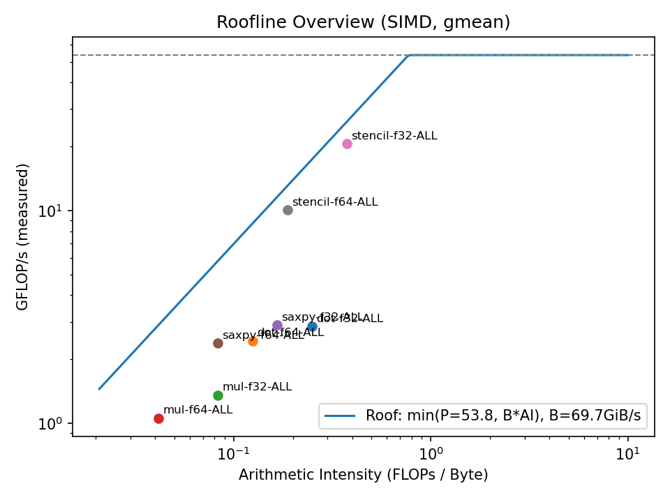

# Roofline Analysis Report

- Peak performance (P_peak): 53.76 GFLOP/s
- Memory bandwidth (B_mem): 69.66 GiB/s
- Filter condition: `stride=1`, region tagging: `off`

## 1) Overview Roofline Plot

## 2) Per-Kernel Roofline Plots
## 3) Measured vs Theoretical Cap and Bottleneck Classification

| kernel   | dtype   | region   |   gmean_ai |   gmean_gflops |   pred_cap |   util_% | bottleneck   |   samples |
|:---------|:--------|:---------|-----------:|---------------:|-----------:|---------:|:-------------|----------:|
| dot      | f32     | ALL      |      0.25  |          2.85  |     17.415 |   16.363 | Memory-bound |        40 |
| dot      | f64     | ALL      |      0.125 |          2.441 |      8.708 |   28.037 | Memory-bound |        40 |
| mul      | f32     | ALL      |      0.083 |          1.355 |      5.805 |   23.349 | Memory-bound |        40 |
| mul      | f64     | ALL      |      0.042 |          1.059 |      2.903 |   36.486 | Memory-bound |        40 |
| saxpy    | f32     | ALL      |      0.167 |          2.899 |     11.61  |   24.966 | Memory-bound |        40 |
| saxpy    | f64     | ALL      |      0.083 |          2.385 |      5.805 |   41.09  | Memory-bound |        40 |
| stencil  | f32     | ALL      |      0.375 |         20.579 |     26.123 |   78.779 | Memory-bound |        36 |
| stencil  | f64     | ALL      |      0.187 |         10.077 |     13.062 |   77.152 | Memory-bound |        36 |

Key Points:

- Points near `y = B*AI`: Memory-bound; improve data reuse, optimize stride.

- Points near `y = P_peak`: Compute-bound; increase SIMD issue rate or parallelism.

- `util_%` indicates utilization; DRAM region typically below 50%, focus on cache reuse and access pattern optimization.
