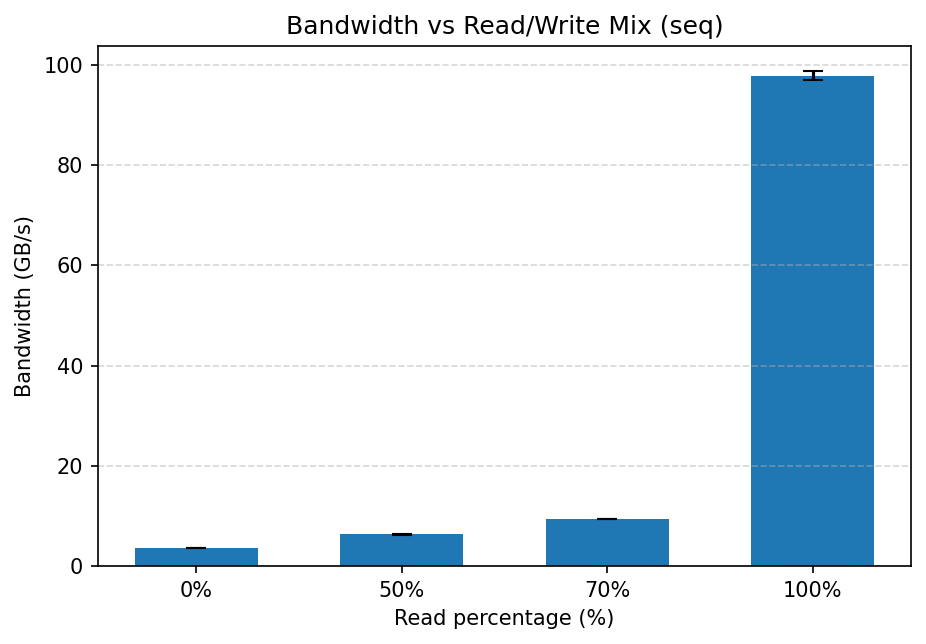

## 4. Read/Write Mix Sweep

### 4.3 Results (Mean ± Std)

**seq — Bandwidth (GB/s) mean ± std (samples)**
| read_pct | bw_mean | bw_std | samples |
| --- | --- | --- | --- |
| 0.0 | 3.653 | 0.031 | 3.0 |
| 50.0 | 6.322 | 0.124 | 3.0 |
| 70.0 | 9.403 | 0.05 | 3.0 |
| 100.0 | 97.818 | 0.9 | 3.0 |

### 4.4 Analysis

- As write ratio increases, bandwidth commonly drops due to write-allocate, store buffering pressure, and writeback bandwidth constraints.
- 70/30 and 50/50 often expose controller and memory subsystem differences (e.g., write-combining efficiency, eviction overhead).
- Random access (if enabled) typically lowers BW versus sequential due to reduced prefetch and poorer row-buffer locality.
- Error bars show run-to-run variance (std) across REPEAT trials; ensure repeats are sufficient for stable estimates.
