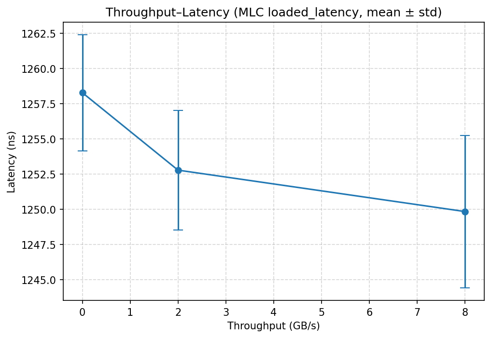

## 5. Access Intensity Sweep (MLC Loaded Latency)

### 5.3 Output Results (bucketed by throughput)

| Throughput (GB/s) | Mean Latency (ns) | Std (ns) | Count |
| --- | --- | --- | --- |
| 0.00 | 1258.27 | 4.12 | 3 |
| 2.00 | 1252.77 | 4.25 | 3 |
| 8.00 | 1249.83 | 5.42 | 3 |

**Knee (approx.)**: BW≈8.00 GB/s, Lat≈1249.8 ns

### 5.4 Analysis

- As injected throughput rises, queueing delays increase, so average latency climbs; after the knee, returns diminish.
- Error bars denote standard deviation across REPEAT runs per throughput bucket.
