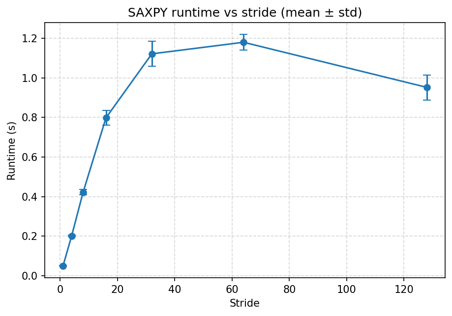

## 7. Cache-Miss impact on a lightweight kernel (SAXPY)

### 7.3 Results (mean ± std)

|     Stride |   Runtime_mean(s) |   Runtime_std(s) |   miss_rate_mean |   miss_rate_std |   LLC_load_misses(avg) |   L1_dcache_load_misses(avg) |
|-----------:|------------------:|-----------------:|-----------------:|----------------:|-----------------------:|-----------------------------:|
|   1.000000 |          0.049706 |         0.001464 |         0.686219 |        0.102357 |         6267316.000000 |               5564340.000000 |
|   4.000000 |          0.200915 |         0.003732 |         0.572536 |        0.252885 |        21707430.666667 |              11616453.000000 |
|   8.000000 |          0.421592 |         0.013577 |         0.581962 |        0.085534 |        48611558.666667 |              37717041.666667 |
|  16.000000 |          0.797965 |         0.036083 |         0.743343 |        0.081816 |        96524125.000000 |             110935350.000000 |
|  32.000000 |          1.121016 |         0.063239 |         0.717318 |        0.062139 |        80653386.666667 |             113304666.333333 |
|  64.000000 |          1.179466 |         0.040137 |         0.643240 |        0.119645 |        85536350.333333 |             113165217.666667 |
| 128.000000 |          0.951625 |         0.063177 |         0.513914 |        0.129073 |        66109449.666667 |             106641891.000000 |

### 7.4 Discussion

- According to AMAT ≈ HitTime + MissRate × MissPenalty, increasing stride worsens locality, raises miss rate, and elongates runtime.
- Compare L1 vs LLC miss components: larger strides typically inflate LLC-load-misses, which dominates end-to-end time.
