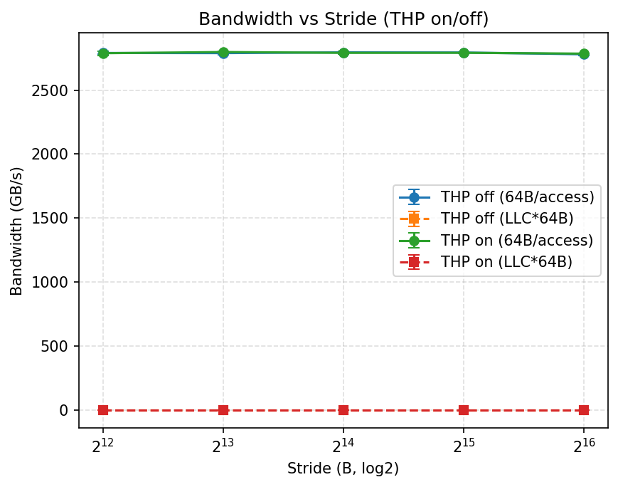
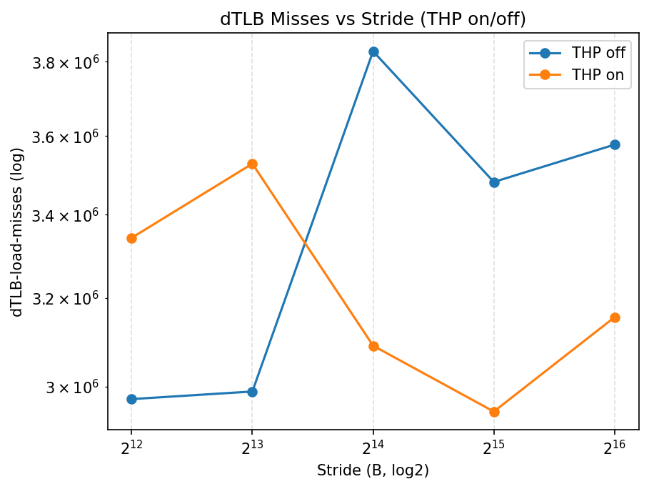

## 8. TLB Miss 对轻量核函数的影响

### 8.3 输出结果

| strideB | thp | count | bw_mean | bw_std | dtlb_mean | dtlb_std |
| --- | --- | --- | --- | --- | --- | --- |
| 4096 | off | 3 | 177714.47487200002 | 376.2959031198786 | 2972944.6666666665 | 449195.4741627896 |
| 8192 | off | 3 | 356578.525523 | 2046.1259637480136 | 2989383.3333333335 | 236614.05356684397 |
| 16384 | off | 3 | 714211.467963 | 2401.271365931112 | 3829372.6666666665 | 171869.9588826778 |
| 32768 | off | 3 | 1423943.4776653333 | 9810.344996196747 | 3481834.6666666665 | 53368.58694338212 |
| 65536 | off | 3 | 2845590.3870916665 | 1906.1786789604419 | 3577737.0 | 447408.49938395224 |
| 4096 | on | 3 | 178676.92034066666 | 651.9527475694664 | 3343088.6666666665 | 721619.3952336186 |
| 8192 | on | 3 | 358109.7714723333 | 281.1418708497625 | 3528487.3333333335 | 354245.97925217624 |
| 16384 | on | 3 | 709483.2892706668 | 5610.664181276438 | 3090756.0 | 537169.0627763293 |
| 32768 | on | 3 | 1417201.4007753332 | 10912.363476560617 | 2946064.0 | 171366.61871263027 |
| 65536 | on | 3 | 2837764.8111196663 | 5340.191175157583 | 3155434.6666666665 | 180151.26770115542 |

### 8.4 结果分析

THP 通过将 4 KiB 页合并为较大的物理页，扩大 dTLB 覆盖范围，降低跨页开销；禁用 THP 时，跨页步幅增大将显著提高 dTLB miss 并压低带宽；启用 THP 后，相同步幅下 miss 更低，带宽曲线更平滑，体现 TLB 效益。
结合 DTLB reach（条目数×页大小）可解释：大页可将可覆盖工作集从 MiB 级提升至数十 MiB 甚至更高，延缓进入“TLB 受限区”的拐点，与图中 THP=on 的 miss 与带宽改善一致。
