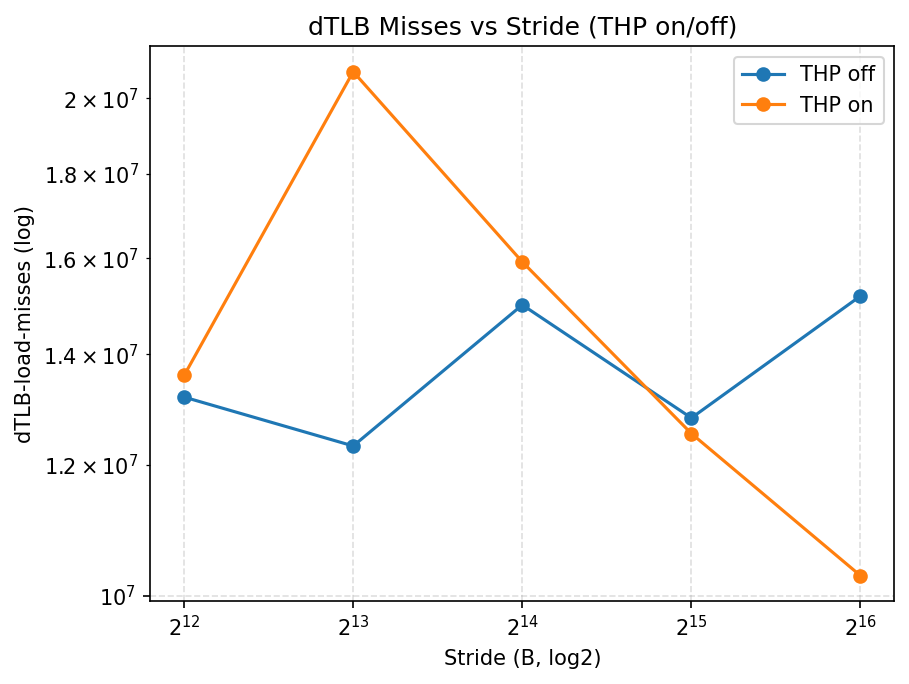

## 8. Impact of TLB Misses on Lightweight Kernels

### 8.3 Output Results

| strideB | thp | count | bw_mean | bw_std | bw_llc_mean | bw_llc_std | dtlb_mean | dtlb_std |
| --- | --- | --- | --- | --- | --- | --- | --- | --- |
| 4096 | off | 3 | 2790.2133403333332 | 11.508142388093507 | 1.1696986298377564e-05 | 9.527370862940594e-07 | 13190390.666666666 | 559353.9750572379 |
| 8192 | off | 3 | 2789.0362966666667 | 13.236528897647764 | 1.1464493840383763e-05 | 2.0221566933037314e-06 | 12322505.666666666 | 1511925.8494556977 |
| 16384 | off | 3 | 2794.806228 | 2.619467589441334 | 1.1191439721886327e-05 | 6.79875646362276e-06 | 14997635.0 | 367430.7600201703 |
| 32768 | off | 3 | 2793.8044843333337 | 1.5285649807449748 | 9.821843016596785e-06 | 1.0023291785659916e-05 | 12812380.666666666 | 2196418.8941694004 |
| 65536 | off | 3 | 2779.911912 | 9.46497846395042 | 7.219196296961907e-06 | 7.698669529754154e-06 | 15185401.666666666 | 1767092.259232758 |
| 4096 | on | 3 | 2788.2794186666665 | 17.009190097001255 | 4.411700159690681e-06 | 2.422599801488832e-06 | 13594440.666666666 | 2529646.7042348683 |
| 8192 | on | 3 | 2797.577032333333 | 3.9098330980595386 | 8.2346407659498e-07 | 4.256030380210507e-07 | 20752689.0 | 294752.7008476767 |
| 16384 | on | 3 | 2791.1271623333337 | 10.457050846268602 | 4.443725755106503e-06 | 4.743054930990235e-06 | 15923577.666666666 | 1540662.2236935433 |
| 32768 | on | 3 | 2791.4827320000004 | 2.03262431026386 | 1.6149302041671472e-06 | 1.4978463341444782e-06 | 12537378.666666666 | 312362.3737205451 |
| 65536 | on | 3 | 2784.9462660000004 | 1.7690333345079514 | 1.6639990873605079e-06 | 1.301782060802254e-06 | 10285860.333333334 | 1827151.8282664234 |

### 8.4 Result Analysis

With 4 KiB pages (THP off), page-scale strides exceed dTLB coverage, increasing TLB walks and suppressing bandwidth. Enabling THP merges small pages into huge pages, enlarging dTLB reach and reducing miss penalties. Both direct (64B/access) and LLC-based bandwidth estimates show smoother, higher throughput under THP at the same stride. As stride grows, dTLB misses rise sharply without THP but remain subdued with THP, validating the coverage advantage of large pages.
These results align with the DTLB reach model (entries × page size): huge pages extend the coverage region, delaying entry into the TLB-limited regime and sustaining higher effective bandwidth.
