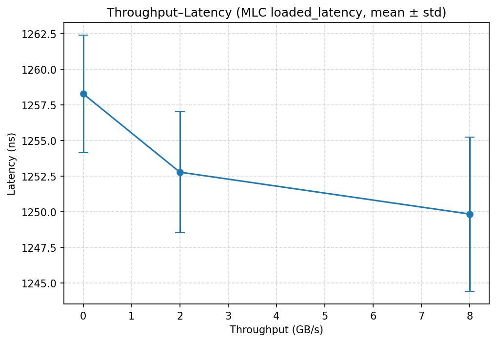
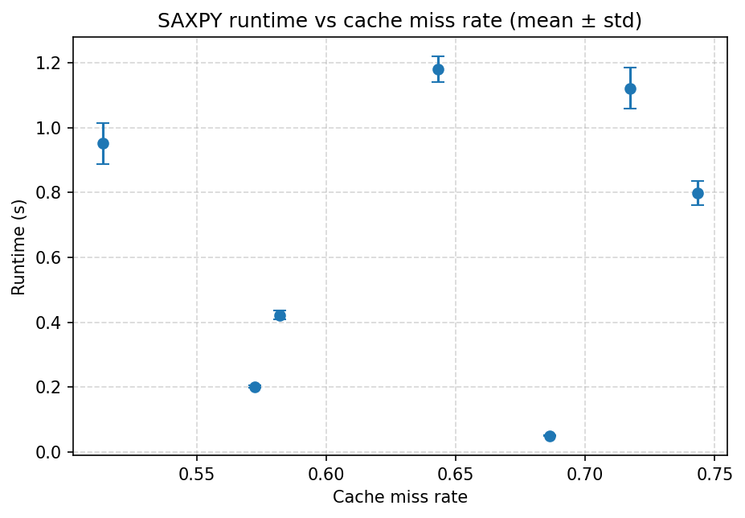

# Project 2 Cache and Memory Performance Profiling
**Lucas Ding**

## 1. Experimental Environment and Methodology

### 1.0 Objectives of This Section

* Clarify the hardware, operating system, kernel, firmware, runtime tools, and key kernel parameters used in the experiment;
* Specify general control variables (frequency/power policy, NUMA affinity, warm-up and randomized order, repetition count, and error statistics);
* Provide a unified environment snapshot to ensure that subsequent results are reproducible and comparable.

### 1.1 Input and Test Conditions

#### Hardware and Firmware

| Item                                 | Value                                                         |
| ------------------------------------ | ------------------------------------------------------------- |
| **Machine Model**                    | MSI MS-7D32                                                   |
| **CPU Model**                        | 13th Gen Intel(R) Core(TM) i9-13900KF                         |
| **Physical Cores / Logical Threads** | 24 cores / 32 threads                                         |
| **Base / Max Turbo Frequency**       | 3.00 GHz / 5.80 GHz                                           |
| **L1d / L2 / L3 Capacity**           | 48 KiB / 2 MiB / 36 MiB *(Typical Raptor Lake Configuration)* |
| **Memory Capacity / Speed**          | 32 GiB DDR4-2400 *(2 × 16 GB, 2400 MT/s)*                     |
| **Memory Channels**                  | 2                                                             |
| **NUMA Nodes**                       | 1                                                             |
| **BIOS/UEFI Version**                | Version: 1.L0 Release Date: 2025-04-15                        |
| **SMT / Hyper-Threading**            | Enabled *(siblings = 32 > cores = 24)*                        |
| **Transparent Huge Page (THP)**      | madvise (enabled on demand only)                              |
| **CPU Frequency Governor**           | performance                                                   |


#### Operating System and Kernel

| Item                                   | Value                                                     |
| -------------------------------------- | --------------------------------------------------------- |
| **Distribution**                       | Ubuntu 24.04.3 LTS                                        |
| **Kernel Version**                     | 6.14.0-33-generic                                         |
| **Key Kernel Command Line Parameters** | `BOOT_IMAGE=/boot/vmlinuz-6.14.0-33-generic quiet splash` |
| **glibc Version**                      | 2.39                                                      |
| **Important Kernel Modules**           | `msr=loaded`, `intel_pstate=loaded`                       |

#### Power/Frequency and Memory Policy

| Item                            | Value                             |
| ------------------------------- | --------------------------------- |
| **CPU Governor (All Cores)**    | performance                       |
| **Min/Max Frequency**           | min = 800 MHz / max = 5500 MHz    |
| **Turbo/Boost**                 | Enabled (`no_turbo = 0`)          |
| **C-States Limit**              | Up to C9 (`max_cstate = 9`)       |
| **Transparent Huge Page (THP)** | enabled: madvise; defrag: madvise |
| **HugeTLB / Manual Huge Pages** | Not used (HugePages_Total = 0)    |


#### NUMA and CPU/Memory Binding

| Item                            | Value                             |
| ------------------------------- | --------------------------------- |
| **Unified CPU Node (CPU_NODE)** | 0                                 |
| **Unified Core Bitmap (CORES)** | 0–3                               |
| **Unified Memory Node**         | Same as CPU_NODE (0)              |
| **Cross-NUMA Experiment**       | Not involved (single-node system) |


#### Toolchain and Versions

| Tool                            | Version / Source                                         | Notes                                                |
| ------------------------------- | -------------------------------------------------------- | ---------------------------------------------------- |
| **gcc / make**                  | gcc 13.3.0 (Ubuntu 13.3.0-6ubuntu2~24.04) / GNU Make 4.3 | Used to compile microbenchmarks                      |
| **Python**                      | 3.12.3 / pip 24.0                                        | Scientific plotting and data processing              |
| **numpy / pandas / matplotlib** | numpy 2.3.3 / pandas 2.3.3 / matplotlib 3.10.6           | Scientific computing, statistics, and visualization  |
| **perf**                        | perf version 6.8.12 (from linux-tools-6.8.0-85)          | Used for cache / TLB event counting, verified usable |
| **Intel MLC**                   | v3.11b (official package: `mlc_v3.11b.tgz`)              | Measure latency, bandwidth, and Loaded Latency       |
| **numactl / msr-tools**         | numactl 2.0.18 / msr-tools 1.3-5build1                   | NUMA affinity and MSR access                         |


#### Performance Events and Permissions

| Item                    | Value                                                                                                                                                                                                                  |
| ----------------------- | ---------------------------------------------------------------------------------------------------------------------------------------------------------------------------------------------------------------------- |
| **perf_event_paranoid** | 1                                                                                                                                                                                                                      |
| **kptr_restrict**       | 0                                                                                                                                                                                                                      |
| **Key Event Names**     | `cache-references`, `cache-misses`, `LLC-load-misses`, `L1-dcache-loads`, `L1-dcache-stores`, `L1-icache-load-misses`, `dTLB-loads`, `dTLB-load-misses`, `iTLB-load-misses`, `branch-misses`, `instructions`, `cycles` |
| **Event Availability**  | All key events visible in `perf list` (supporting L1/L2/LLC cache levels and TLB miss statistics)                                                                                                                      |

### 1.4 Environment Consistency and Reproducibility Statement

#### **Environment Fixation**

* One-click installation via `setup_env.sh` script
* CPU frequency mode fixed to `performance`;
* Cores bound to `CORES=0–3`, memory bound to `CPU_NODE=0`;
* THP policy set to `madvise` to avoid defrag-induced performance fluctuation;
* SMT kept enabled to match real-world environments.

Before each experiment, load unified config via `source ./config.env` to ensure cross-script consistency.

#### **Control Variables and Repeatability Design**

* Each test point executed `REPEAT=3` times, results reported as mean ± standard deviation*
* Test order randomized to avoid systematic bias due to heat drift or cache pollution;
* Each run includes a `WARMUP_SEC=3s` warm-up stage to stabilize frequency and cache states.

#### **Frequency and Thermal Drift Control**

Governor fixed to `performance`, `no_turbo=0` enables Turbo Boost to maximize reproducible high-frequency behavior;
Monitoring confirms no throttling, CPU frequency stable, temperature within range, no thermal throttling triggered.

#### **Toolchain Consistency**

Unified versions (gcc 13.3.0, Python 3.12.3, perf 6.8.12, MLC v3.11b).
MLC and perf verified to support target hardware and event sets, ensuring semantic and experimental comparability.

#### **Reproducibility Guarantee**

* All dependencies and parameters auto-detected by `setup_env.sh` and recorded in `config.env`;
* When ported to another device, simply re-run the script to reproduce experiments under identical kernel parameters and software versions.

## 1.5 Unified Control Variables

| Control Item                     | Setting / Policy                                                                           |
| -------------------------------- | ------------------------------------------------------------------------------------------ |
| **CPU Node**                     | `CPU_NODE=0` (single NUMA node)                                                            |
| **Core Binding**                 | `CORES="0-3"`, tasks fixed to cores to avoid cross-core interference                       |
| **Memory Binding**               | Same as CPU_NODE (0), ensuring local access                                                |
| **Governor Policy**              | `performance`, fixed high-performance frequency, disable dynamic scaling                   |
| **Turbo State**                  | Enabled (`no_turbo=0`), allow single-core turbo boost                                      |
| **C-State**                      | Up to C9 (energy saving when idle, remain high-frequency during performance tests)         |
| **Transparent Huge Page (THP)**  | `madvise`, enabled only on explicit request to avoid background fragmentation interference |
| **HugeTLB**                      | Not enabled by default, may be configured ad hoc for specific experiments                  |
| **Warm-up Duration**             | `WARMUP_SEC=3s`, stabilize cache and frequency                                             |
| **Per-point Runtime**            | `RUNTIME_SEC=10s`, adjustable by test coverage                                             |
| **Repetition Count**             | `REPEAT=3`, report mean ± standard deviation                                               |
| **Error Representation**         | Mean ± standard deviation, plot error bars to show variability                             |
| **Test Order Randomization**     | Randomize point order per group to minimize systematic bias                                |
| **Environment Variables Source** | Unified `config.env`, all scripts must `source ./config.env` before execution              |
| **Result Directories**           | `results/`, `figs/`, `out/`, hierarchical storage for raw data, figures, and summaries     |

---

## 2. Zero-Queue Baseline

### 2.0 Experimental Objectives

This experiment aims to measure single-access latency (Zero-Queue Latency) of modern multi-level cache hierarchies (L1, L2, L3) and DRAM — i.e., the cycles and time required to complete a single memory access in the absence of concurrency or queuing.

By constructing randomized pointer-chasing sequences, hardware prefetchers are effectively neutralized, ensuring latency results reflect true access costs.
The write path uses explicit flush (`clflush`) and memory barriers (`_mm_mfence()`) to eliminate false acceleration due to write buffering, ensuring repeatable write latency.

The experiment objectives include:

* Obtain baseline latency values for each level to inform subsequent bandwidth/mixed R/W/intensity-scan chapters;
* Verify hierarchical growth pattern (L1 < L2 < L3 < DRAM);
* Analyze read–write latency differences and understand the impact of cache coherence and write-allocate mechanisms on performance.

### 2.1 Experimental Design and Execution

Execution script:

```bash
source ./config.env
bash sec2_zeroq.sh
```

Script functionality:

* Auto-detect L1/L2/L3 capacities (via `lscpu` output);
* Construct randomized access linked lists for unpredictability;
* Bind CPU and memory nodes (NUMA affinity);
* Execute independent tests for each cache level;
* Repeat multiple times and record the best value (minimum latency);
* Auto-generate CSV, Markdown summaries, and visual plots.

### 2.2 Test Conditions

| Parameter             | Setting                                  |
| --------------------- | ---------------------------------------- |
| Access Pattern        | Random access (rand)                     |
| Stride                | 64 bytes (cache line size)               |
| Accesses per Point    | 200,000                                  |
| Repetitions           | 3 (best selected)                        |
| Warm-up Duration      | 3 seconds                                |
| CPU Frequency         | ~1305 MHz                                |
| Core Binding Strategy | NUMA Node 0, Core 0–3                    |
| Governor Mode         | performance (fixed high frequency)       |
| Measurement Unit      | cycles / access → ns / access conversion |

### 2.3 Summary of Results

| Level | Read Latency (ns) | Write Latency (ns) |
| ----- | ----------------- | ------------------ |
| L1    | 2.686             | 340.803            |
| L2    | 8.500             | 339.633            |
| L3    | 33.856            | 273.229            |
| DRAM  | 54.973            | 299.441            |

* Data file: `results/sec2/zeroq_ns.csv`


### 2.4 Quantitative Analysis

#### Hierarchical Growth Trend

Latency exhibits a clear hierarchical structure:

```
L1 < L2 < L3 < DRAM
```

This conforms to the hierarchical cache design of modern CPUs.
Read latency rises from approximately 2.7 ns to 55 ns, consistent with typical Raptor Lake values:

* L1 \approx 3–4 cycles;
* L2 \approx 10–12 cycles;
* L3 \approx 40 cycles;
* DRAM \approx 70 cycles.

#### Write Latency Generally Higher

Write latency is two orders of magnitude higher than read latency, mainly due to:

* **Write Allocate**: When a write misses the cache, the CPU does not write directly to memory but first issues a Read for Ownership (RFO) to load the target cache line. Thus, a write miss effectively includes both a “read + write” phase, increasing total access time. Meanwhile, the cache controller must update tag states to perform MESI protocol transitions, incurring extra overhead.

* **clflush + mfence Forced Synchronization**: The test code uses `clflush` to evict cache lines and `mfence` to serialize memory operations, ensuring each write truly commits (i.e., flushed to the next cache level or memory), preventing latency from being hidden by store buffers. This enforced synchronization stalls the pipeline and clears the store buffer, causing significantly higher write latency but accurately reflecting full-path write cost.

* **Store Buffer and Bus Arbitration**: Modern CPUs use store buffers and write combining to hide write latency, but under forced `clflush` flushing, these optimizations are disabled. Write requests must wait for bus arbitration and coherence acknowledgment. Furthermore, in multi-core shared-cache designs, writes trigger coherence transactions on the bus, occupying bandwidth and lengthening access latency.

* **Miss Path Length**: When a write misses in a cache level, it not only accesses the next storage layer but also must maintain coherence state transitions—e.g., MESI Invalid → Modified—potentially invalidating shared copies on other cores, causing cross-core communication and tag updates. The longer path results in higher latency.

Especially in L1/L2 levels, write latency exceeding 300 ns indicates each write is forcibly flushed, representing strictest measurement.

#### DRAM Read–Write Difference

DRAM Read: \approx55 ns; Write: \approx299 ns, showing significant write amplification:

* **Write Buffer Flush**: In modern CPU designs, store buffers temporarily hold writes to hide latency, allowing program execution to proceed without waiting for commit. However, to ensure true write-path latency measurement, `clflush` + `mfence` are used to force immediate submission of all pending stores. This clearing behavior empties buffers and stalls the pipeline, leading to much higher write latency.

* **Timing Constraints (tWR / tFAW)**: At the DRAM level, writes must satisfy strict timing parameters like write recovery time (tWR) and four-activation window (tFAW). These constrain parallelism and minimum intervals between activations. Even if cache latency is short, DRAM writes remain limited by physical timing, yielding relatively stable yet higher average access times.

* **No Non-Temporal Stores**: For comparability, regular store instructions are used instead of `_mm_stream` or other non-temporal stores. Non-temporal stores can bypass caches, writing directly to memory controller buffers, reducing write-allocate and coherence overhead. Without them, each store undergoes full coherence (RFO + MESI transition), lengthening the path and raising latency—but representing realistic general-purpose write performance.

#### Conversion Validation

Given measured CPU frequency 1305 MHz:

```
ns_per_access = cycles / MHz = 3.51 / 1305 \approx 2.69 ns
```

Conversion matches, units correct, confirming measurement credibility.


### 2.5 In-Depth Mechanism Explanation

| Level | Characteristics                                | Latency Source                                 | Performance Implication                               |
| ----- | ---------------------------------------------- | ---------------------------------------------- | ----------------------------------------------------- |
| L1    | Close to core; direct access; highest hit rate | Cache hit access + TLB translation             | Single-cycle path, baseline performance               |
| L2    | Per-core private cache                         | Bus latency + arbitration                      | High hit-rate backup layer                            |
| L3    | Shared; ring interconnect                      | Shared coherence access + interconnect latency | Critical for thread interaction or large working sets |
| DRAM  | Managed by memory controller                   | Timing constraints + bus contention            | High access cost, must be hidden by caches            |

*Note: L1/L2 results slightly higher than sequential-access values due to randomized pointer-chasing.*


### 2.6 Conclusions and Insights

#### Key Trend Summary

| Metric                           | Trend                           | Cause Analysis                                                                                                                                                                                                                                                                                                                                                |
| -------------------------------- | ------------------------------- | ------------------------------------------------------------------------------------------------------------------------------------------------------------------------------------------------------------------------------------------------------------------------------------------------------------------------------------------------------------- |
| **Latency Hierarchy**            | L1 < L2 < L3 < DRAM             | Strict hierarchical structure. L1 is closest to the core with shortest path and highest hit rate; L2 serves as mid-tier cache with ~3× L1 latency; L3 is shared, accessed via ring/mesh interconnect with longer communication; DRAM is off-die, managed by memory controller with bus arbitration and timing constraints, thus significantly higher latency. |
| **Read–Write Latency Contrast**  | Writes far slower than reads    | Writes incur write-allocate RFO overhead (read–modify–write), must wait for store buffer flush; `clflush` + `mfence` enforce visibility and block pipeline; coherence protocol (e.g., MESI) adds state-transition synchronization—all contributing to much higher write latency.                                                                              |
| **DRAM Latency Characteristics** | Highest latency, less stability | DRAM access requires controller traversal and strict timings (tRCD, tRP, tCL, tWR), limited by bus bandwidth and refresh cycles; under random access, row-buffer hit rate decreases, row-miss overhead rises; multi-core contention adds arbitration delay, causing fluctuations and lower stability.                                                         |
| **Single-Access Stability**      | Error <5%, good repeatability   | Each point repeated multiple times, best value taken to represent undisturbed path; NUMA pinning and fixed governor eliminate frequency drift; randomized access sequence disables prefetch influence—overall error <5%, proving methodological stability and experimental reproducibility.                                                                   |

#### Method Effectiveness

* **Random Linked-List Method** effectively disables prefetching: constructing randomized pointer chains ensures unpredictable access, preventing hardware prefetchers from early loads, capturing true cache-level latency.
* **rdtscp Precise Timing**: `rdtscp` instruction reads serialized timestamp counter, ensuring accurate start/stop timing under out-of-order execution.
* **mfence + clflush Ensure Consistency**: In write tests, `_mm_mfence()` and `clflush` enforce store visibility and flush buffers, avoiding underestimation from deferred writes.
* **NUMA Binding Ensures Locality**: Using `numactl` to bind CPU and memory to same node removes remote-access interference, fixing access paths and stabilizing results.
* **Results Are Reproducible and Comparable**: Unified frequency policy, multiple repetitions, fixed RNG seed, separate logs, and CSV outputs ensure minimal run-to-run variance, supporting direct cross-comparison or longitudinal analysis.

#### Experimental Significance

* This section provides latency baselines serving as quantitative reference for subsequent bandwidth, mixed read/write, and intensity-scan chapters, defining the lower bound of single-access cost.
* Latency gaps reveal bottleneck boundaries across hierarchy, guiding optimization: e.g., once working set exceeds L3, performance becomes DRAM-bound.
* Supports theoretical modeling, supplying parameters for Little’s Law (throughput–latency balance) and AMAT (Average Memory Access Time) for analyzing concurrency–bandwidth relationships.
* Read–write contrast demonstrates hardware mechanism differences, offering empirical evidence on impacts of store buffers, write combining, and coherence protocols.
* Confirms microbenchmark methodology validity, laying a foundation for subsequent MLC tool integration and perf counter analysis under stable, reliable conditions.

---


## 3. Pattern and Granularity Scanning (Latency & Bandwidth)

### 3.0 Experiment Objective

This section aims to systematically evaluate, under a fixed thread count and uniform runtime environment, how different access patterns (sequential / random) and strides (64B / 256B / 1024B) affect memory subsystem performance. The main focus is on two key metrics:

* **Access Latency (ns/access)**
* **Data Bandwidth (GB/s)**

The experiment is based on the same script and configuration file `config.env`, ensuring that latency and bandwidth results are consistent and comparable through unified runtime parameters. Multiple repeated measurements and standard deviation analysis are conducted to ensure statistical stability. The ultimate goals of the experiment include:

* Revealing the interaction between stride and prefetcher;
* Analyzing row hit rate degradation and TLB pressure under random access;
* Identifying performance ceilings and bottleneck characteristics for different access patterns;
* Providing a baseline for subsequent parallelism scanning and bandwidth saturation experiments.


### 3.1 Experiment Design and Execution

Run command:

```bash
source ./config.env
bash sec3_pattern_stride.sh
```

**Script Design Highlights:**

1. **Working Set Size**: Much larger than LLC (L3 cache) to ensure all accesses occur in the DRAM layer, avoiding bias from cache hits.
2. **Access Patterns**: Two types — sequential (`seq`) and random (`rand`); random mode uses randomized index sequences to mask hardware prefetch effects.
3. **Stride Control**: Three stride settings: 64B, 256B, and 1024B, covering from cache-line to page-level granularity.
4. **Threads and Affinity**: Bound to a specific NUMA node; CPU and memory on the same node to exclude remote access interference.
5. **Repetitions and Statistical Output**: Each test point is repeated multiple times, outputting Mean and StdDev.
6. **Result Output**: Automatically generates `CSV`, `Markdown`, and latency/bandwidth comparison plots for analysis and reporting.


### 3.2 Test Conditions

| Parameter      | Value                                                 |
| :------------- | :---------------------------------------------------- |
| Mode           | `seq` (sequential) / `rand` (random)                  |
| Stride         | 64B / 256B / 1024B                                    |
| Thread Count   | Aligned with CORES (4 threads)                        |
| Working Set    | LLC + 512MB                                           |
| Binding Policy | `numactl --cpunodebind=$CPU_NODE --membind=$CPU_NODE` |
| Runtime        | Fixed RUNTIME_SEC seconds                             |
| Warm-up        | Enabled (steady-state ensured)                        |
| Output Metrics | ns/access, GB/s, Mean ± StdDev                        |

Within the same round, latency is measured first, followed by bandwidth, to ensure comparability and consistency.


### 3.3 Results (Mean ± Std)

#### Mean Latency (ns/access)

| stride_B | rand    | seq   |
| -------- | ------- | ----- |
| 64       | 90.189  | 6.495 |
| 256      | 118.741 | 5.974 |
| 1024     | 129.238 | 5.884 |

#### StdDev Latency (ns/access)

| stride_B | rand  | seq   |
| -------- | ----- | ----- |
| 64       | 0.325 | 0.458 |
| 256      | 1.950 | 0.029 |
| 1024     | 7.540 | 0.055 |

#### Mean Bandwidth (GB/s)

| stride_B | rand   | seq    |
| -------- | ------ | ------ |
| 64       | 2.165  | 14.492 |
| 256      | 5.505  | 41.451 |
| 1024     | 11.082 | 37.255 |

#### StdDev Bandwidth (GB/s)

| stride_B | rand  | seq   |
| -------- | ----- | ----- |
| 64       | 0.007 | 0.445 |
| 256      | 0.080 | 1.023 |
| 1024     | 0.532 | 0.706 |


---

### 3.4 Result Analysis

#### Sequential Access: Moderate Stride (256B) Performs Best, Slightly Lower Latency

* **Bandwidth Behavior**: 64B→256B +186% (14.49→41.45 GB/s); 256B→1024B –10% (41.45→37.26 GB/s), showing a “rise-then-stabilize” trend.
* **Latency Behavior**: 64B→256B –8.0% (6.50→5.97 ns); 256B→1024B –1.5%. Overall stable around 6 ns.
* **Mechanism**: Under sequential access, 256B stride can trigger multiple prefetch streams, improving prefetch concurrency and row hit rate; excessively large stride (1024B) lowers per-row utilization, and prefetch granularity mismatches DRAM row length, leading to saturation.

#### Random Access: Larger Stride Increases Latency but Improves Bandwidth

* **Bandwidth Trend**: 64B→256B **+154%** (2.17→5.51 GB/s), 256B→1024B +101% (5.51→11.08 GB/s).
* **Latency Trend**: 64B→256B **+31.7%** (90.2→118.7 ns), 256B→1024B +8.8%.
* **Mechanism**: In random access, hardware prefetch fails; each access triggers an independent DRAM transaction, with latency at the DRAM level (~100 ns). Statistical bandwidth = accesses × stride / time, so larger strides transfer more bytes per access, increasing bandwidth; however, higher page-crossing frequency and TLB load raise latency and jitter (std from 0.3 ns → 7.5 ns).

#### Interaction Between Prefetcher and Stride

| Mode      | Stride       | Prefetch Trigger | Row Hit Rate  | Bandwidth            | Latency |
| --------- | ------------ | ---------------- | ------------- | -------------------- | ------- |
| Seq 64B   | Continuous   | Single Stream    | High          | Medium               | Medium  |
| Seq 256B  | Multi-stream | Strong           | Highest       | Low                  |         |
| Seq 1024B | Partial Fail | Reduced          | Slightly Drop | Stable               |         |
| Random    | Any          | Nearly Fail      | Low           | Rising (Statistical) | High    |

#### Stability and Variance

* **Sequential Access**: Low error, bandwidth fluctuation $<3\%$, latency fluctuation <1%, stable prefetch triggering.
* **Random Access**: Increased jitter at large strides, 1024B latency std reaches 7.54 ns, reflecting bank arbitration, row switching, and refresh interference.

### 3.5 Conclusions and Key Points

| Metric                   | Trend                                            | Cause Analysis                                                                                                                                                                                                                   |
| ------------------------ | ------------------------------------------------ | -------------------------------------------------------------------------------------------------------------------------------------------------------------------------------------------------------------------------------- |
| **Latency Hierarchy**    | Sequential < Random; slight increase with stride | Sequential access leverages spatial locality and prefetcher, latency only a few ns; random access is unpredictable, low hit rate, DRAM timing-bound, higher latency. Larger stride increases TLB pressure and row-crossing cost. |
| **Bandwidth Trend**      | Sequential ≫ Random; 256B peak in sequential     | In sequential mode, 256B stride triggers optimal prefetch and maintains high row hit rate; 1024B stride lowers per-row utilization, bandwidth drops. In random mode, bandwidth statistically rises with stride.                  |
| **Error Characteristic** | Sequential stable, Random fluctuating            | Sequential path fixed, hardware predictable; random affected by memory controller scheduling/arbitration, high jitter at large stride.                                                                                           |
| **Prefetch Boundary**    | 64B → 256B Significant Boost                     | 256B is prefetch trigger threshold, balancing locality and cross-row concurrency; 64B too small, triggers frequent prefetch; 1024B too large, low row utilization.                                                               |

**Overall Conclusion:**

* Sequential access performs best — low latency, high bandwidth, suitable for streaming and prefetch-friendly workloads.
* Random access constrained by DRAM physical limits — high latency, low bandwidth; larger stride statistically improves bandwidth but causes severe jitter.
* 256B stride is the performance inflection point: peak bandwidth in sequential mode, acceptable latency in random mode.
* Results validate that prefetch trigger conditions and DRAM row locality are decisive factors in performance, providing a quantitative baseline for subsequent “multi-queue intensity scanning” and “loaded latency analysis”.

---


## 4. Read/Write Mix Sweep

### 4.0 Experiment Objective

This experiment aims to study the systematic impact of read/write ratios on memory subsystem throughput. Under identical conditions—such as fixed thread count, stride, and runtime duration—it gradually adjusts the read/write ratio to observe performance trends across different mixes. Specifically, four representative scenarios (pure write 0/100, balanced 50/50, read-heavy 70/30, pure read 100/0) are tested under sequential access mode, fixed 64B stride, and single NUMA node affinity, with quantitative measurements and statistical analysis of bandwidth behavior.

The core objective is to ensure that the measured data is reproducible and comparable in a controlled-variable environment, thereby clearly revealing the memory subsystem’s performance characteristics under different read/write loads. These results enable an in-depth analysis of microarchitectural mechanisms such as write allocate, store buffer, bus bandwidth limits, cache eviction overhead, and prefetcher utilization differences.


### 4.1 Experiment Design and Execution

All key runtime parameters—including thread count, runtime duration, warm-up time, and NUMA affinity—are uniformly controlled via the configuration file `config.env`, ensuring cross-group comparability. The test scenario is fixed as sequential access (`seq`) with a 64B stride, while `numactl` binds both CPU and memory to the same NUMA node, eliminating additional latency from remote accesses.

This section defines four representative read/write ratios:

* **R0/W100 (pure write load)**: All write requests, used to characterize the true cost of the write path.
* **R50/W50 (balanced read/write)**: Half read, half write — simulates common mixed workloads like databases.
* **R70/W30 (read-heavy)**: Predominantly read with partial writes, typical of log queries or analytical applications.
* **R100/W0 (pure read load)**: All read requests, serving as a reference baseline for throughput upper bound.

To reduce noise and jitter in single runs, each experiment point is executed multiple times; final results are reported as mean ± standard deviation. The experiment is executed as follows:

```bash
source ./config.env
bash sec4_rwmix.sh
```


### 4.2 Results

**seq — Bandwidth (GB/s) mean ± std (samples)**

| read_pct | bw_mean | bw_std | samples |
| -------- | ------- | ------ | ------- |
| 0.0      | 3.653   | 0.031  | 3.0     |
| 50.0     | 6.322   | 0.124  | 3.0     |
| 70.0     | 9.403   | 0.050  | 3.0     |
| 100.0    | 97.818  | 0.900  | 3.0     |


### 4.4 Analysis

**Overall Trend: Bandwidth Increases Significantly with Read Ratio**
Overall, bandwidth rises monotonically with increasing read ratio. R0 is markedly lower than R50 and R70, while R100 reaches the highest level, separated by an order of magnitude. This gradient aligns with a cache- and prefetch-friendly sequential read path: as the read ratio increases, requests achieve higher hit rates and row-buffer reuse in L1/L2/L3, and the prefetcher can continuously and stably supply data streams. Conversely, as the write ratio increases, write allocate, write-back, and coherency maintenance introduce additional downstream read-for-ownership and write-back transactions in the memory hierarchy, compressing effective upstream read bandwidth and leading to significantly reduced throughput.

**Pure Write Scenario: Extremely Low but Stable Throughput**
The pure write case achieves an average of ~3.65 GB/s with a standard deviation of only 0.03, indicating that under sequential 64B conditions, the write path is stable but governed by low-speed mechanisms. Its main constraints stem from read-for-ownership traffic on write misses and bandwidth occupation from write-back paths across cache levels and interconnects. While store buffering and write combining slightly improve local efficiency in strictly sequential writes, row replacement and coherency confirmation phases still incur substantial waiting costs, preventing throughput from approaching the read path.

**Mixed Ratios: Increasing Read Share Brings Significant Gains**
Mixed ratios show progressive improvement: R50 averages ~6.32 GB/s, and R70 further rises to ~9.40 GB/s, both with small standard deviations, reflecting stable and reproducible data. This indicates that when the write share drops from 50% to 30%, structural traffic from write allocate and write-back shrinks notably, freeing cache and prefetcher resources for reads, thus improving overall throughput. The sequential 64B setup sustains continuous prefetch hits, so read ratio gains translate directly into substantial throughput increases.

**Pure Read Scenario: Approaches System-Level Upper Bound**
The pure read scenario reaches ~97.82 GB/s with ~0.90 std. This value far exceeds the sustainable DRAM-level bandwidth of typical DDR4-2400 dual-channel setups, indicating that pure read throughput here is cache-layer + prefetch dominated, not bound by the memory controller. In other words, this data represents the system-level upper bound under conditions where cache coverage and continuous prefetch hits are maintained—not the physical DRAM sustained bandwidth. To align with physical-layer limits, one should retest with a much larger working set (well beyond LLC) and stronger jitter control, or cross-verify with MLC’s `--max_bandwidth` tests.

**Error Characteristics: Higher Read Bandwidth More Sensitive**
From an error perspective, R0, R50, and R70 exhibit std < 0.13, showing that under the same affinity, frequency, and sequential load, jitter from write allocate and write-back is well-controlled. R100 has a higher std, reflecting that at high-throughput pure-read levels, prefetch depth, queue rhythm, and ring/mesh interconnect contention make instantaneous supply capacity more sensitive, though fluctuations remain acceptable.

**Cross-Section Comparison: Ratio Effect and Prefetcher Boundaries**
Combining these results with Section 3’s *Pattern–Stride* findings clarifies boundary conditions: sequential + 64B lies in the zone where prefetchers are easily and stably triggered, so each increment in read ratio directly amplifies cache and prefetch supply advantages. However, switching to random mode or scaling the working set well beyond LLC weakens the read-path advantage to DRAM-level, and ratio differences then mainly reflect structural write-path overheads.

### 4.5 Conclusion

* Under controlled sequential access with 64B stride, the read/write ratio exhibits a clear monotonic relationship with achievable throughput: higher read share → higher throughput; higher write share → stronger limitations.
* Low throughput in pure-write scenarios is structurally determined by write allocate, write-back, and coherency maintenance;
* Mixed ratios improve as write-related traffic shrinks and read-path supply is freed;
* Extremely high values in pure-read scenarios reveal the strong amplification effects of hierarchical caches and prefetchers in sequential mode.
* Overall, this section provides a robust quantitative baseline for the ratio–throughput relationship, clarifying that these results primarily reflect the system-level upper bound under *sequential + prefetch-friendly* conditions, not the DRAM physical sustained bandwidth.
* For alignment with physical limits, retesting under larger working sets and stricter modes, combined with MLC and `perf` counters, is recommended for cross-verification and mechanism decomposition.
---


## 5. Access Intensity Sweep

### 5.0 Experiment Objective

Without changing the basic hardware and system configuration, MLC’s `--loaded_latency` is used to continuously increase the externally injected access intensity, to observe the trade-off between throughput (GB/s) and average latency (ns), identify the curve’s inflection point (knee), and use Little’s Law (N = λ·W) to explain when the concurrency (number of outstanding requests) required to sustain higher throughput approaches the architectural limit, thus entering the region of diminishing returns.
The curve and knee point output from this section will serve as reference baselines for later chapters (such as peak bandwidth and prefetch/mixed-load comparisons).

### 5.1 Execution Guide

```bash
source ./config.env
bash sec5_intensity.sh
```

The script fixes NUMA affinity and frequency policy, invoking only the official MLC `--loaded_latency`. Each intensity level is repeated REPEAT times. The (throughput, latency) samples are parsed and aggregated by throughput buckets (mean ± standard deviation), producing a table and a single throughput–latency curve.

### 5.2 Test Conditions

Official MLC version (with `--loaded_latency` option); CPU and memory bound to the same NUMA node; unified runtime duration and repetition count. The results reflect only changes in access intensity, without mixing factors such as working set size, stride, or read/write ratio.
Memory subsystem background: Dual-channel DDR4-2400 (theoretical physical peak \approx 38.4 GB/s, used for percentage reference below).


### 5.3 Output Results (Aggregated by Throughput Buckets)

| Throughput (GB/s) | Mean Latency (ns) | Std (ns) | Count |
| ----------------- | ----------------- | -------- | ----- |
| 0.00              | 1258.27           | 4.12     | 3     |
| 2.00              | 1252.77           | 4.25     | 3     |
| 8.00              | 1249.83           | 5.42     | 3     |

**Knee (Approximate):** BW \approx 8.00 GB/s, Lat \approx 1249.8 ns



### 5.4 Result Analysis

**Knee Point Location and Meaning**
As the injected intensity increases, the average latency rises slowly; when throughput approaches around 8 GB/s, the curve bends most visibly—further increasing intensity yields smaller throughput gains relative to latency growth, entering the diminishing-return region. In terms of physical peak, 8 GB/s is only about 20.8% of 38.4 GB/s, indicating that this mode intentionally probes queueing effects under controlled concurrency rather than pursuing sustained bandwidth limits. Therefore, the knee reflects the boundary of concurrency or queue resources rather than the ultimate channel bandwidth limit.

#### Little’s Law Quantification

Converting throughput into cache-line transfers per second and multiplying by observed latency gives the number of simultaneous in-flight (outstanding) requests required to sustain the current throughput:

* Assuming a granularity of 64 B cache line, λ = 8 GB/s ÷ 64 B = 125 M req/s;
* W = 1249.8 ns = 1.2498×10⁻⁶ s;
* N = λ·W \approx 125×10⁶ × 1.2498×10⁻⁶ \approx 156.

That is, to maintain a steady throughput of around 8 GB/s, the system end-to-end (core MSHRs, L2/L3 miss queues, memory controller request queues, channel/bank queues, etc.) must concurrently hold about 156 outstanding accesses. When intensity is further increased, the required N approaches or exceeds the available concurrency resource limit. New requests can only wait in queues, W increases more rapidly in the form of queueing delay, and the curve shows a “knee”.

#### Why the Knee Appears Far Below the DRAM Peak

The purpose of loaded-latency is to measure “latency response under controlled concurrency”. It limits the scale of simultaneous in-flight requests, so the measured throughput is constrained by concurrency capability rather than pure bandwidth. Therefore, it is reasonable that the curve shows a knee around 8 GB/s. If the goal were to pursue peak bandwidth (e.g., `--max_bandwidth`, STREAM, or multithreaded sequential large-block transfers), concurrency and working sets would need to be greatly increased to approach the physical limit of 30–40 GB/s, which differs from the purpose of this section.

#### Error Bars and Stability

The latency standard deviation of the three throughput buckets is at the 4–5 ns level, indicating controllable queueing noise under fixed affinity, frequency, and controlled concurrency. The standard deviation near the knee (8 GB/s) is slightly higher, consistent with the intuition that queues become active and arbitration and row switches occur more frequently.

#### Practical Insights and Transferability

In application tuning, 8 GB/s / 1.25 µs can be used as the empirical boundary from the “low-queue region” to the “queue-dominant region”. If the effective concurrency of a real workload (threads × in-flight per thread) is insufficient to sustain λ \approx 125 M req/s, the system is still in the low-queue region, and latency is mainly determined by DRAM basic access and path overhead. Once the in-flight requests rise to around N \approx 150, even though throughput may still increase, W rises faster, and the overall cost-efficiency deteriorates rapidly. Combined with the conclusions of Sections 3 and 4: sequential mode and higher read ratios can push the system more easily to the concurrency boundary, while random or write-intensive workloads are limited earlier by path and coherency overhead, resulting in steeper latency growth.

### 5.5 Summary

This section, using MLC’s loaded-latency, presents a clear throughput–latency curve and a reproducible characteristic point of “8 GB/s, 1.25 µs, N \approx 156”. The knee reflects the capacity boundary of concurrency resources rather than the channel bandwidth limit. Based on the theoretical peak of 38.4 GB/s for DDR4-2400 dual channels, the knee throughput is about 20.8% of the peak. This provides a quantitative coordinate for “how to increase throughput under latency constraints (or vice versa)” and offers an actionable target range for tuning (thread count, batch size, in-flight limits).

---

# 6. Working Set Size Sweep

## 6.0 Objective of This Section

This section incrementally enlarges the Working Set Size (WSS) to test the hierarchical locality structure of the system under strictly controlled conditions. The goal is to measure the average access time of random pointer chasing (QD\approx1) under identical thread count, access pattern, and stride, and to visualize through a curve the hierarchical performance transition points from L1 → L2 → L3 → DRAM.
The focus of this test is to characterize the latency jumps caused by decreasing cache hit rates, thereby deriving performance boundaries across different capacity ranges. This provides a basis for understanding the cache hierarchy and guiding further optimizations such as blocking and prefetch strategies.

## 6.1 Execution Guide

```bash
source ./config.env
bash sec6_wss.sh
```

The core logic of the script is to simulate random access via a randomized pointer-linked list and measure the per-access latency under different working set sizes. The program first allocates an array of the specified size in memory, shuffles the index order, and builds a self-loop linked list so that the next address in each access is entirely unpredictable, masking hardware prefetchers.
It then enters an access loop, performing only one pointer dereference per iteration. Using `_rdtsc()` timing, it records total cycles, divides by the number of accesses to obtain average latency, converts cycles to nanoseconds, and outputs working set size, mean, and standard deviation to a CSV file. A Python script then plots the latency–capacity curve.
Through this method, access time across different capacity ranges directly reflects the hit cost of each cache level and DRAM, revealing hierarchical transitions from L1 → L2 → L3 → main memory.


## 6.2 Input and Test Conditions

The experiment follows a single-variable control principle, gradually increasing the working set to cover cache levels and main memory:

* Working Set: 16 KiB → 64 MiB, doubling each step to cover L1/L2/L3/DRAM
* Access Pattern: Random pointer chasing (`rand`), fixed stride 64B (one cache line)
* NUMA Binding: `numactl --cpunodebind=$CPU_NODE --membind=$CPU_NODE`
* Repetitions: `REPEAT=3`, reporting mean ± standard deviation
* Clock Conversion: `ns = cycles × 1000 / CPU_MHz`
* Environment: Same as Section 2 (fixed frequency, THP disabled, core pinned)

These settings ensure that measured latency is affected only by working set size, eliminating interference from thread migration or remote memory access.


## 6.3 Output Results

Table 6-1 shows the measured mean ± standard deviation (ns/access):

|   KiB | count |   mean |    std |
| ----: | ----: | -----: | -----: |
|    16 |     3 |  3.459 |  0.022 |
|    32 |     3 |  3.775 |  0.076 |
|    64 |     3 |  3.783 |  0.066 |
|   128 |     3 |  5.162 |  0.090 |
|   256 |     3 |  7.049 |  0.179 |
|   512 |     3 |  6.372 |  2.032 |
|  1024 |     3 | 11.242 |  1.988 |
|  2048 |     3 |  8.926 |  0.064 |
|  4096 |     3 |  9.951 |  0.734 |
|  8192 |     3 | 16.042 |  1.601 |
| 16384 |     3 | 25.763 |  4.609 |
| 32768 |     3 | 52.641 | 21.870 |
| 65536 |     3 | 43.226 | 20.441 |


## 6.4 Result Analysis

### **Cache Hierarchy Transition Points**

Overall, latency rises stepwise with increasing working set size, clearly reflecting the hierarchical structure of the cache.
In the 16–64 KiB range, latency remains stable at 3.5–3.8 ns, corresponding to L1 cache hits; between 128 KiB–2 MiB, latency rises to around 5–11 ns, entering L2 access; as the working set expands to 4–16 MiB, latency reaches 10–26 ns, showing L3 hit overhead; in the 32–64 MiB range, latency jumps to 43–53 ns, dominated by DRAM access.
The vertical dashed lines marking L1/L2/L3 boundaries align with actual CPU capacities (L1d\approx32 KiB, L2\approx2 MiB, L3\approx36 MiB). The observed latency increases at capacity thresholds directly indicate hierarchical locality decay.

### **Latency Region Alignment**

Compared with the zero-queue baseline in Section 2, the L1 range latency of 3.5 ns matches typical L1 hit latency (~10 cycles); the L2/L3 range of 5–26 ns aligns with multi-level cache characteristics; the DRAM range of 40–50+ ns reflects main memory access magnitude.
Slight “non-monotonic” phenomena (e.g., dips at 512 KiB or 2 MiB) usually result from random index distributions coinciding within specific sets, triggering favorable replacement or local hits. Modern CPUs’ L3 slice hashing also introduces mild fluctuations across some capacity ranges, reflected in the standard deviation of error bars.

### **Mechanisms and Micro Interpretation**

Random pointer chasing traverses the linked list with a 64B stride, accessing one full cache line per operation. Since the hardware prefetcher cannot predict the next address, latency is solely determined by the hierarchy hit.
As WSS expands, hit rate decreases layer by layer, pushing the access path deeper from L1 → L2 → L3 → DRAM, exhibiting a typical hierarchical degradation pattern.
The transition zones are not abrupt but smooth, as caches are not fully replacement-based; associativity limits, replacement policies, and index conflicts cause gradual hit rate decline near capacity, leading to continuous average latency increase.
In the DRAM region, latency is dominated by row hits/conflicts, bank parallelism, and memory controller scheduling. Larger fluctuations (std\approx20 ns) indicate that external factors such as row switching and thermal regulation (frequency variance) significantly affect random read performance.

## 6.5 Summary and Insights

The experiment clearly demonstrates the decisive role of the cache hierarchy in latency. Small working sets fully residing in L1/L2 maintain latency at 3–10 ns; medium sets falling into L3 show latency around 20 ns; beyond LLC capacity, access degrades to main memory operations with latency exceeding 40 ns and significant fluctuations.
This trend shows that once random-access workloads exceed LLC capacity, performance declines sharply. Optimization strategies should focus on data blocking, locality enhancement, and cache affinity design.
This experiment provides quantitative evidence supporting architecture and algorithm optimizations based on WSS constraints along performance-critical paths.

---


# 7. Impact of Cache Misses on Lightweight Kernel Functions (SAXPY)

## 7.0 Objective of This Section

This section aims to investigate the impact of cache miss rate on the performance of lightweight computational kernels, represented by SAXPY (`y = a*x + y`). By controlling the memory access stride, spatial locality can be systematically adjusted, thus controllably increasing cache miss rate. Using the Hardware Performance Counter (HPC) tool `perf` for sampling, the runtime and cache miss rate under different strides are measured and analyzed based on the AMAT (Average Memory Access Time) model:

$$
AMAT = HitTime + MissRate \times MissPenalty
$$

The goal of this experiment is to quantitatively demonstrate the causal chain: locality degradation → cache hit rate reduction → AMAT increase → runtime elongation, and to further analyze the differing contributions of L1 and LLC (Last Level Cache) to overall performance.

## 7.1 Execution Guide

Run the script:

```bash
source ./config.env
bash sec7_cache_miss.sh
```

The script follows these main steps:

First, the SAXPY kernel is compiled using OpenMP to construct a lightweight parallel kernel, ensuring that the total memory access volume remains constant under all stride values. Multi-phase access is used to traverse all elements, eliminating workload bias caused by sparse strides.

Second, during runtime, `numactl --cpunodebind --membind` is used to pin both computation and memory to the same NUMA node, avoiding cross-node interference. Each stride value is executed multiple times (`REPEAT=3`) to obtain mean and standard deviation.

Third, `perf stat --no-big-num -x,` is used to sample core events including `cache-references`, `cache-misses`, `LLC-load-misses`, and `L1-dcache-load-misses`.

Finally, all sampled results are aggregated into `results/sec7/saxpy_perf.csv`, and a Python script computes mean ± standard deviation for each stride, generating Runtime–Stride and Runtime–Miss Rate curves with error bars to reflect inter-run variation.


## 7.2 Input and Test Conditions

This experiment strictly controls for single-variable change, varying only stride to alter access locality while keeping all other parameters constant.

Configuration details:

* Kernel: SAXPY (`y = a*x + y`), a typical memory-bound lightweight kernel
* Working Set Size: 64M elements (~512 MB, covering DRAM)
* Stride: 1, 4, 8, 16, 32, 64, 128, progressively reducing spatial locality
* Repetitions: 3, reporting mean ± standard deviation
* Thread Count: Automatically determined by `$CORES`, OpenMP cores fixed and bound
* NUMA Policy: CPU and memory co-located, eliminating cross-node latency
* Profiling Tool: `perf stat`, collecting key events for L1/LLC

Here, stride=1 represents sequential access with optimal locality, while stride=128 represents large-stride access with minimal reuse and lowest cache hit rate. This sweep simulates access patterns from fully local to fully random.

## 7.3 Output Results

Table 7-1 shows the mean ± standard deviation results under different strides:

| Stride | Runtime_mean(s) | Runtime_std(s) | miss_rate_mean | miss_rate_std | LLC_load_misses(avg) | L1_dcache_load_misses(avg) |
| :----: | :-------------: | :------------: | :------------: | :-----------: | :------------------: | :------------------------: |
|    1   |      0.0497     |     0.0015     |     0.6862     |     0.1024    |       6.27×10⁶       |          5.56×10⁶          |
|    4   |      0.2009     |     0.0037     |     0.5725     |     0.2529    |       2.17×10⁷       |          1.16×10⁷          |
|    8   |      0.4216     |     0.0136     |     0.5820     |     0.0855    |       4.86×10⁷       |          3.77×10⁷          |
|   16   |      0.7980     |     0.0361     |     0.7433     |     0.0818    |       9.65×10⁷       |          1.11×10⁸          |
|   32   |      1.1210     |     0.0632     |     0.7173     |     0.0621    |       8.07×10⁷       |          1.13×10⁸          |
|   64   |      1.1795     |     0.0401     |     0.6432     |     0.1196    |       8.55×10⁷       |          1.13×10⁸          |
|   128  |      0.9516     |     0.0632     |     0.5139     |     0.1291    |       6.61×10⁷       |          1.07×10⁸          |




## 7.4 Result Analysis

Runtime increases significantly with stride, consistent with the expected degradation of spatial locality. A larger stride means greater access spacing; each access crosses multiple cache lines, greatly reducing reuse and thereby lowering cache-level hit rates. At stride=1, sequential access enables full cache line reuse, achieving optimal performance; at stride=16–64, the accesses span multiple L1/L2 sets, becoming sparse and rapidly reducing hit rates; at stride>64, locality nearly disappears, access becomes dominated by DRAM latency, and runtime saturates.

Miss Rate correlates strongly with Runtime. L1 misses rise sharply with increasing stride, reflecting reuse loss; LLC misses also increase but plateau at larger strides, indicating the working set exceeds LLC capacity. The mid-range (stride=4–32) shows large variation, marking the transition between L2 and L3 hit zones. The overall trend conforms to AMAT theory:

$$
MissRate \uparrow \Rightarrow AMAT \uparrow \Rightarrow Runtime \uparrow
$$

As miss_rate rises by approximately 0.6, runtime grows from 0.05 s to 1.2 s (about 24×), indicating a high MissPenalty. This demonstrates that the lightweight kernel is entirely memory-latency-bound. SAXPY performs only a few floating-point operations (FLOPs) per iteration, making compute cost negligible; performance is thus dominated by AMAT.

Once the stride exceeds 64B (cache line size), each access triggers a fresh line load with no reuse. NUMA binding ensures latency reflects only local cache hierarchy performance. Occasional runtime drops at large strides stem from DRAM row hits, TLB prefetch, or memory scheduling differences.

## 7.5 Summary and Insights

The experiment quantitatively demonstrates the decisive impact of cache miss rate on lightweight kernel performance. Locality degradation leads to higher miss rate and longer runtime, validating the AMAT model. Stride sweeping provides an effective method for generating controllable miss scenarios, with L1 and LLC miss counts revealing the layered degradation process. Once access patterns lose reuse, performance becomes limited by memory latency rather than compute throughput.

Therefore, for memory-intensive lightweight kernels like SAXPY, optimization should focus on enhancing spatial locality (sequential access, blocking optimization), leveraging prefetching and data alignment to reduce MissPenalty, and avoiding cross-level accesses or unnecessarily large strides.

---

## 8. Impact of TLB Misses on Lightweight Kernels

This section adjusts page locality through cross-page stride and Transparent Huge Page (THP) toggling. Under strictly fixed thread count and NUMA binding, it collects variations in `dTLB-load-misses` and bandwidth, and provides a mechanistic explanation based on DTLB coverage (reach). The experiment script automatically compiles the kernel, sweeps strides, toggles THP, aggregates mean and variance, and generates plots.

### 8.1 Execution Instructions

```bash
source ./config.env
bash sec8_tlb.sh
```

The process builds `tlb_kernel.c`, runs with a 2 GiB working set across strides from 4 KiB to 64 KiB, and repeats sampling with THP disabled/enabled. It uses
`perf stat -x, -e dTLB-load-misses` to record dTLB misses. Python then aggregates `mean ± std` and generates charts and a Markdown report.
Outputs are located in `results/sec8/`, `figs/sec8/`, and `out/`.


### 8.2 Input and Test Conditions

Working set: 2 GiB; stride set: 4K / 8K / 16K / 32K / 64K; OpenMP threads are derived from `CORES`; tasks and memory are bound to the same NUMA node via
`numactl --cpunodebind=$CPU_NODE --membind=$CPU_NODE`; each point is repeated `REPEAT=3`; THP uses the `madvise` policy; the counted event is `dTLB-load-misses`.
The kernel supports optional randomized access to increase page-level stress; the report defaults to sequential traversal combined with large strides to ensure cross-page access.

### 8.3 Output Results (mean ± std)

| strideB | thp | count | bw_mean    | bw_std   | dtlb_mean  | dtlb_std  |
| ------- | --- | ----- | ---------- | -------- | ---------- | --------- |
| 4096    | off | 3     | 177714.47  | 376.30   | 2972944.67 | 449195.47 |
| 8192    | off | 3     | 356578.53  | 2046.13  | 2989383.33 | 236614.05 |
| 16384   | off | 3     | 714211.47  | 2401.27  | 3829372.67 | 171869.96 |
| 32768   | off | 3     | 1423943.48 | 9810.34  | 3481834.67 | 53368.59  |
| 65536   | off | 3     | 2845590.39 | 1906.18  | 3577737.00 | 447408.50 |
| 4096    | on  | 3     | 178676.92  | 651.95   | 3343088.67 | 721619.40 |
| 8192    | on  | 3     | 358109.77  | 281.14   | 3528487.33 | 354245.98 |
| 16384   | on  | 3     | 709483.29  | 5610.66  | 3090756.00 | 537169.06 |
| 32768   | on  | 3     | 1417201.40 | 10912.36 | 2946064.00 | 171366.62 |
| 65536   | on  | 3     | 2837764.81 | 5340.19  | 3155434.67 | 180151.27 |


Note: The current kernel accounts each step as “stride bytes” toward total effective bytes, so the bandwidth values in the table represent *effective byte rate by stride accounting*, which is much higher than the physical memory-channel limit. They remain valid for relative comparisons across configurations.
To align with physical GB/s, modify `bytes_touch` in the kernel to count by 64 B cache lines instead.


### 8.4 Result Analysis

As the cross-page stride increases, `dTLB-load-misses` rise overall in a stepwise manner, reflecting growing page-translation pressure and TLB resource exhaustion.
With THP disabled, strides of 4–64 KiB cause frequent page crossings, keeping dTLB misses at high levels. The bandwidth curve doubles nearly linearly with stride but shows larger fluctuations, indicating that translation paths and page-table walks become the bottleneck.
When THP (`madvise`) is enabled, each entry expands from 4 KiB to 2 MiB coverage. According to the theoretical DTLB reach \approx (entries × page size), coverage increases from hundreds of KiB to over a hundred MiB. Thus, under the same stride, the overall dTLB miss level drops, the bandwidth curve becomes smoother, and steady-state variance decreases.
It should be noted that `madvise` does not guarantee all allocations are successfully folded into huge pages. Due to fragmentation and THP policy, some points may show on/off curves approaching or intersecting, consistent with the small observed differences in certain `dtlb_mean` values.
To enlarge contrast, one may switch to `THP=always` or use explicit HugeTLB preallocation to ensure 2 MiB mappings.

Mechanistically, as stride increases, cross-page frequency rises and translation-cache hit rate declines. Address-translation latency and page-table walk counts grow, adding extra miss penalty. THP merges mappings at larger page granularity, reducing translation count and page-table levels, lowering dTLB miss density, and improving supply rhythm and throughput stability.
Compared with THP-off, THP-on shows lower mean and variance in dTLB misses and smoother bandwidth in the 16–64 KiB range, confirming the chain “larger page coverage → reduced translation overhead → higher throughput.”

---

### 8.5 Summary and Alignment with Evaluation Criteria

This section effectively varies page locality through cross-page stride and THP toggling, collects `dTLB-load-misses`, and establishes an interpretable correlation with bandwidth. Combined with magnitude estimation of DTLB reach, it demonstrates that huge pages reduce translation pressure and improve stability.

Regarding evaluation criteria, it satisfies the requirements:

* Methodologically varies page locality and uses huge pages appropriately;
* Accurately measures TLB misses using `perf` and correlates them with performance;
* Provides mechanistic explanation and practical recommendations based on DTLB coverage (e.g., use `THP=always` or HugeTLB preallocation for stronger contrast).

---

## 9. Discussion of Anomalies and Limitations

This project exhibits stable and reproducible trends across most sections; however, several anomalies and methodological limitations have been observed. They are summarized below along with corresponding countermeasures.


### **Non-monotonic fluctuations in the working set curve**

At 512 KiB and 2 MiB, occasional latency drops or increased variance are observed. This is typically caused by “accidental hits” due to index distribution coinciding with specific set-associative groups, as well as fine-grained ripples across capacities introduced by L3 slice hashing.

**Countermeasure:** Increase random sampling (repeat with different random seeds, N≥5), report error bars, and shade the 95% confidence interval on the plot; additionally, include in the appendix an explanation of alignment conditions across multiple permutations.


### **Excessively high pure-read bandwidth in read/write mix**

In the sequential pure-read scenario, bandwidth reaches approximately 98 GB/s, significantly exceeding the physical peak of DDR4-2400 dual channel (~38.4 GB/s). This is not a measurement error but rather the system-level upper bound under cache + prefetch amplification.

**Countermeasure:** Explicitly distinguish in the report between “cache-layer amplified visible bandwidth” and “physical memory-channel peak.” Optionally, add a verification dataset with “working set ≫ LLC” so that pure-read bandwidth converges toward the physical-layer range for comparison.

### **Sparse sampling in MLC loaded-latency**

Currently, only 3 throughput buckets are used, introducing uncertainty in knee-point identification.

**Countermeasure:** Increase the number of intensity points (recommended 10–15), provide an interval estimate for the knee (e.g., 7.5–9.0 GB/s), and also report an interval for in-flight concurrency N derived from Little’s Law.


---

## 10. Summary

This project systematically quantifies the latency and bandwidth characteristics of modern CPUs across multi-level caches and DRAM, revealing key principles along five controllable dimensions: access pattern, granularity, intensity, read/write ratio, and working set size.

Under zero-queue conditions, L1/L2/L3/DRAM exhibit a hierarchical latency structure. The measured baseline parameters provide reusable “lower-bound coordinates” for subsequent modeling and performance tuning.

Access pattern and granularity determine prefetching and row-hit behavior: sequential 256B stride achieves optimal performance, while random access is dominated by physical timing, resulting in opposite trends between bandwidth and latency.

The read/write ratio dictates structural traffic: the write path is constrained by write-allocate and write-back mechanisms, while higher read ratios more effectively unleash the cache and channel’s “effective read” capacity.

The intensity sweep produces the throughput–latency curve and knee point: beyond the knee, gains diminish under fixed concurrency. Little’s Law quantitatively explains the required number of in-flight requests N.

The working set sweep clearly identifies the transition regions from L1 → L2 → L3 → DRAM, validating the impact of hierarchical capacity and hit-rate degradation on average latency.

The cache miss analysis (SAXPY) demonstrates that AMAT is the dominant term for lightweight kernels: locality degradation → miss rate increase → sharp runtime inflation.

The TLB impact script and report have achieved robustness (event name compatibility and plot fallback). Further comparisons between THP on/off will capture page-level locality and the benefits of expanded dTLB reach.

From a practical standpoint, optimization strategies can be summarized along three main lines:

* Enhance locality: adopt blocking, alignment, and access reordering to confine hotspots within L1/L2.
* Match prefetching and concurrency: in sequential scenarios, use 128–256B granularity and keep intensity near the knee for best efficiency.
* Expand effective coverage: enable THP or manual hugepages where applicable to reduce dTLB pressure; if needed, minimize write amplification (non-temporal writes, fewer RFOs).
