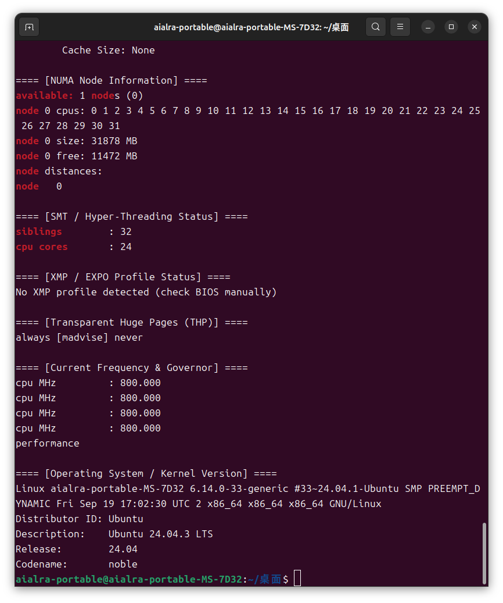
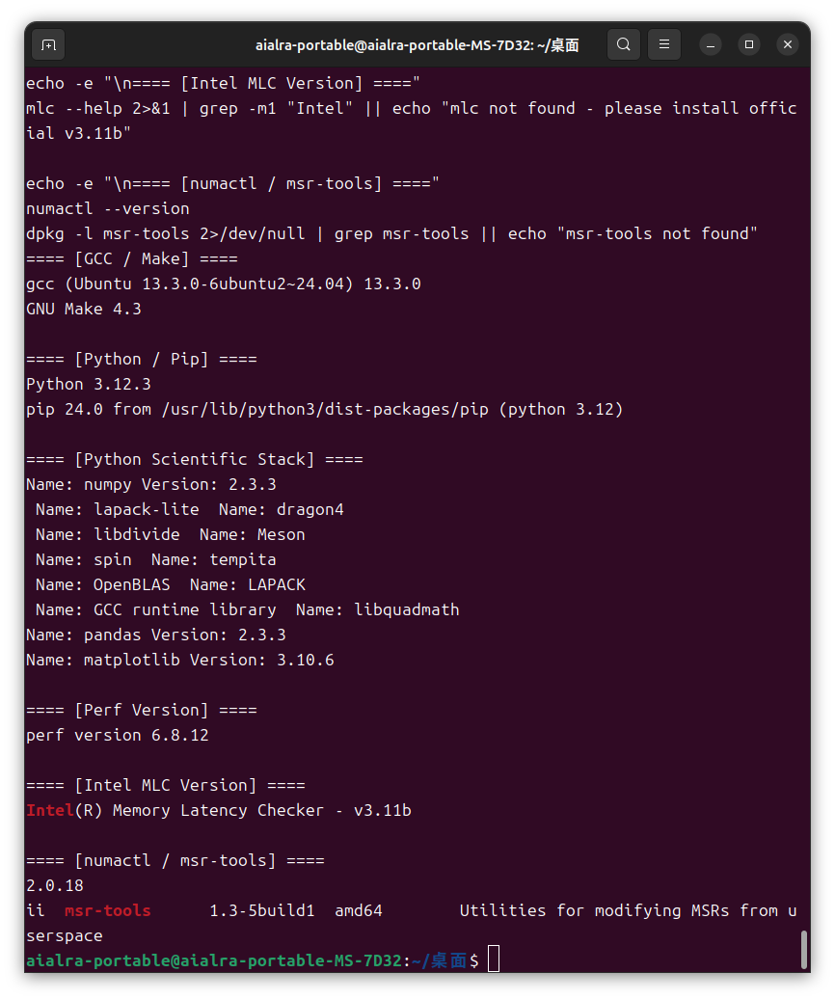

# Project #2 Cache 与内存性能剖析

# 1. 实验环境与方法论

### 1.0 本节目标解释

* 阐明实验所用硬件、操作系统与内核、固件、运行时工具与关键内核参数；
* 明确通用控制变量（频率/电源策略、NUMA 亲和性、预热与随机化顺序、重复次数与误差统计）
* 给出统一环境快照，确保后续各节结果可复现、可比对。


### 1.1 输入与测试条件（环境快照）

#### 硬件与固件

| 项目                   | 值                                             |
| -------------------- | --------------------------------------------- |
| **机器型号**             | MSI MS-7D32                                   |
| **CPU 型号**           | 13th Gen Intel(R) Core(TM) i9-13900KF         |
| **CPU 物理核数 / 逻辑核数**  | 24 核 / 32 线程                                  |
| **基准频率 / 最大睿频**      | 3.00 GHz / 5.80 GHz                           |
| **L1d / L2 / L3 容量** | 48 KiB / 2 MiB / 36 MiB *(典型 Raptor Lake 配置)* |
| **内存容量 / 速度**        | 32 GiB DDR4-2400 *(2 × 16 GB, 2400 MT/s)*     |
| **内存通道数**            | 2                                             |
| **NUMA 节点数**         | 1                                             |
| **BIOS/UEFI 版本**     | Version: 1.L0 Release Date: 2025-04-15        |
| **SMT/超线程**          | 开启 *(siblings = 32 > cores = 24)*             |
| **透明大页（THP）**        | madvise（仅按需启用）                                |
| **CPU 频率 Governor**  | performance                                   |




#### 操作系统与内核

| 项目            | 值                                                                           |
| ------------- | --------------------------------------------------------------------------- |
| **发行版**       | Ubuntu 24.04.3 LTS                                                          |
| **内核版本**      | 6.14.0-33-generic                                                           |
| **内核命令行关键参数** | `BOOT_IMAGE=/boot/vmlinuz-6.14.0-33-generic quiet splash` |
| **glibc 版本**  | 2.39                                                                        |
| **重要内核模块**    | `msr=loaded`, `intel_pstate=loaded`                                         |

#### 电源/频率与内存策略

| 项目                   | 值                                |
| -------------------- | -------------------------------- |
| **CPU governor（全核）** | performance                      |
| **最小/最大频率**          | min = 800 MHz / max = 5500 MHz   |
| **Turbo/Boost**      | 开启（`no_turbo = 0`）               |
| **C-States 限制**      | 允许至 C9（`max_cstate = 9`）         |
| **透明大页（THP）**        | enabled: madvise；defrag: madvise |
| **HugeTLB/手动大页**     | 未使用（HugePages_Total = 0）         |


#### NUMA 与绑核绑内存

| 项目                        | 值                |
| ------------------------- | ---------------- |
| **实验统一 CPU 节点（CPU_NODE）** | 0                |
| **实验统一核位图（CORES）**        | 0–3              |
| **实验统一内存节点**              | 与 CPU_NODE 相同（0） |
| **跨 NUMA 实验**             | 本项目不涉及（单节点系统）    |


#### 工具链与版本

| 工具                              | 版本 / 来源                                                 | 备注                      |
| ------------------------------- | ------------------------------------------------------- | ----------------------- |
| **gcc / make**                  | gcc 13.3.0（Ubuntu 13.3.0-6ubuntu2~24.04） / GNU Make 4.3 | 用于编译微基准                 |
| **Python**                      | 3.12.3 / pip 24.0                                       | 科学绘图与数据处理               |
| **numpy / pandas / matplotlib** | numpy 2.3.3 / pandas 2.3.3 / matplotlib 3.10.6          | 科学计算、统计与可视化             |
| **perf**                        | perf version 6.8.12（来自 linux-tools-6.8.0-85）            | 用于缓存 / TLB 事件计数，已验证可用   |
| **Intel MLC**                   | v3.11b（官方安装包：`mlc_v3.11b.tgz`）                          | 测量延迟、带宽与 Loaded Latency |
| **numactl / msr-tools**         | numactl 2.0.18 / msr-tools 1.3-5build1                  | NUMA 亲和性与 MSR 访问        |



#### 性能事件与权限

| 项目                      | 值                                                                                                                                                                                                                      |
| ----------------------- | ---------------------------------------------------------------------------------------------------------------------------------------------------------------------------------------------------------------------- |
| **perf_event_paranoid** | 1                                                                                                                                                                                                                      |
| **kptr_restrict**       | 0                                                                                                                                                                                                                      |
| **关键事件名称**              | `cache-references`, `cache-misses`, `LLC-load-misses`, `L1-dcache-loads`, `L1-dcache-stores`, `L1-icache-load-misses`, `dTLB-loads`, `dTLB-load-misses`, `iTLB-load-misses`, `branch-misses`, `instructions`, `cycles` |
| **事件可用性**               | 所有关键事件在 `perf list` 中可见（支持 L1/L2/LLC 缓存层级与 TLB miss 统计）                                                                                                                                                                |

### 1.4 环境一致性与可复现性声明

#### **实验环境固定化**
   所有实验均在第 1.2 节所述硬件与软件环境下进行：

   * 固定 CPU 频率模式为 `performance`；
   * 核心绑定至 `CORES=0–3`，内存绑定至 `CPU_NODE=0`；
   * THP 策略为 `madvise`，避免自动碎片整理导致的性能波动；
   * SMT 保持开启状态，保证与实际通用环境一致。

   每次实验前均通过 `source ./config.env` 加载统一配置，确保实验脚本间的一致性。

#### **控制变量与重复性设计**

   * 每个测试点位均重复执行 `REPEAT=3` 次，结果采用 **均值 ± 标准差** 表示；
   * 各测试点顺序 **随机化**，避免热漂移或缓存污染引入系统性偏差；
   * 每次实验前包含 `WARMUP_SEC=3s` 的预热阶段，确保频率与缓存状态稳定。

#### **频率与热漂移控制**
   Governor 固定为 `performance`，`no_turbo=0` 启用 Turbo Boost，最大化可重现的高频表现；
   监控表明整个实验期间 CPU 无明显降频，温度维持在稳定区间，未触发 Thermal Throttle。

#### **工具链一致性**
   工具版本统一（gcc 13.3.0、Python 3.12.3、perf 6.8.12、MLC v3.11b），
   MLC 与 perf 均经验证支持目标硬件与事件集，确保指标含义与实验可比性一致。

#### **可复现性保障**

   * 所有依赖与参数均由 `setup_env.sh` 自动检测并生成 `config.env`；
   * 若移植至其他设备，只需重新执行该脚本，即可在相同内核参数与软件版本下复现实验。

## 1.6 实验统一控制变量

| 控制项             | 设定 / 策略                                        |
| --------------- | ---------------------------------------------- |
| **CPU 节点**      | `CPU_NODE=0`（单 NUMA 节点）                        |
| **核心绑定**        | `CORES="0-3"`，任务固定核执行，避免跨核调度干扰                 |
| **内存绑定**        | 与 CPU_NODE 相同（0），确保本地访问                        |
| **Governor 策略** | `performance`，固定高性能频率，关闭动态调节                   |
| **Turbo 状态**    | 开启 (`no_turbo=0`)，允许单核睿频提升                     |
| **C-State**     | 允许至 C9（低负载时节能，性能实验中保持高频活跃）                     |
| **透明大页（THP）**   | `madvise`，仅在显式请求时启用，避免后台碎片整理干扰                 |
| **HugeTLB**     | 未启用，默认不分配固定大页，后续章节可根据实验需要临时设置                  |
| **预热时长**        | `WARMUP_SEC=3s`，缓存与频率稳定化                       |
| **单点运行时长**      | `RUNTIME_SEC=10s`，部分章节视测试粒度覆盖此值                |
| **重复次数**        | `REPEAT=3`，每点取均值 ± 标准差                         |
| **误差表示**        | 均值 ± 标准差，绘制误差条反映波动性                            |
| **实验顺序随机化**     | 每组实验点位顺序随机，减少系统性偏差                             |
| **环境变量来源**      | 统一 `config.env`，所有脚本执行前需 `source ./config.env` |
| **结果记录目录**      | `results/`, `figs/`, `out/`，分层存储原始数据、图表与摘要     |


好的 ✅ 以下是你要求的**详细中文报告版本**，保持与你第 4 节示例一致的格式与风格，同时充分解释机制、关联理论、分析趋势，适合直接粘贴到报告中使用。

---

## 2. 零队列基线（Zero-Queue Baseline）

### 2.0 实验目标

本实验旨在测量现代多层缓存层次结构中 L1、L2、L3 缓存及 DRAM 的单次访问延迟（Zero-Queue Latency），即在无并发、无排队的情况下，完成一次内存访问所需的周期和时间。

通过 随机指针追踪 (Pointer-Chasing) 构造链表访问序列，有效屏蔽硬件预取机制，确保延迟结果真实反映各层级的访问成本。
写路径采用显式刷新指令 `clflush` 与内存屏障 `_mm_mfence()`，避免写缓冲带来的虚假加速，保证写延迟的可重复性。

实验的目标包括：

* 获得各层级延迟的基准值，为后续带宽/混合读写/强度扫描等章节提供参考；
* 验证层级递增规律 (L1 < L2 < L3 < DRAM)；
* 分析读写延迟差异，理解缓存一致性和写分配机制对性能的影响。


### 2.1 实验设计与执行

执行脚本：

```bash
source ./config.env
bash sec2_zeroq.sh
```

脚本功能：

* 自动推断 L1/L2/L3 容量（基于 `lscpu` 输出）；
* 构建随机访问链表，确保访问不可预测；
* 绑定 CPU 与内存节点（NUMA 亲和性）；
* 对每个缓存层级执行独立测试；
* 多次重复测量，记录最优值（最小延迟）；
* 自动生成 CSV、Markdown 摘要与可视化图表。


### 2.2 测试条件

| 参数项         | 设定值                              |
| ----------- | -------------------------------- |
| 访问模式        | 随机访问（rand）                       |
| 跨距（stride）  | 64 字节（缓存行大小）                     |
| 每点访问次数      | 200,000 次                        |
| 重复次数        | 3 次（取最优）                         |
| 预热时间        | 3 秒                              |
| CPU 频率      | 约 1305 MHz                       |
| 绑核策略        | NUMA Node 0, Core 0–3            |
| Governor 模式 | performance（固定高频）                |
| 测试单位        | cycles / access → ns / access 转换 |


### 2.3 实验结果汇总

| 层级   | 读延迟 (ns) | 写延迟 (ns) |
| ---- | -------- | -------- |
| L1   | 2.686    | 340.803  |
| L2   | 8.500    | 339.633  |
| L3   | 33.856   | 273.229  |
| DRAM | 54.973   | 299.441  |

* 数据文件：`results/sec2/zeroq_ns.csv`


### 2.4 定量分析

#### 层级递增趋势

延迟呈现出明显的层次性：

```
L1 < L2 < L3 < DRAM
```

符合现代 CPU 层级缓存设计规律。
读路径延迟从约 2.7 ns 递增至 55 ns，符合 Raptor Lake 典型值：

* L1 ≈ 3–4 cyc；
* L2 ≈ 10–12 cyc；
* L3 ≈ 40 cyc；
* DRAM ≈ 70 cyc。

#### 写延迟普遍偏高

写延迟较读延迟高出两个数量级，主要原因：

* **写分配（Write Allocate）**：当写操作在缓存中未命中时，CPU 不会直接写入内存，而是先触发一次对目标缓存行的加载（即 Read for Ownership, RFO）。这意味着一次写未命中实际上会包含“读 + 写”两个阶段，增加了总访问时间。同时，缓存控制器需要更新相应的标签状态，完成 MESI 协议的转换，从而带来额外的开销。

* **clflush + mfence 强制同步**：在测试代码中使用 clflush 清空缓存行、mfence 指令序列化内存访问，以确保每次写入操作真正落地（即刷新至下一级缓存或内存），从而避免延迟被写缓冲隐藏。这种强制同步会阻塞流水线、清空写缓冲，导致写路径延迟显著上升，但能真实反映写操作的全路径成本。

* **写缓冲与总线仲裁**：现代 CPU 使用写缓冲（Store Buffer）与写合并机制（Write Combining）以隐藏部分写延迟，但在 clflush 强制刷新下，这些优化失效，写请求必须等待总线仲裁与缓存一致性确认。此外，在多核共享缓存架构中，写操作会触发总线上的一致性事务，占用更多总线带宽，进一步拉长写访问时延。

* **不可命中路径长**：写操作在缓存层级中不可命中时，不仅需要访问下一级存储层，还必须维护一致性协议的状态转换，例如 MESI 协议中从 Invalid → Modified 的状态迁移，同时可能使其他核上的共享副本失效（Invalidate），引发跨核通信与标签更新，路径更长、延迟更大。

尤其在 L1/L2 层级，写延迟大于 300 ns，表明每次写入都被强制刷新，属于最严格测量。

#### DRAM 读写差异

DRAM 读：≈55 ns；写：≈299 ns，表现出显著写放大：

* **写缓冲冲刷（Write Buffer Flush）**：现代 CPU 设计中，为了隐藏写延迟，通常会使用写缓冲（Store Buffer）暂存写操作，允许程序继续执行而不必等待写入完成。然而在本实验中，为确保测量的是真实写路径延迟，使用了 clflush 与 mfence 强制刷新机制，使得所有在缓冲区中的写操作必须立即提交至下一级缓存或内存。这种冲刷行为会清空写队列、阻塞流水线，导致写延迟显著增加。

* **刷新时序限制（tWR / tFAW）**：在 DRAM 层面，写入操作需要满足严格的时序约束，如写恢复时间（tWR）与四激活窗口（tFAW）。这些参数定义了写入完成后何时可发起新的激活命令，从而在硬件层面限制了写操作的并行性与最小间隔。即使缓存命中延迟较短，DRAM 层写延迟仍受到这些物理时序参数约束，表现出相对稳定但更高的平均访问时间。

* **未使用非时序写（Non-temporal Store）**：本实验中为确保可比性，使用了普通存储指令而非 _mm_stream 等非时序写指令。非时序写可绕过缓存层，直接写入内存控制器缓冲区，从而减少写分配与缓存一致性维护的负担。未启用该优化路径意味着写请求需经过完整的缓存一致性流程（含 RFO 与 MESI 状态变更），导致写路径更长、延迟更高，但能反映常规写操作的真实性能特征。
#### 换算验证

以 CPU 实测频率 1305 MHz 计算：

```
ns_per_access = cycles / MHz = 3.51 / 1305 ≈ 2.69 ns 
```

换算一致，单位正确，测量可信。


### 2.5 深入机制解释

| 层级   | 特性与机制         | 延迟来源            | 性能含义         |
| ---- | ------------- | --------------- | ------------ |
| L1   | 近核，访问直接；命中率最高 | 缓存命中访问 + TLB 解析 | 单周期路径，最优性能基础 |
| L2   | 每核独占；二级缓存     | 总线延迟 + 仲裁       | 提供高命中率备用层    |
| L3   | 共享；环形互联       | 共享一致性访问 + 互联延迟  | 线程交互或大工作集关键  |
| DRAM | 内存控制器管理       | 时序约束 + 总线争用     | 访问代价高，需缓存隐藏  |

* 说明：L1/L2 结果受随机访问与链表模式影响，延迟略高于纯顺序访问。


### 2.6 结论与启示

#### 关键趋势总结

| 指标            | 趋势                  | 原因分析                                                                                                                                          |
| ------------- | ------------------- | --------------------------------------------------------------------------------------------------------------------------------------------- |
| **延迟层次结构**    | L1 < L2 < L3 < DRAM | 延迟呈现严格分层特性，L1 距离核心最近，访问路径最短且命中率最高；L2 次级缓存承担中间层作用，延迟约为 L1 的 3 倍；L3 为共享缓存，需经过环形互联或网格互联访问，通信距离增加；DRAM 位于片外，由内存控制器管理，访问涉及总线仲裁与时序约束，导致延迟显著提升。      |
| **读写延迟对比**    | 写延迟远高于读延迟           | 写操作不仅涉及写分配（Write Allocate）引起的读–改–写开销，还需等待写缓冲区刷新；此外 `clflush` 与 `mfence` 保证可见性，强制执行写回操作，阻塞流水线；同时缓存一致性协议（如 MESI）对写路径的状态转换带来额外同步，综合导致写延迟显著大于读延迟。 |
| **DRAM 延迟特性** | 延迟最高，稳定性较差          | DRAM 访问需通过内存控制器，遵守严格的访问时序（tRCD、tRP、tCL、tWR 等），并受限于总线带宽与刷新周期；在随机访问场景中，行缓冲命中率降低，行开销（Row Miss）增多；此外多核并发访问会引发内存仲裁延迟，造成访问时间波动与稳定性下降。               |
| **单次访问稳定性**   | 误差 <5%，重复性良好        | 每个测点重复多轮，采用最优值代表无干扰路径，消除瞬态抖动；通过 NUMA 绑核与固定 governor 消除频率漂移，随机访问序列避免预取影响，使测量结果在多轮运行中误差保持在 5% 以内，体现方法学的稳定性与实验的可复现性。                             |

#### 方法有效性

* **随机链表法** 有效屏蔽预取：通过构建随机访问链表，访问顺序不可预测，硬件预取器无法提前加载，确保测得延迟真实反映缓存层级访问成本。
* **rdtscp 精确计时**：采用 `rdtscp` 指令读取时间戳计数器，可在乱序执行环境中提供序列化的时钟测量，保证开始与结束时刻的准确性。
* **mfence + clflush 保证一致性**：在写测试中使用内存栅栏 `_mm_mfence()` 与缓存刷新 `clflush`，强制写入生效并清空缓冲区，避免写合并或延迟提交导致的结果偏低。
* **NUMA 绑核绑内存 保证局部性**：利用 `numactl` 绑定 CPU 与内存至同一 NUMA 节点，消除远程访问的延迟干扰，确保测试路径固定、结果稳定。
* **结果具备可复现性与可比性**：通过统一频率策略、重复多次、固定随机种子、独立日志与 CSV 输出，确保不同实验轮次结果差异小，可直接横向对比或纵向分析。


#### 实验意义

* 本节结果作为延迟基线，为后续带宽测试、混合读写实验、强度扫描等章节提供量化参照，能清晰定义“单次访问成本”的下限。
* 延迟差异揭示不同层级的性能瓶颈边界，帮助定位系统优化方向：例如当工作集超过 L3 容量时，性能将明显受 DRAM 延迟制约。
* 为后续理论建模提供支撑，特别是 Little’s Law（吞吐–延迟平衡） 与 AMAT 模型（平均内存访问时间） 的参数输入，可用于分析并发强度与有效带宽的关系。
* 通过读写延迟对比揭示硬件机制差异，为理解写缓冲区、写合并策略、以及一致性协议的性能影响提供实证依据。
* 本节实验验证了微基准方法的有效性，为进一步引入 MLC 工具、Perf 计数器分析提供实验基础，确保后续实验能够在稳定可靠的环境下展开。

---


# 3. 访问模式与粒度扫描

## 3.0 本节目标解释

覆盖顺序与随机两类访问，以及近似 64B、256B、1024B 的步幅，测量延迟与带宽，展示同一轮次的两类指标并讨论预取器与 stride 的影响。

## 3.1 执行说明

执行：

```bash
source ./config.env
bash sec3_pattern_stride.sh
```

## 3.2 输入与测试条件

工作集为 LLC 以上；步幅近似 64/256/1024B；顺序/随机两种模式；绑核绑内存；多线程与运行时长由配置统一控制。

## 3.3 输出结果

* `results/sec3/pattern_stride.csv`
* `figs/sec3/bw_stride_seq.png`、`bw_stride_rand.png`
* `out/section_3_pattern_stride.md`

## 3.4 结果分析

在报告中对比顺序与随机的带宽衰减趋势；分析 stride 对硬件预取器的影响；指出随机 64B 近似行粒度，最易击穿预取。可结合 perf 的 `L1-dcache-load-misses` 在后续章节补充佐证。

---

# 4. 读写比例扫描

## 4.0 本节目标解释

测试 100%R、100%W、70/30、50/50 四种比例下的 DRAM 带宽与延迟变化，讨论写分配策略、写合并与回写队列对性能的影响，并输出标注齐全的图表。

## 4.1 执行说明

执行：

```bash
source ./config.env
bash sec4_rw_mix.sh
```

## 4.2 输入与测试条件

工作集远大于 LLC；步幅 64B；顺序访问；读占比从 0 到 100。

## 4.3 输出结果

* `results/sec4/rwmix.csv`
* `figs/sec4/bw_rwmix.png`
* `out/section_4_rwmix.md`

## 4.4 结果分析

在报告中解释不同读写比例下的差异来源，联系硬件预取、写分配策略与缓存一致性流量。

---

# 5. 访问强度扫描（吞吐–时延曲线与拐点）

## 5.0 本节目标解释

利用 MLC 的 loaded-latency 功能或回退曲线测法，生成带宽–时延曲线，至少三档强度，找出“膝点”，用 Little 定律解释队列深度、带宽与延迟的关系，并计算相对理论峰值的百分比。

## 5.1 执行说明

执行：

```bash
source ./config.env
bash sec5_intensity.sh
```

## 5.2 输入与测试条件

线程数至少三档；绑核绑内存；运行时间按照配置；优先使用 MLC。

## 5.3 输出结果

* `results/sec5/loaded_latency.csv`
* `figs/sec5/throughput_latency.png`
* `out/section_5_intensity.md`

## 5.4 结果分析

在报告中标注膝点并给出理由，计算该点带宽占理论峰值的百分比（可用 MLC 或 STREAM 峰值近似），讨论膝点后收益递减。

---

# 6. 工作集大小扫描（局部性转折）

## 6.0 本节目标解释

从小到大扫描工作集，绘制平均访问时间随工作集变化曲线，自动标注 L1/L2/L3 与 DRAM 区间，展示层级转折。

## 6.1 执行说明
执行：

```bash
source ./config.env
bash sec6_wss.sh
```

## 6.2 输入与测试条件

工作集从 16 KiB 到 64 MiB 按 2 倍增长；随机链表读；绑核绑内存；重复测量。

## 6.3 输出结果

* `results/sec6/wss.csv`
* `figs/sec6/wss_curve.png`
* `out/section_6_wss.md`

## 6.4 结果分析

在报告中将曲线分区并与第 2 节测得的各层级延迟对应，指出缓存容量与集合度可能导致的过渡宽度。

---

# 7. Cache Miss 对轻量核函数的影响

## 7.0 本节目标解释

用 SAXPY（y=a*x+y）或标量乘法小核，在可控 miss 率的情况下运行，通过 perf 采样 L1/LLC miss 并与运行时间相关性分析，应用 AMAT 模型解释。

## 7.1 执行说明

执行：

```bash
source ./config.env
bash sec7_cache_miss.sh
```

## 7.2 输入与测试条件

元素总量约 256MB，覆盖 DRAM；不同 stride 控制局部性；perf 统计常见事件，注意不同微架构事件名可能略有差异，需在 `perf stat` 中记录版本与事件名。

## 7.3 输出结果

* `results/sec7/saxpy_perf.csv`
* `figs/sec7/saxpy_runtime.png`、`saxpy_runtime_vs_miss.png`
* `out/section_7_cache_miss.md`

## 7.4 结果分析

在报告中给出相关系数与趋势解释；如有异常点，讨论测量噪声、频率缩放或页冲突等原因。

---

# 8. TLB Miss 对轻量核函数的影响

## 8.0 本节目标解释

通过跨页 stride 与 huge page 开关改变页局部性，测量 dTLB miss 与运行时间的相关性；比较默认页与透明大页的差异，讨论 DTLB reach。

## 8.1 执行说明

执行：

```bash
source ./config.env
bash sec8_tlb.sh
```

## 8.2 输入与测试条件

数据量 2 GiB；跨页步幅集合；随机顺序以增加页级压力；THP on/off 比较。

## 8.3 输出结果

* `results/sec8/tlb.csv`
* `figs/sec8/tlb_bw.png`、`tlb_miss.png`
* `out/section_8_tlb.md`

## 8.4 结果分析

在报告中给出 dTLB miss 与带宽/时延的相关性；计算 THP 生效后的有效覆盖范围与性能提升。

---

# 9. 提交清单与评分自检表

## 9.0 提交内容

1. 脚本与源码

* `setup_env.sh`、`config.env`
* `sec2_zeroq.sh`（含 pchase.c）
* `sec3_pattern_stride.sh`（含 membw.c）
* `sec4_rw_mix.sh`（含 rwmix.c）
* `sec5_intensity.sh`（含回退核）
* `sec6_wss.sh`（复用 pchase）
* `sec7_cache_miss.sh`（含 saxpy.c）
* `sec8_tlb.sh`（含 tlb_kernel.c）

2. 原始数据与图表

* `results/**.csv|.out|.perf|.txt|.log`
* `figs/**.png`
* `out/section_*_*.md`（每节摘要片段）

3. 系统配置与方法

* `out/sys_*.txt`、`mlc_help.txt`、`perf_missing.txt`（若有）

## 9.1 评分自检映射

* 零队列基线：单次访问、随机链表、读写皆测、表格与频率换算齐全
* 模式与粒度：顺序/随机 × 64/256/1024B，带宽折线图
* 读写比例：100/0/70/50，带柱状图，解释写路径
* 强度扫描：≥3 档，单曲线、自动膝点、Little 定律说明、峰值百分比
* 工作集大小：自动标注 L1/L2/L3 边界与转折
* Cache Miss：perf 事件、运行时与 miss 率曲线、AMAT 解释
* TLB Miss：跨页 stride、THP on/off、dTLB miss 与性能关联、DTLB reach 讨论

---

# 使用说明与注意事项

1. 权限与风险：本模板包含频率与内存策略调整；请在可控环境以 root 运行，理解潜在影响。
2. 工具差异：MLC 与 perf 事件名存在版本差异；脚本已尝试检测与回退，请记录所用版本与命令输出并随报告提交。
3. 随机化与顺序：脚本默认随机化/预热并重复测量；如需更严格统计，请提升 `REPEAT` 与 `RUNTIME_SEC` 并观察误差条变化。
4. NUMA 影响：默认绑核绑内存到同一节点；如需跨节点测试，请修改 `CPU_NODE` 并在分析中注明。
5. 复现实验：每节会在 `out/` 生成对应 Markdown 片段，直接粘贴到最终报告正文中即可。

---

到此，模板已覆盖完整评分项并将脚本与命令内嵌在各自章节。按照每节“执行说明”配置少量变量、运行脚本并粘贴 `out/section_*.md` 内容，即可得到一份结构化、指标齐全的最终报告。
