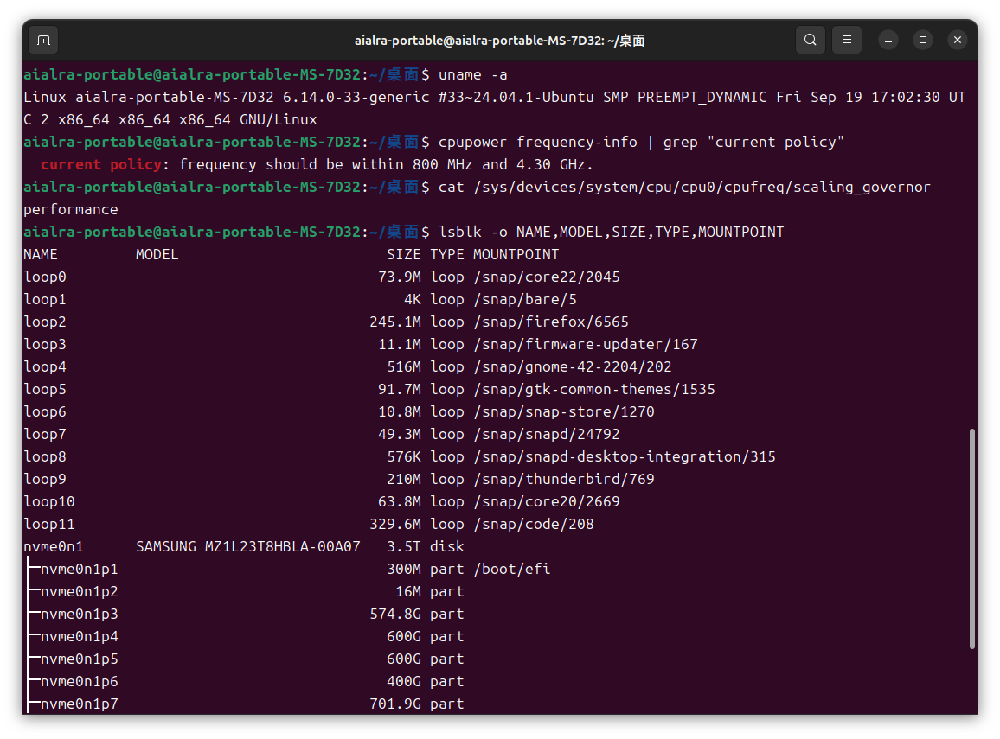

# SSD Performance Profiling

Lucas Ding

---

## 1. Environment & Feasibility, Methodology & Reproducibility

### 1.1 Experimental Environment

Use the script `sudo bash env.bash` for one-click setup
See details in `out/env.txt`

### 1.2 Hardware & System

* OS Kernel: Linux 6.14.0-33-generic (Ubuntu 24.04.1)
* CPU governor has been set to performance; some background cron tasks disabled
  
* CPU:13900KF  
  
### 1.3 Path & Medium


* Target SSD under test: `/dev/nvme1n1` (SAMSUNG MZVLB256HBHQ-00000, 256 GB)

  * Current partition status: nvme1n1p3 ≈208 GB (unmounted, safe for fio testing)
  * Note: System disk is another 3.84 TB `nvme0n1`, to be avoided

* Safe mounting

```bash
sudo mkfs.ext4 -F /dev/nvme1n1p1
sudo mount /dev/nvme1n1p1 /mnt/ssdtest
```

### 1.4 I/O Engine & Policy

* Engine: io_uring (fallback to libaio if unavailable) — fio by default uses the Linux kernel’s io_uring I/O engine, which offers lower syscall overhead and higher concurrency efficiency; if io_uring is not available, it will automatically fall back to the traditional libaio engine to ensure the tests can run smoothly.

* Repetitions per data point: 3 times — Each test condition is run three times to reduce the effect of random fluctuations; the mean and standard deviation are used to represent stability. Three runs strike a reasonable balance between accuracy and duration.

* Run time: 30 s, warm-up 5 s — Each test case collects performance data for 30 seconds, preceded by a 5-second warm-up to trigger cache, queue, and controller stabilization, preventing cold-start or transient spikes from skewing results.

* direct=1 to bypass page cache — The `direct=1` option forces fio to perform direct I/O on the device, bypassing the OS page cache to obtain latency and throughput closer to the hardware’s actual performance; otherwise, Linux’s caching would interfere.

* Results will include mean and standard deviation, plotted with error bars — The repeated test data will be averaged, standard deviations computed, and final graphs will show error bars to illustrate variability, reflecting both performance level and experimental reliability.

### 1.5 Health Monitoring

* `nvme0n1` (Samsung enterprise SSD, 3.84 TB) health status PASS, temperature 43–61 °C, wear level 1%, total writes ≈ 122 TB.
* `nvme1n1` (Samsung OEM SSD, 256 GB) as test subject, unmounted, SMART available.
  
  

#### Tools:

* fio
  

#### Reproducibility Measures:

* Environment dependencies (fio, gnuplot, matplotlib, numpy, pandas, etc.) installed
* Test directory structure

> ├── out/                 # Auto-generated md summary snippets
> ├── results/             # Raw JSON
> ├── tables/              # CSV summaries
> ├── figs/                # Charts
> └── tmp/                 # Temporary FIO jobs and logs

---


## 2. Zero-Queue Baseline

### 2.0 Objective of This Section

#### Measure average latency and p95/p99 under QD=1 for 4KiB random read/write and 128KiB sequential read/write

* QD=1: Queue depth = 1, meaning only one I/O request is issued at a time — the next must wait until the previous one completes. This is the most “basic” latency scenario, showing the device’s true response time per single request.

* 4KiB Random Read/Write: This is the smallest common block size (4KB), also the I/O unit frequently used by databases and operating systems. *Random* means requests jump to different locations on the disk, not contiguous.

* 128KiB Sequential Read/Write: This is a relatively large block size (128KB), with data being continuous, simulating large file sequential transfers (e.g., video streaming).

* Average Latency: How long a request takes on average.

* p95/p99: Percentile latencies. For example, p95 = 95% of requests are faster than this, only 5% are slower; p99 = 99% of requests are faster than this, only 1% are slower.

* Table: Will list, for each test (random read, random write, sequential read, sequential write):

  * Average latency (ms)
  * p95 / p99 latency (ms)
  * IOPS (I/O operations per second)
  * MB/s (throughput)

* Figures:

  * Bar chart comparing average latency
  * Bar chart comparing IOPS

### Confirm Alignment and Direct I/O Are Enabled

* Alignment (offset_align=4k): Ensures all requests start at a 4KB-aligned address. This prevents “cross-page” reads/writes inside the SSD, which would otherwise degrade performance.
* Direct I/O (direct=1): Forces bypassing of the OS cache, sending commands directly to the SSD to measure *true hardware performance*, not memory cache speed.

### 2.1 Execution

Use script `sudo bash qd1_test.bash`
Output: `out/section_2_qd1.md`

### 2.2 Input and Test Conditions

#### Input

* Test Target (`TARGET`): A raw device (e.g., `/dev/nvme1n1p3`) or large file representing the SSD test object.
* Parameter Settings:

  * I/O Engine: `io_uring` (fallback to `libaio` if unavailable)
  * Runtime: `RUNTIME=30s`
  * Warm-up Time: `RAMP=5s`
  * Repeat Count: `REPEAT=3` (to ensure statistical significance)

#### Test Conditions

* Queue Depth Fixed at QD=1 (only one I/O request at a time, no concurrency), emphasizing fundamental device latency.

* I/O Modes (four combinations):

  1. `4KiB Random Read`
  2. `4KiB Random Write`
  3. `128KiB Sequential Read`
  4. `128KiB Sequential Write`

* Other Settings:

  * `direct=1` → Bypass Linux page cache, access hardware directly
  * `offset_align=4k` → Ensure 4K alignment, avoid extra overhead
  * `percentile_list=50:95:99:99.9` → Collect p50/p95/p99/p99.9 latency distribution

#### Output

* Raw Results: `results/*.json`

* Parsed Results:

  * `tables/qd1_baseline.csv` —— Average latency, p95/p99 tail latency, IOPS, throughput for each mode
  * `figs/qd1_mean_latency.png` —— Comparison of average latency among four modes
  * `figs/qd1_iops.png` —— Comparison of IOPS among four modes
  * `out/section_2_qd1.md` —— Markdown summary snippet, ready to include in the report

* Comparative Focus:

  * Random vs Sequential: Check if random I/O latency is significantly higher than sequential; whether sequential bandwidth approaches the interface limit.
  * Read vs Write: Compare latency and throughput between read/write, verify impact of write amplification/cache.
  * Tail Latency (p95/p99): Assess stability, detect outliers or fluctuation caused by write amplification.

### 2.3 Output Results

#### QD=1 Baseline Table

| Mode       | Block Size | Read/Write | Avg Latency(ms) | p50(ms) | p95(ms) | p99(ms) |                  IOPS |       MB/s |
| ---------- | ---------- | ---------- | --------------: | ------: | ------: | ------: | --------------------: | ---------: |
| Random     | 4k         | Read       | 0.07970±0.00029 | 0.07424 | 0.09097 | 0.10018 |  12493.49466±47.87256 |   48.80271 |
| Random     | 4k         | Write      | 0.01486±0.00008 | 0.01210 | 0.01602 | 0.03085 | 66351.58828±363.54864 |  259.18589 |
| Sequential | 128k       | Read       | 0.13311±0.00002 | 0.11930 | 0.18739 | 0.22972 |    7500.13332±1.02507 |  937.51805 |
| Sequential | 128k       | Write      | 0.07345±0.00139 | 0.05914 | 0.06409 | 0.09370 | 13585.04717±258.98712 | 1698.13228 |

#### Average Latency Comparison


#### IOPS Comparison


### 2.4 Result Analysis

#### Key Analysis Points

##### Random 4 KiB: Pure Latency Scenario

* Random read average latency ~0.08 ms (80 µs), but tail (p99) close to 0.10 ms, indicating that under QD=1, latency is dominated by device single-access overhead.
* Random write is faster, averaging only ~0.015 ms, likely due to SSD using cache (DRAM or SLC cache) optimization, making write latency significantly lower than random read.

##### Sequential 128 KiB: Bandwidth-Driven Scenario

* Sequential read average latency ~0.13 ms, throughput near 940 MB/s, approaching device’s sequential read bandwidth limit.
* Sequential write performs even better, latency ~0.07 ms, throughput close to 1.7 GB/s, showing clear write-path optimization.
* Tail latency differs notably: sequential read p99 ≈ 0.23 ms, sequential write p99 ≈ 0.09 ms, indicating more stable sequential write.

##### Read vs Write

* In random mode, write latency is significantly lower than read latency, showing write cache effect;
* In sequential mode, write bandwidth is also higher than read bandwidth, suggesting stronger controller optimization for writes.

##### Sequential vs Random

* Sequential I/O IOPS are far lower than random 4 KiB, but due to larger block size, bandwidth is 20–30× higher, reflecting the typical shift from IOPS-driven to bandwidth-driven regimes.
* Random 4 KiB tail latency reflects intrinsic hardware service time, while sequential 128 KiB latency includes substantial data transfer time.

#### Queueing Theory Perspective

* Zero Queue (QD=1): No queue waiting; observed latency equals device single-service time (Service Time).
* 4 KiB Random → IOPS-driven region: performance determined by controller’s ability to handle small I/O requests;
* 128 KiB Sequential → Bandwidth-driven region: each request takes longer, but total bandwidth approaches interface limit.
* Latency Distribution: Differences in p95/p99 percentiles reveal tail latency issues — even at QD=1, some requests are 2–3× slower than average.

This validates the classic Latency–Throughput Tradeoff:

* At low queue depth, system utilization is low, latency stable;
* As queue depth increases (in later QD sweep), throughput rises, but latency grows exponentially per queueing theory, entering the degradation phase at the “knee” saturation point.

---

## 3. Block Size Sweep: Random vs Sequential

### 3.0 Objectives of This Section

#### Scan 4 KiB → 256 KiB / 512 KiB / 1 MiB Under Fixed Parallelism

* Fixed Parallelism: Keep the same queue depth (e.g., QD = 32) to isolate the impact of block size on performance.
* Block Size Sweep: Cover the common range from 4 KiBto 256 KiB, and extend to 512 KiB / 1 MiB, spanning from “small-block random I/O” to “large-block sequential streaming I/O.”
* Comparison Dimensions:

  * IOPS Curve: X-axis = block size, Y-axis = IOPS. Small blocks → high IOPS; large blocks → sharp IOPS drop.
  * Throughput (MB/s): X-axis = block size, Y-axis = bandwidth. Small blocks → bandwidth-limited; large blocks → bandwidth approaches SSD limit.
  * Average Latency (ms): X-axis = block size, Y-axis = mean latency. Expected to grow linearly with block size.
* Knee-Point Discussion: Identify the transition zone from “IOPS-driven” → “Bandwidth-driven” (typically 32–128 KiB).


### 3.1 Execution

Use the script:

```bash
sudo bash bs_sweep_test.bash
```

### 3.2 Input and Test Conditions

* Test Target (`TARGET`): Raw device partition `/dev/nvme1n1p1`

* Parameter Settings:

  * I/O Engine: `io_uring` (fallback to `libaio` if unavailable)
  * Runtime: 30 s / block size
  * Warm-up: 5 s
  * Queue Depth: `iodepth=32`
  * Repetitions: 3 (running mean + std dev)

* Test Modes:

  * Fixed Patterns:

    Random Read (`randread`)
    Sequential Read (`read`)
  * Block Size Sweep:

    ```
    4 KiB, 16 KiB, 32 KiB, 64 KiB, 128 KiB, 256 KiB, 512 KiB, 1 MiB
    ```
  * Other Settings:

    * `direct=1` → bypass cache
    * `time_based=1` → ensure consistent runtime
    * `group_reporting=1` → unified stats
    * `percentile_list=50:95:99:99.9` → tail-latency distribution

### 3.3 Output Results

#### Random Read (randread, QD = 32)

| Block Size (KiB) | IOPS (mean ± std) | MB/s (mean ± std) | Mean Lat (ms ± std) |
| ---------------: | ----------------: | ----------------: | ------------------: |
|                4 |  145,508.7 ± 24.4 |      568.4 ± 0.10 |     0.220 ± 0.00004 |
|               16 |    40,141.4 ± 1.2 |      627.2 ± 0.02 |     0.797 ± 0.00003 |
|               32 |    30,619.0 ± 7.1 |      956.9 ± 0.22 |     1.045 ± 0.00021 |
|               64 |    24,846.7 ± 8.4 |    1,553.0 ± 0.53 |     1.288 ± 0.00043 |
|              128 |    17,699.4 ± 1.5 |    2,212.6 ± 0.18 |     1.808 ± 0.00018 |
|              256 |    10,281.6 ± 5.8 |    2,570.7 ± 1.44 |     3.112 ± 0.00170 |
|              512 |   5,313.2 ± 716.3 |   2,657.1 ± 358.1 |     6.101 ± 0.89039 |
|            1,024 |    2,952.1 ± 22.4 |   2,953.2 ± 22.39 |    10.837 ± 0.08229 |

*1,024 KiB = 1 MiB.*


#### Sequential Read (read, QD = 32)

| Block Size (KiB) |   IOPS (mean ± std) | MB/s (mean ± std) | Mean Lat (ms ± std) |
| ---------------: | ------------------: | ----------------: | ------------------: |
|                4 | 401,426.9 ± 3,687.2 |   1,568.1 ± 14.40 |    0.0796 ± 0.00073 |
|               16 |    134,916.3 ± 72.1 |    2,108.1 ± 1.13 |    0.2371 ± 0.00012 |
|               32 |     71,527.9 ± 73.6 |    2,235.3 ± 2.30 |    0.4472 ± 0.00048 |
|               64 |    51,635.9 ± 350.4 |   3,227.3 ± 21.90 |    0.6196 ± 0.00419 |
|              128 |     26,027.5 ± 43.2 |    3,253.6 ± 5.40 |    1.2293 ± 0.00202 |
|              256 |      13,024.3 ± 9.0 |    3,256.3 ± 2.25 |    2.4567 ± 0.00164 |
|              512 |     6,135.0 ± 201.2 |  3,068.0 ± 100.57 |    5.2190 ± 0.16798 |
|            1,024 |     2,909.1 ± 233.5 |  2,910.2 ± 233.49 |   11.0431 ± 0.84534 |


---

### 3.4 Result Analysis

#### Overview and Peak Values

* Random Read (IOPS → MB/s)
  *IOPS* drops rapidly as block size increases (145 k @ 4 K → 2.95 k @ 1 M), while bandwidth rises steadily from 568 MB/s (4 K) to about 2.95 GB/s at 1 MiB.
  *Mean latency* grows linearly from 0.22 ms (4 K) to 10.84 ms (1 M).

* Sequential Read (Bandwidth-Dominated)
  *Bandwidth* reaches the platform ceiling around 64–256 KiB (~3.23–3.26 GB/s), then declines at ≥512 KiB (3.07 GB/s @ 512 K, 2.91 GB/s @ 1 M).
  *Mean latency* increases roughly linearly (0.08 ms @ 4 K → 11.04 ms @ 1 M).

#### Transition Points

* Random Read:
  Bandwidth hits 2.21 GB/s at 128 KiB, rises to 2.57 GB/s at 256 KiB (+16%), 256 → 512 KiB only +3.3%, 512 → 1 M another ~11%.
  With diminishing returns, the knee lies around 128–256 KiB: beyond this, IOPS loss grows while bandwidth gains taper (entering “bandwidth-dominated” region).

* Sequential Read:
  64 → 128 KiB bandwidth gain < 1% (3227 → 3254 MB/s), 128 → 256 KiB nearly flat. Knee ≈ 64–128 KiB:
  Further increases yield no benefit; ≥512 KiB even drops—typical of lower queue utilization, dispatch overhead, or controller policy inefficiency.

#### Detailed Insights

* Small Random Blocks (4–32 KiB):
  Dominated by command handling and seek/mapping overhead. *IOPS* high but *MB/s* limited; latency in hundreds of µs. Phase = IOPS-dominated.
* Medium Blocks (64–256 KiB):
  Controller merges channels more efficiently; *MB/s* climbs quickly to near-peak. Transitional zone—key for “best cost-performance” block size.
* Large Blocks (≥512 KiB):
  Sequential read peaks then falls (~3.25 GB/s max). Large requests cut concurrency (fixed QD → fewer IOPS); submission/completion overheads, scheduler/FS interactions, PCIe/controller pipelines may yield negative marginal gains.
  Random read still improves slightly, but returns fade (256 → 512 KiB +3.3%).

#### Practical Recommendations

* Random Workloads:
  For high bandwidth with tolerable latency, 128–256 KiB is a good balance; 1 MiB squeezes ~2.95 GB/s but at higher *IOPS*/latency cost.
* Sequential Workloads:
  64–128 KiB already approaches platform peak (~3.25 GB/s). ≥512 KiB offers no benefit and slightly regresses.
* Report Visualization:
  Place “IOPS / MB/s / Latency” curves (random & sequential) side-by-side to clearly show IOPS plunge vs MB/s plateau/decline crossover.

### 3.5 Summary

* Random Read: Bandwidth rises with block size; knee ≈ 128–256 KiB; 1 MiB ≈ 2.95 GB/s.
* Sequential Read: 64–128 KiB reaches ~3.25 GB/s peak; larger blocks gain nothing, may drop.
* Latency scales nearly linearly with block size—classic shift from IOPS-dominated to Bandwidth-dominated regime.

---


## 4. Read/Write Mix Sweep: R100/W0, R70/W30, R50/W50, R0/W100

### 4.0 Experiment Objective

This section aims to explore the systematic impact of read/write ratio on performance under fixed I/O mode (4 KiB random I/O) and fixed parallelism (Queue Depth = 32).

By changing the read/write mix ratio (R/W Mix), we can deeply analyze the internal mechanisms of SSDs when handling mixed workloads, including read/write path contention, cache hit and write amplification, and latency evolution.

### 4.1 Experiment Design and Execution

Run the script:

```bash
sudo bash mix_rw_test.bash
```

The script will automatically execute the following four groups of typical mixed workloads, each running 30 s, with 5 s warm-up, repeated 3 times for averaging:

| Mix Ratio | Mode Description    | Read Ratio | Write Ratio |
| --------- | ------------------- | ---------- | ----------- |
| R100/W0   | Full Read Load      | 100 %      | 0 %         |
| R70/W30   | Mixed Read/Write    | 70 %       | 30 %        |
| R50/W50   | Balanced Read/Write | 50 %       | 50 %        |
| R0/W100   | Full Write Load     | 0 %        | 100 %       |


### 4.2 Test Conditions

* Test Target: `/dev/nvme1n1p1`
* I/O Mode: Random Access (`randrw`)
* Block Size: 4 KiB (fixed)
* I/O Engine: `io_uring`
* Queue Depth: `iodepth=32`
* Runtime: 30 s
* Warm-up Time: 5 s
* Repetitions: 3
* General Settings:

  * `direct=1` (Direct Mode, bypass cache)
  * `time_based=1` (Time-based)
  * `group_reporting=1` (Group Reporting)
  * `percentile_list=50:95:99:99.9` (Collect Tail Latency Percentiles)

### 4.3 Summary of Results

| Mix Ratio | Throughput (MB/s) | Mean Latency (ms) |
| --------- | ----------------- | ----------------- |
| R100/W0   | 578.7             | 0.217             |
| R70/W30   | 376.1             | 0.333             |
| R50/W50   | 376.9             | 0.332             |
| R0/W100   | 502.6             | 0.256             |

Explanation:

* Under full read load, performance is best: high bandwidth, low latency;
* Under mixed load, performance decreases;
* Under full write load, bandwidth recovers but latency is slightly higher than pure read.


### 4.4 Visualization Analysis

#### Throughput Comparison


* X-Axis: R/W Mix Ratio
* Y-Axis: Bandwidth (MB/s)

A small proportion of writes (R70/W30) already begins to slow down overall bandwidth, especially when the controller frequently switches R/W paths, introducing synchronous waits.
In the full-write scenario (R0/W100), bandwidth slightly recovers with the help of the write cache, but the duration depends on the SLC cache size.

#### Mean Latency Comparison


* X-Axis: R/W Mix Ratio
* Y-Axis: Mean Latency (ms)

As the write ratio increases, latency gradually rises. R50/W50 and R70/W30 have similar latency, indicating that a 30% write ratio is already enough to make write path contention the main bottleneck.
R0/W100 latency slightly rises again, caused by the write amplification effect and background GC (Garbage Collection).


### 4.5 In-Depth Interpretation and Mechanism Analysis

#### Full Read Scenario (R100/W0)

* Highest IOPS / Lowest Latency: Read operations directly read from NAND without FTL mapping updates;
* Controller Optimization Path: Sequential prefetching and multi-channel parallel reads can be fully utilized;
* Good Latency Stability: Tail latency distribution is concentrated, with no obvious jitter.

#### Full Write Scenario (R0/W100)

* IOPS Decrease / Latency Increase: Write operations need FTL mapping table updates and erase block preparation;
* Write Amplification Effect (Write Amplification): Logical writes trigger multiple physical writes underneath;
* SLC Cache Supports Staged High Performance, but after cache overflow, GC (Garbage Collection) is triggered, causing performance fluctuation.

#### Mixed Workloads (R70/W30, R50/W50)

* Read/Write Path Contention: The controller needs to dynamically schedule read and write requests in the command queue;
* Cache Flush Conflicts: Some write commands require metadata synchronization, which blocks subsequent reads;
* Bimodal Latency Distribution: Read latency is concentrated, write latency has significant long tails, raising the overall mean;
* Small Difference Between 70/30 and 50/50: Indicates that once the write ratio exceeds 30%, performance is mainly dominated by the write path.

### 4.6 Conclusions and Insights

#### Summary

| Metric               | Trend                              | Explanation                                    |
| -------------------- | ---------------------------------- | ---------------------------------------------- |
| IOPS / Bandwidth | Decreases as write ratio increases | Complex write path, FTL contention             |
| Mean Latency     | Increases as write ratio increases | Write amplification, Flush and GC              |
| Volatility       | Most evident in mixed ratios       | Increased uncertainty in controller scheduling |

#### Performance Patterns

* SSD performance is extremely sensitive to the write ratio under fixed 4 KiB random I/O conditions.
* When the write ratio exceeds 30%, performance begins to be dominated by the write path, and latency rises significantly.
* Full write restores bandwidth, but at the cost of high latency and high fluctuation.
* Read-intensive applications (such as database queries, log analysis) should keep write operations asynchronous or batched to maintain high IOPS.
* Mixed workloads need to pay attention to write cache size and background GC strategies; appropriately reducing the write ratio can improve stability.
* Write-intensive scenarios (such as persistent logs, database writes) can lower QD or adopt sequential write mode to reduce random write amplification.

---

## 5. Queue Depth Sweep: Throughput–Latency Trade-off, Knee Identification, and Tail Latency

### 5.0 Objectives of This Section

This experiment aims to analyze the performance variation of SSDs under 4 KiB random read workloads as parallelism changes, through a systematic Queue Depth (QD) sweep, to identify performance knees, and to conduct in-depth analysis combined with Little’s Law theory and tail latency distribution. Objectives include:

* **Fixed Workload**: Use 4 KiB random read (`randread`, `bs=4k`, `direct=1` direct I/O, `time_based=1` fixed time window, `group_reporting=1` aggregated statistics) to ensure stability and comparability.

* **Scan Dimension**: Set `iodepth` = 1, 2, 4, 8, 16, 32, 64, 128, for a total of 8 representative queue depths (≥5 QD points), covering the full range from low to high concurrency.

* **Output Curves**: Plot a single Throughput–Latency curve with error bars, showing throughput gains and latency variation at different QDs; and generate BW vs QD and Latency vs QD line charts.

* **Knee Point Identification**: Use the marginal gain threshold method, i.e., when throughput growth rate < 5% and average latency growth rate > 20%, mark as Knee Point.

* **Tail Latency Analysis**: At a moderate QD (e.g., QD=16) and knee QD (e.g., QD=32 or 64), extract p50 / p95 / p99 / p99.9 latency percentiles and plot bar comparisons to reveal steep tail latency increases.

* **Note**: 4 KiB random read is an IOPS-driven scenario, where performance bottlenecks are limited by concurrency and controller queuing capability rather than interface bandwidth. Therefore, this section uses the “observed maximum value” as the reference peak (100%)**, and all throughput values can be expressed as percentages relative to the peak. To compare with vendor 4K random read IOPS specs, simply add the spec value to the table and convert to percentage.

### 5.1 Overview of Observations and Curve Interpretation

#### Table

* **Test Load**: 4 KiB random read (`randread`, `bs=4k`, `direct=1`, fixed time window)
* **Scan Dimension**: `iodepth` = 1 / 2 / 4 / 8 / 16 / 32 / 64 / 128 (≥5 QD points, satisfying experimental requirement)
* **Observed Peak**: **580.3 MB/s** (≈ 148.7 K IOPS)

|  QD | Throughput BW (MB/s) | Relative Peak (%) | Mean Latency (ms) | Calculated IOPS (≈ BW × 1024 / 4) |
| --: | -------------------: | ----------------: | ----------------: | --------------------------------: |
|   1 |                 49.0 |               8.4 |             0.079 |                            12,544 |
|   2 |                 92.5 |              15.9 |             0.084 |                            23,656 |
|   4 |                164.8 |              28.4 |             0.095 |                            42,157 |
|   8 |                268.4 |              46.3 |             0.116 |                            68,798 |
|  16 |                398.2 |              68.6 |             0.157 |                           102,120 |
|  32 |                522.7 |              90.0 |             0.239 |                           133,806 |
|  64 |                566.7 |              97.7 |             0.441 |                           145,254 |
| 128 |                580.3 |             100.0 |             0.861 |                           148,690 |

#### **Marginal Change (Throughput/Latency Variation Between Adjacent QDs)**

* QD 32 → 64: +8.4% throughput / +84.5% latency
* QD 64 → 128: +2.4% throughput / +95.4% latency
* It can be seen that from QD 32, throughput increase narrows sharply while average latency rises rapidly; the QD 64 → 128 region typically shows a “high latency for small throughput gain” diminishing return phenomenon.

#### Curve Interpretation and Comparison

* **Throughput–Latency Trade-off Curve**
  
  Displays a single Throughput–Latency curve, each point labeled with its QD.
  It can be clearly seen: as QD increases, the system operating point moves toward “high throughput, high latency”; throughput gradually approaches its limit, while latency inflates quickly. The knee position (in this case practical knee QD≈32, automatic detection ≈128) is marked in the title, consistent with the marginal gain threshold definition.

* **Throughput vs QD**


Shows BW (MB/s) growth with QD:
Early stage (QD ≤ 16) increases significantly; at QD 32 reaches 90% of peak; QD 64 only rises to 97.7%, QD 128 gain nearly zero. Indicates beyond this, system is limited by queuing delay and controller scheduling, entering the saturation zone.

* **Average Latency vs QD**


Average latency increases approximately linearly:
QD from 32 → 64 → 128, latency 0.239 → 0.441 → 0.861 ms. The trend clearly reflects queue delay dominance.

#### Relationship with Interface/Vendor Peak

4 KiB random read is small I/O, command-intensive load, mainly constrained by controller concurrency, firmware scheduling, and flash channel parallelism, not interface bandwidth. Therefore, using observed peak 580.3 MB/s as reference better reflects true random read capability.
If comparing vendor specs, add 4K random read IOPS ratings into table and convert to percentage (e.g., reaching 25% / 60% / 90% of spec) to assess utilization.


## 5.2 Knee Identification and Little’s Law Verification

#### Knee Determination

* Rule: When marginal throughput gain < 5% and latency gain > 20%, current QD is considered “Knee Point”.
* By this rule: knee lies near QD≈128 (gain +2.4% and +95.4% satisfy condition).
* But practical knee is at QD≈32–64:
* QD 32 → 64 throughput rises only 8.4%, while latency surges 84.5%;
* Continuing to raise QD is “not worthwhile”, entering the evident diminishing-return region.

### Little’s Law Verification

Little’s Law: IOPS ≈ concurrency / mean latency (latency in seconds). Validate two points:

* **QD=32**: predicted IOPS ≈ 32 / 0.0002389 ≈ 134k; observed 133.8k
* **QD=64**: predicted IOPS ≈ 64 / 0.0004409 ≈ 145k; observed 145.3k

Good alignment—also indicates that beyond QD=32, throughput gain mainly comes from added queuing, while service time (device intrinsic latency) no longer shrinks; thus latency surge is inevitable.


## 5.3 Significance of Tail Latency (p50/p95/p99/p99.9) to Workloads

Compare moderate QD (16) vs near knee (128):

* **QD=16**: p50=0.136 ms, p95=0.305 ms, p99=0.387 ms, p99.9=0.491 ms
* **QD=128**: p50=0.692 ms, p95=2.288 ms, p99=3.140 ms, p99.9=3.839 ms

|  QD | p50 Latency (ms) | p95 Latency (ms) | p99 Latency (ms) | p99.9 Latency (ms) |
| --: | ---------------: | ---------------: | ---------------: | -----------------: |
|   1 |           0.0736 |           0.0906 |           0.1015 |             0.1553 |
|   2 |           0.0783 |           0.1155 |           0.1430 |             0.1690 |
|   4 |           0.0855 |           0.1485 |           0.1853 |             0.2345 |
|   8 |           0.0981 |           0.2079 |           0.2724 |             0.3488 |
|  16 |           0.1362 |           0.3052 |           0.3871 |             0.4908 |
|  32 |           0.2181 |           0.4608 |           0.5857 |             0.7523 |
|  64 |           0.3830 |           0.9544 |           1.2315 |             1.6138 |
| 128 |           0.6922 |           2.2883 |           3.1403 |             3.8393 |

* Tail latency worsens exponentially in high QD regions (p99 ~0.39 ms → ~3.14 ms, ≈8×).
* Critical for SLA (e.g., p99 < 1 ms).
* If online metrics are p95/p99-sensitive, avoid pushing QD to 64/128;
* To meet throughput goals while maintaining stability, QD 16–32 often provides better steady-state latency.

## 5.4 Practical Recommendations

#### For Production / Latency-Critical Systems

Recommend controlling queue depth at QD = 16–32. Throughput reaches about 69–90% of observed peak while keeping average and tail latency within control.
In this range, IOPS gain and latency increase are roughly proportional, marking a “linearly scalable” stage; controller and scheduler resources are well-utilized but not saturated.
For latency-sensitive loads (e.g., database queries, KV storage, online recommendation), this range balances high throughput and stable response, avoiding p99/p99.9 tail latency surges.

#### Throughput-Oriented Workloads

If higher latency is acceptable, raise QD to 64. Throughput then approaches peak (~97.7%) at the cost of average latency rising to 0.44 ms, p99.9 > 1.6 ms.
Further to QD=128 adds only 2.4% throughput but nearly doubles latency (+95%), a clear diminishing return.
Thus for batch or data preloading tasks, QD=64 is a good balance; beyond that, benefit is minimal.

#### SLA-Governed Services

If services have p95/p99/p99.9 latency limits (e.g., cloud databases, OLTP, search indexing), choose QD based on measured curves, combining **knee method + SLA goals** to locate optimal concurrency.
Recommendations:

* Mark p99/p99.9 curves vs QD during stress testing;
* Identify critical QD where latency exceeds SLA threshold;
* In production, use adaptive throttling or dynamic I/O scheduling to adjust concurrency in real time, preventing entry into high-latency zone.

#### Diagnosis & Reproduction

If 32 → 64 shows near-zero throughput gain but doubled latency, inspect system-level factors:

* CPU/interrupt affinity: cross-core interrupts or NUMA imbalance causing frequent context switches;
* NVMe queue mapping: improper multiqueue mapping causing soft interrupts to concentrate on one core;
* I/O merge policy: excessive merging leads to queuing;
* Data locality: access patterns conflict with controller scheduling, lowering hit rate.
  When reproducing, keep block size, I/O mode, and concurrency parameters identical to ensure reproducibility.

### 5.5 Summary & Insights

#### Diminishing Marginal Returns of Throughput Growth

As QD increases, throughput rises rapidly at first, but saturates around QD≈32–64, with marginal gain dropping sharply:

* QD 32→64: +8.4% throughput, +84.5% latency;
* QD 64→128: +2.4% throughput, latency nearly doubles.
  Indicates system has entered queue-dominated phase, controller parallelism maxed, added concurrency only increases queuing.

#### Knee Identification and Little’s Law Verification

According to Little’s Law: L = λ × W (requests = throughput × average response time), when λ approaches saturation, increasing L only increases W proportionally.
Measured data show average latency grows near-linearly with QD, confirming the “throughput via queuing” behavior;
When λ cannot rise further, increasing L (QD) only inflates W (latency), i.e., the performance knee.

#### Relative Peak Analysis and Reference Significance

For 4 KiB random read, bottleneck lies in controller concurrency and firmware scheduling, not interface bandwidth, so using observed peak (580 MB/s ≈ 148.7 K IOPS) better reflects random I/O.
If vendor spec (e.g., 200K IOPS) available, convert each QD’s performance to percentage to verify scheduling efficiency and firmware parallelism.

#### Impact of Tail Latency on SLA

High QD zones show tail explosion (e.g., QD=128 p99.9≈3.84 ms), meaning severe queuing, possible timeouts, degraded UX;
For latency-critical workloads (trading, online inference, DB transactions), strictly control QD or adopt adaptive throttling.

#### Best Practice Summary

* Low-latency/interactive: QD 16–32;
* Throughput/batch: QD 64;
* Ultra-high concurrency/research: QD 128+ for study only, not production;
* Knee identification should combine measured Throughput–Latency curve + p99/p99.9 latency distribution for interpretability and engineering usability.

---

## 6. Working Set / LBA Range and Burst vs Steady-state

### 6.0 Objectives of This Section

In the previous chapters, we have studied the performance of SSDs from different perspectives. In actual use scenarios, SSD performance is not only determined by these "explicit control knobs", but is also deeply affected by the Working Set Size (WSS) and Runtime Phases (Burst vs Steady-state) The goal of this section is to help us understand and demonstrate these two effects.

The first is the Working Set Size (WSS) effect. The working set size refers to the range of logical block addresses accessed during the test. If we only access a small portion of the LBA (for example, only 2 GB of hot data), the FTL mapping table inside the SSD controller (stored in DRAM cache) is more likely to hit, data channels and block allocation are more concentrated, background migration and merge operations are fewer, and the overall performance shows lower average latency, a tighter tail latency distribution, and more stable performance. If the access range expands to the entire disk (for example 64 GB or more), the mapping table cache hit rate decreases, data migration and garbage collection occur frequently, resulting in increased latency, extended p95/p99/p99.9 tail latency, and greater IOPS fluctuation. This type of effect is especially sensitive to random reads and writes, because random workloads depend directly on mapping hits and write amplification mechanisms.

The second is the Runtime Phase Effect (Burst vs Steady-state). During a short burst period, the SSD usually relies on its internal SLC cache to absorb write traffic, showing very high throughput and very low latency. However, when the write duration extends and enters the steady-state, the SLC cache gradually becomes exhausted, and data must be written directly to TLC/QLC physical cells, significantly increasing write amplification. At the same time, background GC (garbage collection) threads compete with foreground I/O for resources, leading to latency fluctuation and a sharp increase in tail latency. In addition, as the temperature rises, the SSD controller may trigger thermal throttling, further reducing throughput and increasing latency. The final result is that the burst phase performance forms a “high plateau”, while in the steady-state it drops to a “low plateau”, accompanied by deterioration in tail latency.


### 6.1 Impact of Working Set Size (WSS) on Performance and Tail Latency

#### Key Mechanisms

Small WSS (Hotset): When accesses are concentrated within a small logical address range (for example, a few GB hot region), the SSD controller’s FTL (Flash Translation Layer) mapping table is more likely to hit in cache. Most mapping entries stay resident in the controller DRAM without frequent loading, thus reducing additional flash access. This means faster command response, lower average latency, and lower tail latency. In addition, data in the hot region is more concentrated, the reuse efficiency of underlying channels and blocks is higher, and scheduling is more balanced, so the performance is more stable and the jitter smaller.

Large WSS (Full-span): When access covers the entire disk, the FTL needs to frequently replace mapping pages, reducing cache hit rates and bringing extra read amplification. At the same time, writes are scattered, triggering more background migration and GC operations that compete for resources with foreground I/O. As a result, the average latency increases, tail latency (p95/p99/p99.9) extends significantly, and IOPS stability deteriorates.

#### Expected Phenomena

Under the same block size (`bs`), queue depth (`iodepth`) and access mode:

* Hotset (small range hotspot): I/O path is short, FTL cache hit rate is high, background interference is small, so the average latency is lower, p99/p99.9 is shorter, IOPS curve smoother, and performance jitter smaller.
* Full-span (whole range): Mapping cache miss rate is high, background migration frequent, leading to noticeable latency increase and significantly larger tail latency; meanwhile, IOPS stability declines, possibly showing periodic fluctuation.
* For sequential read/write, since the mapping is linear and cache pressure low, the difference is not significant; random workloads are more sensitive, especially random writes, where write amplification and GC overlay cause more obvious performance gaps.

### 6.2 Burst vs Steady-state

#### Key Mechanisms

In the operation lifecycle of an SSD, performance usually goes through two stages: Burst Phase and Steady-state Phase. The difference lies in the states of internal cache, garbage collection, and thermal management, which directly affect externally visible throughput and latency.

* Burst Phase: When the system starts writing, most data will first enter the controller’s SLC cache (Pseudo-SLC Buffer). At this stage, the write path is shortest, program latency is lowest, and background GC pressure is minimal, so it shows very high throughput and very low average latency. This is the device’s “best performance window”.

* Entering Steady-state:

  * SLC cache exhaustion → When the cache space is filled, the controller needs to move data to TLC/QLC layers for slower programming, write amplification rises, and write rate decreases significantly;
  * GC activation → Garbage collection starts to run frequently, competing with foreground I/O for channel and compute resources; the latency curve rises, especially the p99/p99.9 tail latency increases significantly;
  * Thermal management trigger → If sustained high load raises temperature close to the threshold, the controller may automatically enable Thermal Throttling, reducing channel speed or parallelism to prevent overheating, which leads to bandwidth decline and latency fluctuation.

In general, random writes are most likely to trigger these steady-state effects because their writes are scattered and reclamation complex; random reads, though not writing directly, may still be affected by GC interference, resulting in increased tail latency.

#### Expected Phenomena

In experiments, if fixed parameters are used (such as `rw=randwrite, bs=4k, iodepth=32, runtime≥60s`), the following patterns can be observed:

* In the first 10–30 seconds burst phase, I/O throughput stays at a high level, forming an obvious “performance plateau”;
* As time goes by, when the *LC cache is exhausted, the write path switches to slow TLC/QLC, and throughput shows a clear drop;
* Meanwhile, background GC becomes frequent, foreground I/O is interrupted, tail latency metrics (especially p99/p99.9) rise significantly, and the curve becomes steep;
* If the device temperature keeps increasing to the controller threshold, thermal throttling may be triggered, further causing performance fluctuation and bandwidth decrease.

For read workloads, if the background is still processing write reclamation tasks, they may also encounter tail penalty, that is, extended high-percentile latency. This interference is particularly noticeable in mixed read/write scenarios.


### 6.3 Relation with Queueing Theory

SSD I/O system performance follows Little’s Law:

```
Throughput ≈ Concurrency / Latency
```

That is, under fixed concurrency, the longer the service time (latency), the lower the throughput; and if latency remains stable, increasing concurrency can bring approximately linear growth.

### Small Working Set vs Large Working Set

* Hotset (small WSS): Mapping table hit rate is high, channel utilization is good, service time short, throughput high, tail latency low.

* Full-span (large WSS): Mapping swaps in and out frequently, FTL migration and merges increase, average latency longer, p99/p99.9 significantly higher.

* Conclusion: Under the same concurrency, large WSS leads to lower throughput and worse tail latency.

### Burst vs Steady-state

* Burst Phase: SLC cache not yet exhausted, short write path, low latency, high throughput.
* Steady-state Phase: SLC exhausted, GC frequent, temperature rises → average latency increases → throughput decreases.
* If trying to further increase QD to compensate bandwidth, latency rises sharply, entering queue-dominated region.

### Knee Point Movement

* In Steady-state/Full-span scenarios, service time is longer, performance curve saturates earlier, Knee moves left: smaller QD enters high-latency region.
* In Hotset/Burst scenarios, latency is shorter, scalability better, Knee moves right.

---


## 7. Exceptions, Limitations, and Assumptions

During the experiment, the following factors may interfere with results or cause local anomalies. They need to be explicitly stated in the report with possible explanations:

### **Background GC (Garbage Collection) and Write Consolidation Policy**

The FTL (Flash Translation Layer) inside the SSD performs merge, migration, and erase operations in the background. If the write rate is high or the runtime is long during testing, GC threads will compete with foreground I/O for channel bandwidth, manifesting as throughput decline, latency fluctuation, or p99/p99.9 tail latency increase. This is typical steady-state behavior, especially evident under random write or mixed workloads.

### **Host-side Cache and System Interference**

Although all tests enable `direct=1` to bypass the page cache, if the file system still maintains metadata caching or journaling (e.g., ext4 journal), minor deviations may occur. System-level tasks (cron job, logrotate, OS updates) may also introduce transient I/O interference during execution, resulting in outliers. It is recommended to run tests in an exclusive environment and monitor background activities with `iostat`, `pidstat`, and `vmstat`.

### **Measurement Duration and Steady-state Convergence**

If `runtime` is set too short (e.g., <10 s), the SSD may not have entered the steady-state phase, and the statistical window will be insufficient, potentially overestimating performance. For tests involving GC or SLC cache, a runtime ≥30 s is recommended to observe the complete transition from burst to steady-state.

### **Thermal Control and Throttling**

Long-duration high-concurrency tests (e.g., QD≥64) may cause the controller temperature to rise. When approaching the thermal threshold, some consumer-grade NVMe SSDs will automatically reduce frequency to protect components, resulting in bandwidth reduction and increased latency fluctuation. You may check temperature changes using `nvme smart-log`; if necessary, apply air cooling or intermittent testing strategies.

---

## 8. Conclusion

This study systematically examined the performance characteristics of a modern NVMe SSD across multiple dimensions — queue depth, block size, read/write ratio, working set size, and runtime phases. Under the controlled experimental environment, we observed the fundamental throughput–latency trade-off predicted by queueing theory: throughput scales quickly with concurrency before reaching a saturation point, beyond which latency rises sharply while gains diminish. The zero-queue baseline established the intrinsic service latency (~0.08 ms @ 4 KiB random read), and the QD sweep verified QD 32–64 as the practical knee, achieving over 90 % of peak throughput with manageable latency. Block size and workload analysis further revealed the shift from IOPS-driven to bandwidth-driven regimes, with 128 KiB emerging as the typical transition point.

In addition, mixed read/write tests showed that even moderate write ratios introduce contention and GC overhead, increasing latency and volatility, while working set and runtime studies highlighted cache and steady-state effects. A smaller hotset or burst phase yields higher stability, whereas full-span or long-duration loads trigger mapping misses, write amplification, and thermal throttling. Overall, SSD performance is shaped by the interplay of concurrency, access patterns, and controller policies. For latency-sensitive workloads, QD 16–32 offers the best balance between utilization and stability; for throughput-oriented tasks, QD 64 approaches saturation. These findings provide practical guidance for configuring SSD-based systems and serve as a reproducible framework for future performance profiling and SLA planning.