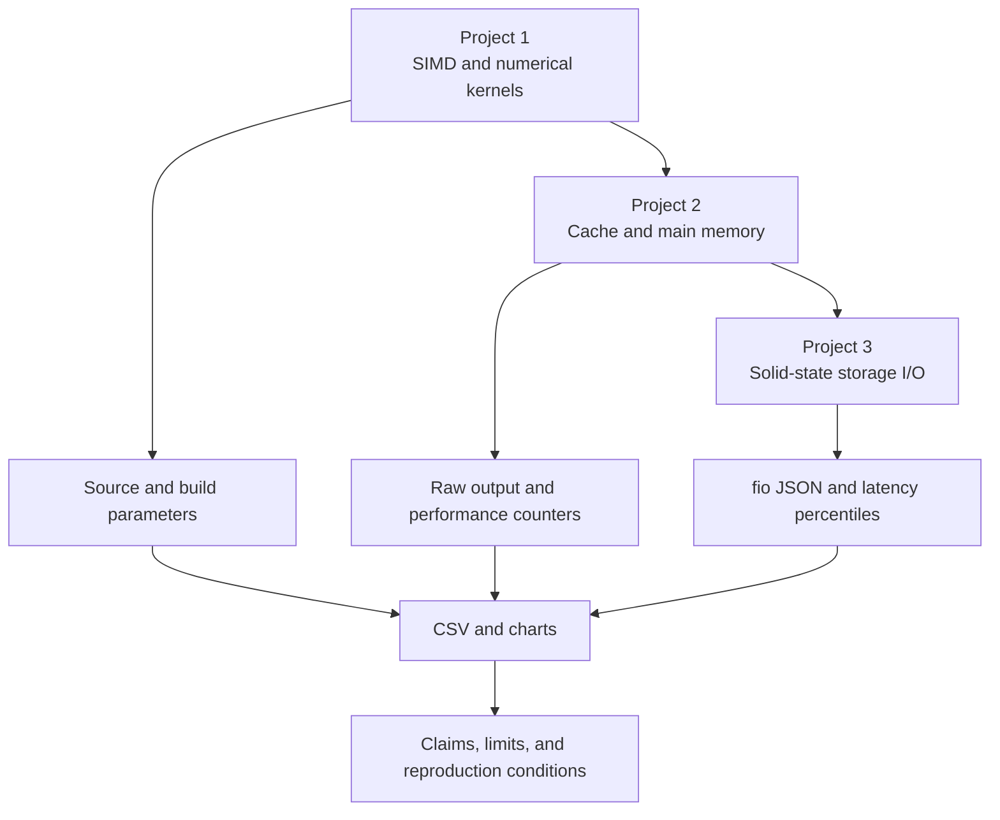
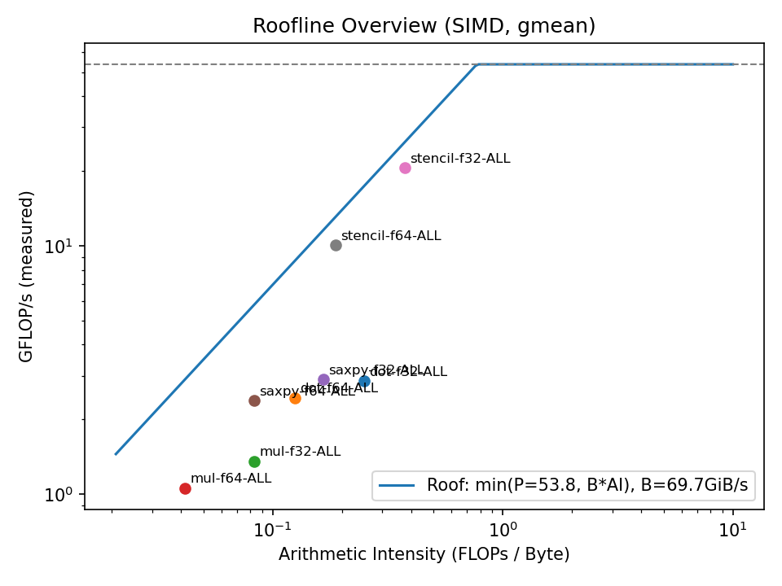
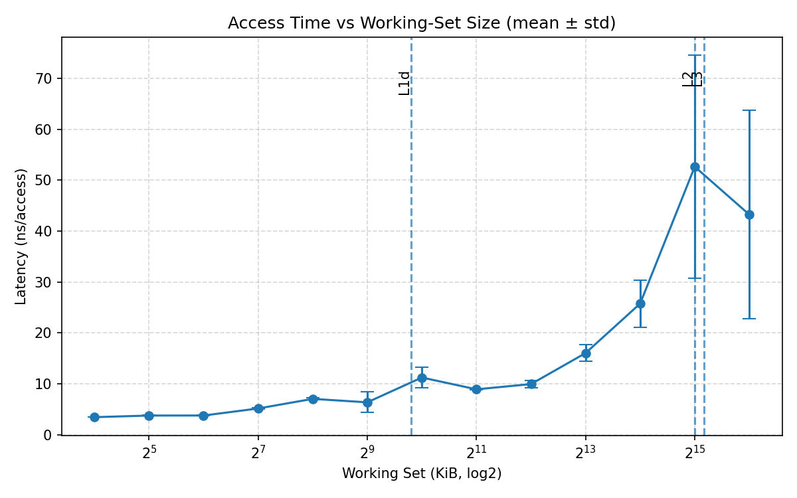
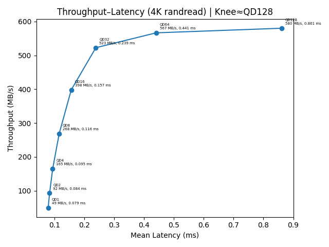

<div align="center">

# 🧪 ECSE 4320 Advanced Computer Systems Labs

**A reproducible experiment archive spanning processor vectorization, cache and memory, and solid-state storage**

[](Project1%20SIMD/)
[](Project2%20Cache/)
[](#5-quick-start)
[](#4-experiment-gallery)
[](#15-contributing-and-license)

[中文](README.md) · [English](README.en.md) · [Lab map](#2-three-labs) · [Safety boundary](#11-safety-boundary) · [Reproduction](#10-reproduction-and-comparison)

</div>

> [!IMPORTANT]
> This is a course experiment archive, not a machine-independent performance leaderboard. Every chart records observations from a specific hardware and software environment. Re-measure after changing the processor, memory, kernel, compiler, firmware, or storage device

> [!CAUTION]
> Scripts under `Project3 SSD` may install packages, change CPU frequency policy, pause system timers, create a 64 GiB file, or write to a selected block device. Read the [safety boundary](#11-safety-boundary) first and perform syntax checks only by default

## 1 Project scope

The repository connects three system-performance labs into one evidence chain, moving from compute cores through the memory hierarchy to persistent storage. Each lab retains source code, automation, raw measurements, charts, and a full report

<div align="center">

Table 1.1. Questions answered by the labs

| Layer | Main question | Method | Artifacts |
| --- | --- | --- | --- |
| Processor | How does single-instruction, multiple-data execution change four numerical kernels | Scalar and auto-vectorized builds, alignment and stride sweeps, Roofline analysis | C++ benchmark, CSV, compiler reports, charts |
| Cache and memory | How do working sets, access strides, read/write mixes, and translation change latency and bandwidth | Pointer chasing, OpenMP microbenchmarks, `perf`, Intel MLC | C programs, shell scripts, raw output, charts |
| Solid-state storage | How do block size, queue depth, read/write ratio, and working set change throughput and tail latency | `fio` parameter sweeps with repeated sampling | Shell scripts, JSON/CSV, charts, report |

</div>

SIMD lets one processor instruction operate on multiple data elements. The Roofline model places compute and memory-bandwidth ceilings on one plot to help distinguish compute-bound from memory-bound behavior

## 2 Three labs

<div align="center">

Table 2.1. Lab navigation

| Lab | Entry | Coverage | Reading route |
| --- | --- | --- | --- |
| Project 1 · SIMD | [`Project1 SIMD/`](Project1%20SIMD/) | SAXPY, dot, multiply, stencil, types, alignment, tails, strides, Roofline | Start with the project README, then `reports/` and `plots/` |
| Project 2 · Cache | [`Project2 Cache/`](Project2%20Cache/) | Idle latency, patterns, read/write mix, intensity, working set, cache misses, TLB | Inspect `config.env`, then `sec2` through `sec8` |
| Project 3 · SSD | [`Project3 SSD/`](Project3%20SSD/) | QD1, block size, read/write mix, queue-depth sweep, working-set and burst writes | Read the safety boundary before scripts and `figs/` |

</div>

Full reports remain at the repository root and inside each project’s `reports/` directory. Existing reports, data, and figures are preserved; this landing page adds routing, boundaries, and a reproducible starting point

## 3 Experiment relationship

<div align="center">



Figure 3.1. Evidence chain from compute cores to storage devices

</div>

## 4 Experiment gallery

<div align="center">



Figure 4.1. Roofline distribution measured for the SIMD kernels

</div>

These points are historical measurements, not peak values for other processors. The Project 1 report separates floating-point type, alignment, stride, and tail effects

<div align="center">



Figure 4.2. Access latency as the working set expands

</div>

Dashed lines show cache-capacity references used by the report, and error bars retain variation across repeated samples. A nearby knee supports investigation but does not by itself prove causality

<div align="center">



Figure 4.3. Throughput and average-latency trade-off across queue depths

</div>

The curve belongs to one SSD and one test setup. Throughput approaches saturation while latency continues rising, and the report marks an observed knee near `QD128`

## 5 Quick start

This safe route only builds and runs a small Project 1 in-memory benchmark. It installs nothing and never touches a block device

```bash
cmake -S "Project1 SIMD" -B /tmp/ecse4320-p1 -DCMAKE_BUILD_TYPE=Release # Generate a separate Linux release build
cmake --build /tmp/ecse4320-p1 --parallel # Compile the C++17 benchmark
/tmp/ecse4320-p1/bench --kernel saxpy --dtype f32 --n 65536 --reps 3 --warmups 1 --verify # Run a small correctness check
```

The program prints one comma-separated row. The penultimate field is the verification status, where `1` means the current run passed. Project 1’s report and output section define every field

## 6 Project 1 · SIMD

Project 1 compares scalar and compiler-auto-vectorized builds of the same C++17 benchmark. `--stride_mode index` keeps operation count fixed while changing read locations; `sample` reduces sample count as stride grows. Comparisons must use matching semantics

<div align="center">

Table 6.1. Project 1 dimensions

| Dimension | Options | Observation |
| --- | --- | --- |
| Kernel | `saxpy`, `dot`, `mul`, `stencil` | Time, cycles per element, GiB/s, GFLOP/s |
| Type | `f32`, `f64` | Vector width and throughput |
| Memory behavior | Alignment, deliberate misalignment, stride, tail length | Auto-vectorization and locality |
| Build | GNU/Clang release and vectorization-disabled scalar build | Speedup and compiler diagnostics |

</div>

GCC’s `-fopt-info-vec-optimized` and `-fopt-info-vec-missed` report successful and missed vectorization opportunities. Historical diagnostics remain available while personal directories are replaced with a repository placeholder [1]

## 7 Project 2 · Cache

Project 2 changes working set, access stride, and read/write ratio on Linux, then combines microbenchmarks with performance counters to inspect cache and address translation. A hardware performance monitoring unit records events such as cycles and cache misses

<div align="center">

Table 7.1. Project 2 sections

| Section | Script | Main output |
| --- | --- | --- |
| 2 | `sec2_zeroq.sh` | Idle and baseline latency |
| 3 | `sec3_pattern_stride.sh` | Sequential, random, and strided access |
| 4 | `sec4_rw_mix.sh` | Bandwidth across read/write ratios |
| 5 | `sec5_intensity.sh` | Throughput and latency relationship |
| 6 | `sec6_wss.sh` | Working-set curve and cache knees |
| 7 | `sec7_cache_miss.sh` | SAXPY runtime and cache misses |
| 8 | `sec8_tlb.sh` | Translation lookaside buffer bandwidth and misses |

</div>

`perf stat` aggregates selected events, but availability changes with the processor, kernel permissions, and virtualization. Check `perf list` and the system’s `perf_event_paranoid` policy first [2]

## 8 Project 3 · SSD

Project 3 uses the Flexible I/O Tester, `fio`, to generate sequential or random workloads and record throughput, I/O operations per second, average latency, and tail latency. Tail latency describes slower high-percentile requests; p99 means 99% of requests complete within that value [3]

<div align="center">

Table 8.1. Project 3 script risk

| Script | Behavior | Documentation default |
| --- | --- | --- |
| `env.bash` | Installs tools, changes frequency policy, pauses timers, creates a large file | Read only; do not execute directly |
| `qd1_test.bash` | Creates a test file and runs QD1 load | Confirm a dedicated test file first |
| `bs_sweep_test.bash` | Sweeps block sizes and performs reads | Reduce size and runtime first |
| `mix_rw_test.bash` | Includes write workloads | Use only disposable test media |
| `qd_sweep_test.bash` | Sweeps multiple queue depths | Check capacity, temperature, and free space |
| `wss_burst_steady.bash` | Includes steady and burst random writes | Require a test window and recovery plan |

</div>

Scripts use `direct=1` to bypass the operating-system page cache. That does not remove device-wear, overwrite, or block-device data-loss risk. In `fio`, `filename` directly determines the I/O target [3]

## 9 Data and artifacts

<div align="center">

Table 9.1. Artifact map

| Location | Content | Suggested use |
| --- | --- | --- |
| `Project1 SIMD/results/` | CSV across kernels and parameters | Replot speedup, throughput, and Roofline results |
| `Project1 SIMD/plots/` | Processor figures | Inspect trends and cross-check the report |
| `Project2 Cache/out/` | Environment snapshots and command output | Track conditions; identity fields are redacted |
| `Project2 Cache/csv/` | Cache and memory measurements | Recompute means, deviations, and knees |
| `Project2 Cache/figs/` | Cache and translation figures | Follow the report section by section |
| `Project3 SSD/out/` | Environment and raw `fio` output | Audit parameters and reparse metrics |
| `Project3 SSD/figs/` | Storage figures | Compare block size, queue depth, and read/write ratio |

</div>

`Project2 Cache/.venv/` historically committed 8,399 environment files. The new `.gitignore` prevents future additions, but already tracked files remain in history and the current tree. Cleanup should be a separate reviewed change after selecting a dependency-locking strategy

## 10 Reproduction and comparison

Reproduce the conditions before comparing values

- Step 1: Record processor model, topology, memory, kernel, compiler, frequency policy, and background load

- Step 2: Fix kernel parameters, working set, repetitions, warmups, CPU affinity, and statistics

- Step 3: Run a small correctness or read-only smoke test before increasing scale

- Step 4: Write new measurements to a separate directory and preserve historical data

- Step 5: Report median, dispersion, sample count, and environmental differences together

CMake supports separating source and build trees, which avoids rewriting the source directory. Repository validation also uses temporary build directories [4]

## 11 Safety boundary

> [!CAUTION]
> Never pass an unknown block device, system disk, irreplaceable partition, or production mount point to `TARGET`. Write workloads can overwrite data, and formatting commands destroy the existing filesystem

All of the following conditions must be true before running Project 3

- Recoverable backups exist and the test data may be discarded
- `TARGET` is a dedicated test file or explicitly isolated test partition
- Device name, mount state, free space, temperature, and health have been checked
- The script’s default `64G` size, runtime, and write ratio have been read
- Steps are ready to restore frequency policy and system timers
- Syntax checks and a read-only smoke test have passed first

This static command parses the scripts without running `fio`

```bash
for script in "Project3 SSD"/*.bash; do bash -n "$script"; done # Check Bash syntax without starting a workload
```

## 12 Repository layout

```text
# Repository layout
.
├── Project1 SIMD/        # C++17 vectorization benchmark, data, charts, and report
├── Project2 Cache/       # C/OpenMP cache benchmarks, scripts, data, and report
├── Project3 SSD/         # fio scripts, raw results, charts, and report
├── docs/assets/readme/   # Local landing-page images
├── README.md             # Chinese primary entry
└── README.en.md          # English backup entry
```

## 13 Known limitations

<div align="center">

Table 13.1. Current limitations

| Limitation | Consequence | Recommendation |
| --- | --- | --- |
| Historical results come from one hardware environment | Values do not generalize directly | Re-run and label every target environment |
| Project 1 uses `-march=native` | Instructions and binaries depend on the build host | Rebuild on each target machine |
| Project 2 depends on Linux, OpenMP, PMU access, and optional Intel MLC | Windows or restricted containers cannot run the full suite | Check permissions and events on native Linux |
| Project 2 tracks a complete virtual environment | Repository size and supply-chain review cost are high | Migrate to locked dependency metadata later |
| Project 3 includes write-heavy workloads | Data can be overwritten and device writes increase | Use a dedicated test file, reduce scale, and confirm explicitly |
| No repository license is declared | Reuse and redistribution rights are unclear | Add a license after owner confirmation |

</div>

## 14 Privacy and redaction

The landing page exposes no production endpoint, account, user identifier, hostname, serial number, credential, or license key. This revision replaces personal absolute paths, hostnames, and SSD serial numbers in text artifacts with `<repo>`, `<redacted-host>`, and `<redacted-serial>`

Before committing new output, inspect text, CSV, JSON, terminal screenshots, image metadata, and PDFs. Device inventories, prompts, and compiler diagnostics can also reveal identity or infrastructure details

## 15 Contributing and license

Contributions may add reproducible scripts, cross-platform guidance, locked dependencies, statistical tests, or anonymized results. Preserve traceability from raw data to claims and document hardware, software, and measurement methods

No license file is currently detected. Public visibility does not grant permission to copy, modify, or redistribute the material. Obtain explicit authorization until the repository owner selects and commits a license

## 16 References

[1] GNU Project, “Optimize Options,” *GNU Compiler Collection Documentation*. [Online]. Available: https://gcc.gnu.org/onlinedocs/gcc/Optimize-Options.html. [Accessed: Aug. 24, 2026].

[2] Linux Kernel Organization, “Perf events and tool security,” *The Linux Kernel Documentation*. [Online]. Available: https://docs.kernel.org/admin-guide/perf-security.html. [Accessed: Aug. 24, 2026].

[3] fio Project, “fio Documentation,” *fio Read the Docs*. [Online]. Available: https://fio.readthedocs.io/en/latest/fio_doc.html. [Accessed: Aug. 24, 2026].

[4] Kitware, “cmake(1),” *CMake Documentation*. [Online]. Available: https://cmake.org/cmake/help/latest/manual/cmake.1.html. [Accessed: Aug. 24, 2026].
