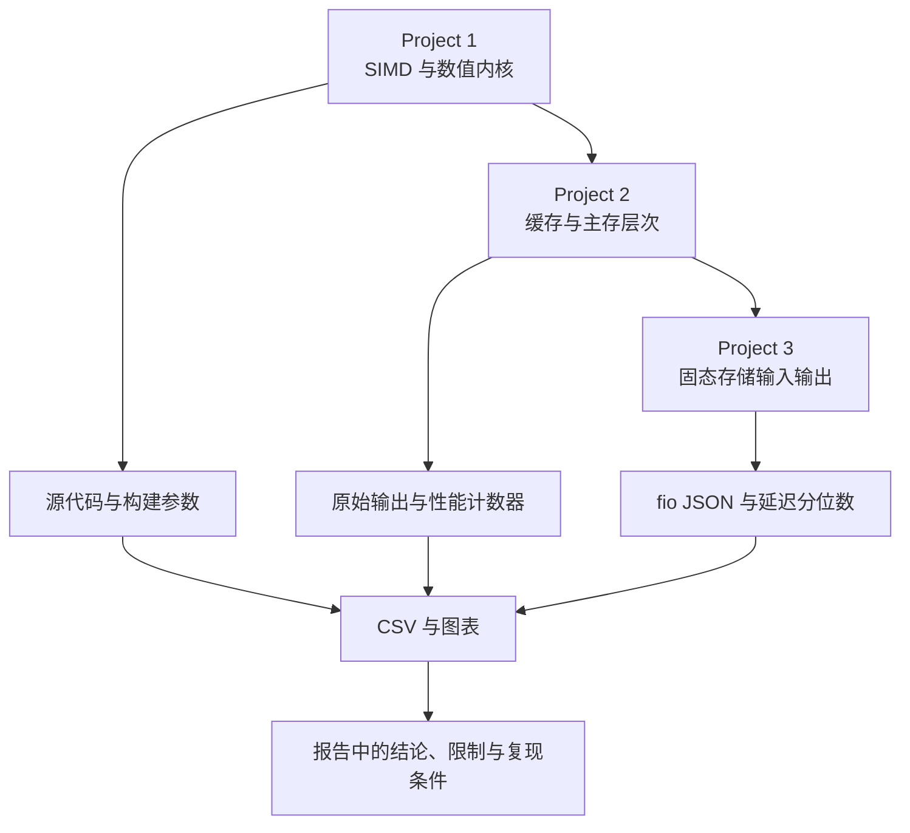

<div align="center">

# 🧪 ECSE 4320 高级计算机系统实验集

**从处理器向量化、缓存与内存层次，一直测到固态存储的可复现实验档案**

[](Project1%20SIMD/)
[](Project2%20Cache/)
[](#5-快速开始)
[](#4-实验图集)
[](#15-贡献许可)

[中文](README.md) · [English](README.en.md) · [实验导航](#2-三组实验) · [安全边界](#11-安全边界) · [复现说明](#10-复现比较)

</div>

> [!IMPORTANT]
> 这是课程实验档案，不是跨机器通用的性能排行榜，图表记录一次特定硬件与软件环境下的观测结果，换用处理器、内存、内核、编译器、固件或固态硬盘后，数值应重新测量

> [!CAUTION]
> `Project3 SSD` 中的脚本可能安装软件、调整中央处理器频率策略、暂停系统定时任务、创建 64 GiB 测试文件，或对指定块设备执行写入，先阅读[安全边界](#11-安全边界)，默认只做语法检查

## 1 项目定位

本仓库把 3 个相互衔接的系统性能实验放在同一条证据链上，从计算核心、内存层次到持久化存储逐层观察瓶颈

每个项目同时保留源代码、自动化脚本、原始数据、图表与长篇实验报告，本文全部数值来自仓库内的源代码、报告、文件统计或本次验证记录

<div align="center">

表 1.1 三个实验回答的问题

| 层次 | 核心问题 | 主要方法 | 主要产物 |
| --- | --- | --- | --- |
| 处理器 | 单指令多数据执行如何改变四类数值内核的吞吐量 | 标量与自动向量化构建、步长与对齐扫描、Roofline 分析 | C++ 基准程序、CSV、编译器报告、图表 |
| 缓存与内存 | 工作集、访问步长、读写混合和地址转换如何改变延迟与带宽 | 指针追逐、OpenMP 微基准、`perf` 计数、Intel MLC | C 程序、Shell 脚本、原始输出、图表 |
| 固态存储 | 块大小、队列深度、读写比例与工作集如何改变吞吐量和尾延迟 | `fio` 参数扫描与重复采样 | Shell 脚本、JSON/CSV、图表、报告 |

</div>

注：单指令多数据简称 SIMD，它让一条处理器指令同时处理多个数据元素

Roofline 模型把计算吞吐上限与内存带宽上限放在同一张图中，帮助判断内核更接近计算受限还是访存受限

## 2 三组实验

<div align="center">

表 2.1 项目导航

| 项目 | 入口 | 已覆盖范围 | 阅读顺序 |
| --- | --- | --- | --- |
| Project 1 · SIMD | [`Project1 SIMD/`](Project1%20SIMD/) | SAXPY、点积、逐元素乘法、三点模板、数据类型、对齐、尾部、步长、Roofline | 先读项目说明，再看 `reports/` 和 `plots/` |
| Project 2 · Cache | [`Project2 Cache/`](Project2%20Cache/) | 零负载延迟、访问模式、读写混合、强度、工作集、缓存未命中、TLB | 先看 `config.env`，再按 `sec2` 至 `sec8` 阅读 |
| Project 3 · SSD | [`Project3 SSD/`](Project3%20SSD/) | 队列深度 1、块大小、读写混合、队列深度扫描、工作集与突发写 | 先读安全边界，再看脚本与 `figs/` |

</div>

仓库根目录和各项目的 `reports/` 保存完整实验报告，现有报告、数据和图表均被保留，根 README 只提供入口、边界和可复现路径

## 3 实验关系

<div align="center">



图 3.1 从计算核心到存储设备的实验链路

</div>

## 4 实验图集

<div align="center">


图 4.1 SIMD 内核在测量机器上的 Roofline 分布

</div>

图中的点是历史实测值，不代表其他处理器的峰值，项目报告进一步拆分了 `float`、`double`、对齐、步长和尾部效应

<div align="center">


图 4.2 访问延迟随工作集扩大而变化

</div>

虚线对应报告采用的缓存容量参考位置，误差棒保留重复测量的离散程度，缓存容量标签与拐点接近并不等同于严格因果证明

<div align="center">


图 4.3 随队列深度增加的吞吐量与平均延迟权衡

</div>

该图来自特定固态硬盘和测试条件，队列深度增加后吞吐量趋于饱和，同时延迟继续增长，报告把拐点标为约 `QD128`

## 5 快速开始

以下路径只构建并运行 Project 1 的小规模只读内存基准，不安装依赖，也不接触块设备

```bash
cmake -S "Project1 SIMD" -B /tmp/ecse4320-p1 -DCMAKE_BUILD_TYPE=Release # 生成 Linux 发布构建目录
cmake --build /tmp/ecse4320-p1 --parallel # 编译 C++17 基准程序
/tmp/ecse4320-p1/bench --kernel saxpy --dtype f32 --n 65536 --reps 3 --warmups 1 --verify # 运行小规模正确性检查
```

预期输出是一行逗号分隔结果，其中倒数第二个字段为正确性检查状态，`1` 表示本次运行通过，完整字段含义位于 Project 1 报告和源代码输出段

## 6 Project 1 · SIMD

Project 1 用同一套 C++17 基准比较标量构建和编译器自动向量化构建

`--stride_mode index` 保持运算次数固定并改变读取位置，`sample` 模式则随步长减少采样数量，比较结果时必须保持语义一致

<div align="center">

表 6.1 Project 1 的实验维度

| 维度 | 选项或范围 | 观察量 |
| --- | --- | --- |
| 内核 | `saxpy`、`dot`、`mul`、`stencil` | 时间、每元素周期、GiB/s、GFLOP/s |
| 数据类型 | `f32`、`f64` | 向量宽度与吞吐量差异 |
| 内存行为 | 对齐与故意错位、步长、尾部长度 | 自动向量化和局部性变化 |
| 构建 | GNU/Clang 发布优化、标量禁用向量化 | 加速比与编译器向量化报告 |

</div>

GNU 编译器的 `-fopt-info-vec-optimized` 和 `-fopt-info-vec-missed` 会报告成功与错过的向量化机会，项目保留了历史报告，并已把其中的个人目录替换为仓库占位符[1]

## 7 Project 2 · Cache

Project 2 用 Linux 微基准逐步扩大工作集、改变访问步长和读写比例，并结合性能计数器观察缓存与地址转换行为

性能监控单元简称 PMU，这类处理器硬件会记录缓存未命中、指令和周期等事件

<div align="center">

表 7.1 Project 2 的章节入口

| 章节 | 脚本 | 主要输出 |
| --- | --- | --- |
| 2 | `sec2_zeroq.sh` | 零负载与基线延迟 |
| 3 | `sec3_pattern_stride.sh` | 连续、随机和步长访问 |
| 4 | `sec4_rw_mix.sh` | 不同读写比例的带宽 |
| 5 | `sec5_intensity.sh` | 吞吐量与延迟关系 |
| 6 | `sec6_wss.sh` | 工作集曲线与缓存拐点 |
| 7 | `sec7_cache_miss.sh` | SAXPY 运行时间与缓存未命中 |
| 8 | `sec8_tlb.sh` | 地址转换缓存的带宽与未命中 |

</div>

`perf stat` 用于聚合选定事件的计数

实际可用事件取决于处理器，也会受到内核权限和虚拟化环境影响，应先检查 `perf list` 与系统的 `perf_event_paranoid` 策略[2]

## 8 Project 3 · SSD

Project 3 使用 Flexible I/O Tester，也就是 `fio`，生成顺序或随机读写负载

实验记录吞吐量、每秒输入输出次数、平均延迟与尾延迟，尾延迟描述较慢请求的高分位等待时间[3]

<div align="center">

表 8.1 Project 3 的脚本风险

| 脚本 | 行为 | 默认文档策略 |
| --- | --- | --- |
| `env.bash` | 安装工具、修改频率策略、暂停定时任务、创建大文件 | 只阅读，不直接执行 |
| `qd1_test.bash` | 创建测试文件并运行队列深度 1 负载 | 先确认目标是专用测试文件 |
| `bs_sweep_test.bash` | 扫描块大小并执行读负载 | 先缩小文件大小与运行时间 |
| `mix_rw_test.bash` | 包含写入负载 | 只在可丢弃数据的测试介质执行 |
| `qd_sweep_test.bash` | 扫描多档队列深度 | 先完成容量、温度和空间检查 |
| `wss_burst_steady.bash` | 包含持续和突发随机写 | 需要明确的测试窗口和恢复计划 |

</div>

仓库中的脚本使用 `direct=1` 绕过操作系统页缓存，但这不会消除设备磨损、文件覆盖或块设备数据损坏风险，`fio` 的 `filename` 会直接决定输入输出目标[3]

## 9 数据产物

<div align="center">

表 9.1 产物类型与用途

| 位置 | 内容 | 建议用途 |
| --- | --- | --- |
| `Project1 SIMD/results/` | 不同内核和参数的 CSV | 重画加速比、吞吐量与 Roofline 图 |
| `Project1 SIMD/plots/` | 处理器实验图表 | 快速检查趋势并与报告交叉验证 |
| `Project2 Cache/out/` | 环境快照与命令输出 | 追踪实验条件，敏感标识已脱敏 |
| `Project2 Cache/csv/` | 缓存与内存测量数据 | 重新统计均值、标准差和拐点 |
| `Project2 Cache/figs/` | 缓存与地址转换图表 | 对照报告各章节 |
| `Project3 SSD/out/` | 环境与 `fio` 原始结果 | 审查参数并重新解析指标 |
| `Project3 SSD/figs/` | 固态存储图表 | 比较块大小、队列深度与读写比例 |

</div>

仓库文件统计显示，`Project2 Cache/.venv/` 历史上被提交了 8,399 个环境文件

新加入的 `.gitignore` 会阻止后续新增，但已经跟踪的文件仍在历史与当前树中

清理工作应另开经过审核的变更，并先确认报告脚本的依赖锁定方案

## 10 复现比较

复现实验时先复制条件，再比较结果，不能只复制命令

- 第一步，记录处理器型号、核心拓扑、内存容量、内核、编译器、频率策略和后台负载

- 第二步，固定内核参数、工作集、重复次数、预热次数、处理器亲和性和统计方法

- 第三步，先运行小规模正确性或只读冒烟测试，再扩大数据规模

- 第四步，把新结果写入独立目录，不覆盖仓库中的历史数据

- 第五步，在结论中同时报告中位数、离散程度、样本量和与原实验环境的差异

CMake 的源目录与构建目录分离方式可避免改写源树，本仓库的验证也采用临时构建目录[4]

## 11 安全边界

> [!CAUTION]
> 不要把未知块设备、系统盘、带有唯一数据的分区或生产挂载点传给 `TARGET`，写入型 `fio` 任务可能覆盖数据，格式化命令会直接破坏现有文件系统

执行 Project 3 前必须同时满足以下条件

- 已做可恢复备份，并确认测试数据允许丢失
- `TARGET` 指向专用测试文件或明确隔离的测试分区
- 已核对设备名、挂载状态、剩余空间、温度与健康信息
- 已阅读脚本中的默认 `64G` 容量、运行时间和写入比例
- 已安排恢复频率策略和系统定时任务的步骤
- 已先用语法检查与只读冒烟测试验证参数

安全的静态检查命令如下，它只解析脚本语法，不运行 `fio`

```bash
for script in "Project3 SSD"/*.bash; do bash -n "$script"; done # 检查全部存储脚本的 Bash 语法，不执行负载
```

## 12 仓库结构

```text
# 仓库目录结构
.
├── Project1 SIMD/        # C++17 向量化基准、数据、图表与报告
├── Project2 Cache/       # C/OpenMP 缓存微基准、脚本、数据与报告
├── Project3 SSD/         # fio 脚本、原始结果、图表与报告
├── docs/assets/readme/   # 根 README 使用的本地图像
├── README.md             # 中文主入口
└── README.en.md          # 英文备份入口
```

## 13 已知限制

<div align="center">

表 13.1 当前限制与处理建议

| 限制 | 影响 | 建议 |
| --- | --- | --- |
| 历史结果来自单一硬件环境 | 数值不能直接推广到其他平台 | 在目标机器重跑并单独标注环境 |
| Project 1 使用 `-march=native` | 二进制和指令集依赖构建机器 | 在每台目标机器重新构建 |
| Project 2 依赖 Linux、OpenMP、PMU 和可选 Intel MLC | Windows 或受限容器无法完整执行 | 在原生 Linux 上检查权限与事件支持 |
| Project 2 跟踪了完整虚拟环境 | 仓库体积和供应链审查成本较高 | 后续迁移到锁定依赖文件 |
| Project 3 包含高写入量负载 | 可能覆盖数据并增加设备写入量 | 采用专用测试文件、缩小规模并显式确认 |
| 仓库尚未声明许可证 | 再分发和复用权限不明确 | 获得所有者确认后补充许可证 |

</div>

## 14 隐私脱敏

根 README 不展示真实部署地址、账号、用户标识、主机名、序列号、凭据或许可证密钥，本次整理已把文本产物中的个人绝对路径、主机名和固态硬盘序列号替换为 `<repo>`、`<redacted-host>` 与 `<redacted-serial>`

提交新结果前，请同时检查文本、CSV、JSON、终端截图、图片元数据和 PDF，设备清单、终端提示符和编译器日志也可能泄露身份或基础设施信息

## 15 贡献许可

欢迎补充可复现脚本、跨平台构建说明、依赖锁定文件、统计检验与匿名化的新实验结果

变更应保留原始数据与结论之间的可追溯关系，并在说明中写明硬件、软件和测量方法

仓库当前没有检测到许可证文件，公开可见并不授予任意复制、修改或再分发的权利

在仓库所有者选择并提交许可证前，请先取得明确授权

## 16 参考资料

[1] GNU Project, “Optimize Options,” *GNU Compiler Collection Documentation*. [Online]. Available: https://gcc.gnu.org/onlinedocs/gcc/Optimize-Options.html. [Accessed: Aug. 24, 2026].

[2] Linux Kernel Organization, “Perf events and tool security,” *The Linux Kernel Documentation*. [Online]. Available: https://docs.kernel.org/admin-guide/perf-security.html. [Accessed: Aug. 24, 2026].

[3] fio Project, “fio Documentation,” *fio Read the Docs*. [Online]. Available: https://fio.readthedocs.io/en/latest/fio_doc.html. [Accessed: Aug. 24, 2026].

[4] Kitware, “cmake(1),” *CMake Documentation*. [Online]. Available: https://cmake.org/cmake/help/latest/manual/cmake.1.html. [Accessed: Aug. 24, 2026].
